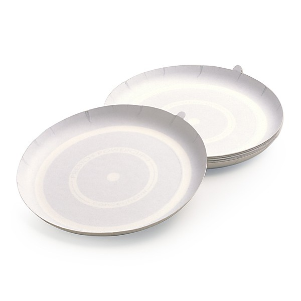

# Lost & Forgotten Power Pop - Vol. 12

By **Various Artists**

## Album Data

- **Catalog:** Beets
- **Format:** Digital, Album
- **Album:** Lost & Forgotten Power Pop - Vol. 12
- **Artist:** Various Artists
- **Albumartist:** Various Artists
- **Genre:** Power Pop
- **MusicBrainz Album Artist ID:** 
- **MusicBrainz Album ID:** 
- **MusicBrainz Release Group ID:** 
- **Year:** 0000
- **Catalog #:** 
- **Label:** 
- **Total Tracks:** 00

## Album Tracks

### Track 00 - ANGEL - Good Time Fanny

- **Artist:** Angel
- **Format:** MP3
- **Genre:** Gothic Metal
- **Length:** 3:14
- **MusicBrainz Track ID:** 
- **Title:** ANGEL - Good Time Fanny
- **Track:** 00
- **Year:** 0000

### Track 00 - BROKEN HOME - Run Away From Home

- **Artist:** Broken Home
- **Format:** MP3
- **Genre:** Power Pop
- **Length:** 3:45
- **MusicBrainz Track ID:** 
- **Title:** BROKEN HOME - Run Away From Home
- **Track:** 00
- **Year:** 0000

### Track 00 - CHARLIE FAWN - Alibis

- **Artist:** Charlie Fawn
- **Format:** MP3
- **Genre:** Power Pop
- **Length:** 3:15
- **MusicBrainz Track ID:** 
- **Title:** CHARLIE FAWN - Alibis
- **Track:** 00
- **Year:** 0000

### Track 00 - DAHCOTAH - Too Easy To Love

- **Artist:** Dahcotah
- **Format:** MP3
- **Genre:** Glam Rock
- **Length:** 3:12
- **MusicBrainz Track ID:** 
- **Title:** DAHCOTAH - Too Easy To Love
- **Track:** 00
- **Year:** 0000

### Track 00 - FACE DANCER - The Sphinx

- **Artist:** Face Dancer
- **Format:** MP3
- **Genre:** Power Pop
- **Length:** 3:33
- **MusicBrainz Track ID:** 
- **Title:** FACE DANCER - The Sphinx
- **Track:** 00
- **Year:** 0000

### Track 00 - FOOLS FACE - American Guilt

- **Artist:** Fools Face
- **Format:** MP3
- **Genre:** Power Pop
- **Length:** 3:12
- **MusicBrainz Track ID:** 
- **Title:** FOOLS FACE - American Guilt
- **Track:** 00
- **Year:** 0000

### Track 00 - HEAVY METAL KIDS - Chelsea Kids

- **Artist:** Heavy Metal Kids
- **Format:** MP3
- **Genre:** Punk Rock
- **Length:** 4:19
- **MusicBrainz Track ID:** 
- **Title:** HEAVY METAL KIDS - Chelsea Kids
- **Track:** 00
- **Year:** 0000

### Track 00 - LOCAL OPERATOR - Mumbo Man

- **Artist:** Local Operator
- **Format:** MP3
- **Genre:** Power Pop
- **Length:** 3:14
- **MusicBrainz Track ID:** 
- **Title:** LOCAL OPERATOR - Mumbo Man
- **Track:** 00
- **Year:** 0000

### Track 00 - NO DICE - Spacey Romance

- **Artist:** No Dice
- **Format:** MP3
- **Genre:** Thrashcore
- **Length:** 3:48
- **MusicBrainz Track ID:** 
- **Title:** NO DICE - Spacey Romance
- **Track:** 00
- **Year:** 0000

### Track 00 - THE HEAT - High School Sweater

- **Artist:** The Heat
- **Format:** MP3
- **Genre:** Heavy Metal
- **Length:** 2:57
- **MusicBrainz Track ID:** 
- **Title:** THE HEAT - High School Sweater
- **Track:** 00
- **Year:** 0000

### Track 00 - THE HEAT - Instant Love

- **Artist:** The Heat
- **Format:** MP3
- **Genre:** Heavy Metal
- **Length:** 3:29
- **MusicBrainz Track ID:** 
- **Title:** THE HEAT - Instant Love
- **Track:** 00
- **Year:** 0000

### Track 00 - THE ORBITS - Rear View Mirror

- **Artist:** The Orbits
- **Format:** MP3
- **Genre:** Rockabilly
- **Length:** 4:00
- **MusicBrainz Track ID:** 
- **Title:** THE ORBITS - Rear View Mirror
- **Track:** 00
- **Year:** 0000

### Track 00 - THE PROBERS - Mad At The World

- **Artist:** The Probers
- **Format:** MP3
- **Genre:** Rock
- **Length:** 10:16
- **MusicBrainz Track ID:** 
- **Title:** THE PROBERS - Mad At The World
- **Track:** 00
- **Year:** 0000

### Track 00 - VENUS & THE RAZOR BLADES - Finer Things in Life

- **Artist:** Venus & The Razorblades
- **Format:** MP3
- **Genre:** Punk Rock
- **Length:** 3:29
- **MusicBrainz Track ID:** 
- **Title:** VENUS & THE RAZOR BLADES - Finer Things in Life
- **Track:** 00
- **Year:** 0000

### Track 00 - ZAPPO - Rock and Roll Crazy

- **Artist:** Zappo
- **Format:** MP3
- **Genre:** Power Pop
- **Length:** 3:20
- **MusicBrainz Track ID:** 
- **Title:** ZAPPO - Rock and Roll Crazy
- **Track:** 00
- **Year:** 0000

