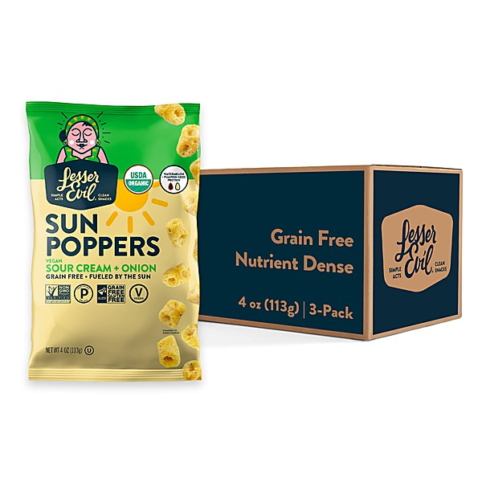

# Lost & Forgotten Power Pop - Vol. 15

By **Various Artists**

## Album Data

- **Catalog:** Beets
- **Format:** Digital, Album
- **Album:** Lost & Forgotten Power Pop - Vol. 15
- **Artist:** Various Artists
- **Albumartist:** Various Artists
- **Genre:** Indie Rock
- **MusicBrainz Album Artist ID:** 
- **MusicBrainz Album ID:** 
- **MusicBrainz Release Group ID:** 
- **Year:** 0000
- **Catalog #:** 
- **Label:** 
- **Total Tracks:** 00

## Album Tracks

### Track 00 - 13 ENGINES - King Of Saturday Night

- **Artist:** 13 Engines
- **Format:** MP3
- **Genre:** Alternative Rock
- **Length:** 3:21
- **MusicBrainz Track ID:** 
- **Title:** 13 ENGINES - King Of Saturday Night
- **Track:** 00
- **Year:** 0000

### Track 00 - BRADEN BLAKE - Peter Pan

- **Artist:** Braden Blake
- **Format:** MP3
- **Genre:** Power Pop
- **Length:** 3:26
- **MusicBrainz Track ID:** 
- **Title:** BRADEN BLAKE - Peter Pan
- **Track:** 00
- **Year:** 0000

### Track 00 - FLYING COLOR - Dear Friend

- **Artist:** Flying Color
- **Format:** MP3
- **Genre:** Rock And Roll
- **Length:** 3:09
- **MusicBrainz Track ID:** 
- **Title:** FLYING COLOR - Dear Friend
- **Track:** 00
- **Year:** 0000

### Track 00 - RAYON CITY QUARTET - Cool Again

- **Artist:** Rayon City Quartet
- **Format:** MP3
- **Genre:** Power Pop
- **Length:** 3:40
- **MusicBrainz Track ID:** 
- **Title:** RAYON CITY QUARTET - Cool Again
- **Track:** 00
- **Year:** 0000

### Track 00 - ROSS RICE - Words Fail Me

- **Artist:** Ross Rice
- **Format:** MP3
- **Genre:** Power Pop
- **Length:** 3:32
- **MusicBrainz Track ID:** 
- **Title:** ROSS RICE - Words Fail Me
- **Track:** 00
- **Year:** 0000

### Track 00 - SPAIN COLORED ORANGE - Better Left Alone

- **Artist:** Spain Colored Orange
- **Format:** MP3
- **Genre:** Indie Rock
- **Length:** 4:07
- **MusicBrainz Track ID:** 
- **Title:** SPAIN COLORED ORANGE - Better Left Alone
- **Track:** 00
- **Year:** 0000

### Track 00 - BARELY PINK - Baby A.M.

- **Artist:** Starduster ep
- **Format:** MP3
- **Genre:** Power Pop
- **Length:** 4:14
- **MusicBrainz Track ID:** 
- **Title:** BARELY PINK - Baby A.M.
- **Track:** 00
- **Year:** 0000

### Track 00 - STILL - The Wild Twilite

- **Artist:** STILL
- **Format:** MP3
- **Genre:** Hardcore Punk
- **Length:** 3:42
- **MusicBrainz Track ID:** 
- **Title:** STILL - The Wild Twilite
- **Track:** 00
- **Year:** 0000

### Track 00 - THE BIRDWATCHERS - Smile

- **Artist:** The Birdwatchers
- **Format:** AAC
- **Genre:** Freakbeat
- **Length:** 4:49
- **MusicBrainz Track ID:** 
- **Title:** THE BIRDWATCHERS - Smile
- **Track:** 00
- **Year:** 0000

### Track 00 - THE PRANKS - Don't Ask, Don't Tell

- **Artist:** The Pranks
- **Format:** MP3
- **Genre:** Power Pop
- **Length:** 3:19
- **MusicBrainz Track ID:** 
- **Title:** THE PRANKS - Don't Ask, Don't Tell
- **Track:** 00
- **Year:** 0000

### Track 00 - TIM CHRISTENSEN - Jump The Gun

- **Artist:** Tim Christensen
- **Format:** MP3
- **Genre:** Soft Rock
- **Length:** 3:24
- **MusicBrainz Track ID:** 
- **Title:** TIM CHRISTENSEN - Jump The Gun
- **Track:** 00
- **Year:** 0000

### Track 00 - TIM CULLEN - Good To Know

- **Artist:** Tim Cullen
- **Format:** MP3
- **Genre:** Power Pop
- **Length:** 3:01
- **MusicBrainz Track ID:** 
- **Title:** TIM CULLEN - Good To Know
- **Track:** 00
- **Year:** 0000

### Track 00 - WARM SODA - Jeanie Loves Pop

- **Artist:** Warm Soda
- **Format:** MP3
- **Genre:** Power Pop
- **Length:** 2:53
- **MusicBrainz Track ID:** 
- **Title:** WARM SODA - Jeanie Loves Pop
- **Track:** 00
- **Year:** 0000

