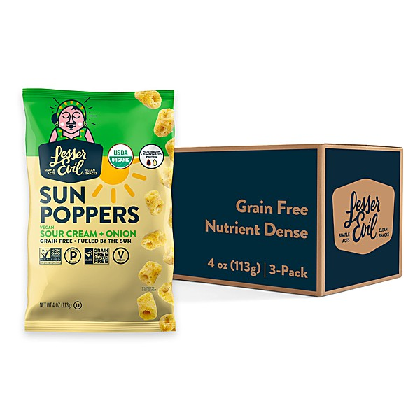

# Lost & Forgotten Power Pop - Vol. 7

By **Various Artists**

## Album Data

- **Catalog:** Beets
- **Format:** Digital, Album
- **Album:** Lost & Forgotten Power Pop - Vol. 7
- **Artist:** Various Artists
- **Albumartist:** Various Artists
- **Genre:** Power Pop
- **MusicBrainz Album Artist ID:** 
- **MusicBrainz Album ID:** 
- **MusicBrainz Release Group ID:** 
- **Year:** 2012
- **Catalog #:** 
- **Label:** 
- **Total Tracks:** 14

## Album Tracks

### Track 07 - I'm Gonna Do It To You

- **Artist:** Birdwatchers
- **Format:** ALAC
- **Genre:** Garage Rock
- **Length:** 2:18
- **MusicBrainz Track ID:** 
- **Title:** I'm Gonna Do It To You
- **Track:** 07
- **Year:** 0000

### Track 03 - Fresher Than The Sweetness

- **Artist:** Honeybus
- **Format:** ALAC
- **Genre:** Sunshine Pop
- **Length:** 3:07
- **MusicBrainz Track ID:** 
- **Title:** Fresher Than The Sweetness
- **Track:** 03
- **Year:** 0000

### Track 12 - She Said Yes

- **Artist:** Honeybus
- **Format:** ALAC
- **Genre:** Pop
- **Length:** 3:37
- **MusicBrainz Track ID:** 
- **Title:** She Said Yes
- **Track:** 12
- **Year:** 0000

### Track 04 - Good To Me

- **Artist:** Lexington Avenue
- **Format:** ALAC
- **Genre:** Sunshine Pop
- **Length:** 2:37
- **MusicBrainz Track ID:** 
- **Title:** Good To Me
- **Track:** 04
- **Year:** 0000

### Track 10 - Move With The Dream

- **Artist:** Marc Eric
- **Format:** ALAC
- **Genre:** Sunshine Pop
- **Length:** 2:47
- **MusicBrainz Track ID:** 
- **Title:** Move With The Dream
- **Track:** 10
- **Year:** 0000

### Track 02 - Emily Needs A Man

- **Artist:** Powder
- **Format:** ALAC
- **Genre:** Britpop
- **Length:** 3:03
- **MusicBrainz Track ID:** 
- **Title:** Emily Needs A Man
- **Track:** 02
- **Year:** 0000

### Track 05 - Here Comes That Feeling

- **Artist:** Sandy Salisbury
- **Format:** ALAC
- **Genre:** Sunshine Pop
- **Length:** 2:25
- **MusicBrainz Track ID:** 
- **Title:** Here Comes That Feeling
- **Track:** 05
- **Year:** 0000

### Track 01 - Alien

- **Artist:** Scooters
- **Format:** ALAC
- **Genre:** Happy Hardcore
- **Length:** 3:06
- **MusicBrainz Track ID:** 
- **Title:** Alien
- **Track:** 01
- **Year:** 0000

### Track 13 - Song For A Stat

- **Artist:** Sweeney Todd
- **Format:** ALAC
- **Genre:** Glam Rock
- **Length:** 2:53
- **MusicBrainz Track ID:** 
- **Title:** Song For A Stat
- **Track:** 13
- **Year:** 0000

### Track 08 - Just Can't Wait

- **Artist:** The Full Treatment
- **Format:** ALAC
- **Genre:** Sunshine Pop
- **Length:** 2:45
- **MusicBrainz Track ID:** 
- **Title:** Just Can't Wait
- **Track:** 08
- **Year:** 0000

### Track 09 - Kaleidoscope

- **Artist:** The Marmalade
- **Format:** ALAC
- **Genre:** Psychedelic Rock
- **Length:** 4:08
- **MusicBrainz Track ID:** 
- **Title:** Kaleidoscope
- **Track:** 09
- **Year:** 0000

### Track 06 - High And Mighty

- **Artist:** Tomorrow's Keepsake
- **Format:** ALAC
- **Genre:** Sunshine Pop
- **Length:** 2:39
- **MusicBrainz Track ID:** 
- **Title:** High And Mighty
- **Track:** 06
- **Year:** 0000

### Track 11 - Satin City News

- **Artist:** Troll
- **Format:** ALAC
- **Genre:** Black Metal
- **Length:** 2:45
- **MusicBrainz Track ID:** 
- **Title:** Satin City News
- **Track:** 11
- **Year:** 0000

### Track 14 - 53 Summer Street

- **Artist:** Turquoise
- **Format:** ALAC
- **Genre:** Garage Rock
- **Length:** 2:53
- **MusicBrainz Track ID:** 
- **Title:** 53 Summer Street
- **Track:** 14
- **Year:** 0000

