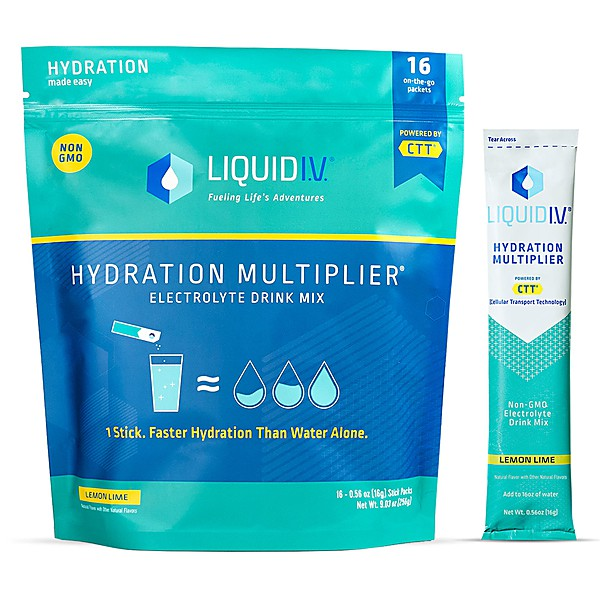

# Lost & Forgotten Power Pop V9

By **Various Artists**

## Album Data

- **Catalog:** Beets
- **Format:** Digital, Album
- **Album:** Lost & Forgotten Power Pop V9
- **Artist:** Various Artists
- **Albumartist:** Various Artists
- **Genre:** Sunshine Pop
- **MusicBrainz Album Artist ID:** 
- **MusicBrainz Album ID:** 
- **MusicBrainz Release Group ID:** 
- **Year:** 0000
- **Catalog #:** 
- **Label:** 
- **Total Tracks:** 14

## Album Tracks

### Track 04 - Fly Now

- **Artist:** Brian Protheroe
- **Format:** ALAC
- **Genre:** Indie Rock
- **Length:** 2:27
- **MusicBrainz Track ID:** 
- **Title:** Fly Now
- **Track:** 04
- **Year:** 2018

### Track 03 - Electra City

- **Artist:** Chris Rainbow
- **Format:** ALAC
- **Genre:** Progressive Rock
- **Length:** 2:39
- **MusicBrainz Track ID:** 
- **Title:** Electra City
- **Track:** 03
- **Year:** 2018

### Track 08 - Ram On

- **Artist:** Db Cooper
- **Format:** ALAC
- **Genre:** Power Pop
- **Length:** 4:10
- **MusicBrainz Track ID:** 
- **Title:** Ram On
- **Track:** 08
- **Year:** 2018

### Track 07 - Like I Always Do

- **Artist:** Pastiche
- **Format:** ALAC
- **Genre:** Techno
- **Length:** 2:00
- **MusicBrainz Track ID:** 
- **Title:** Like I Always Do
- **Track:** 07
- **Year:** 2018

### Track 10 - Tell Me

- **Artist:** Probeer
- **Format:** ALAC
- **Genre:** Power Pop
- **Length:** 3:14
- **MusicBrainz Track ID:** 
- **Title:** Tell Me
- **Track:** 10
- **Year:** 2018

### Track 12 - Heartbreak Song

- **Artist:** R.F. & The Radar Angels
- **Format:** ALAC
- **Genre:** Power Pop
- **Length:** 2:45
- **MusicBrainz Track ID:** 
- **Title:** Heartbreak Song
- **Track:** 12
- **Year:** 2018

### Track 06 - I've Got Something To Tell You

- **Artist:** Robert Ellis Orrall
- **Format:** ALAC
- **Genre:** Country
- **Length:** 2:28
- **MusicBrainz Track ID:** 
- **Title:** I've Got Something To Tell You
- **Track:** 06
- **Year:** 2018

### Track 02 - Claudette

- **Artist:** Robert Johnson
- **Format:** ALAC
- **Genre:** Delta Blues
- **Length:** 2:25
- **MusicBrainz Track ID:** 
- **Title:** Claudette
- **Track:** 02
- **Year:** 2018

### Track 09 - Shy Guy

- **Artist:** Smokie
- **Format:** ALAC
- **Genre:** Soft Rock
- **Length:** 3:27
- **MusicBrainz Track ID:** 
- **Title:** Shy Guy
- **Track:** 09
- **Year:** 2018

### Track 14 - You're A Liar

- **Artist:** The Bottles
- **Format:** ALAC
- **Genre:** Indie Rock
- **Length:** 3:22
- **MusicBrainz Track ID:** 
- **Title:** You're A Liar
- **Track:** 14
- **Year:** 2018

### Track 01 - AM

- **Artist:** The Marshalls
- **Format:** ALAC
- **Genre:** Art Punk
- **Length:** 2:47
- **MusicBrainz Track ID:** 
- **Title:** AM
- **Track:** 01
- **Year:** 2018

### Track 05 - Get Your Radio

- **Artist:** The Secrets*
- **Format:** ALAC
- **Genre:** Power Pop
- **Length:** 3:16
- **MusicBrainz Track ID:** 
- **Title:** Get Your Radio
- **Track:** 05
- **Year:** 2018

### Track 13 - Waited Too Long

- **Artist:** Tom Evans
- **Format:** ALAC
- **Genre:** Soft Rock
- **Length:** 4:19
- **MusicBrainz Track ID:** 
- **Title:** Waited Too Long
- **Track:** 13
- **Year:** 2018

### Track 11 - Thank You

- **Artist:** Zuider Zee
- **Format:** ALAC
- **Genre:** Power Pop
- **Length:** 3:25
- **MusicBrainz Track ID:** 
- **Title:** Thank You
- **Track:** 11
- **Year:** 2018

