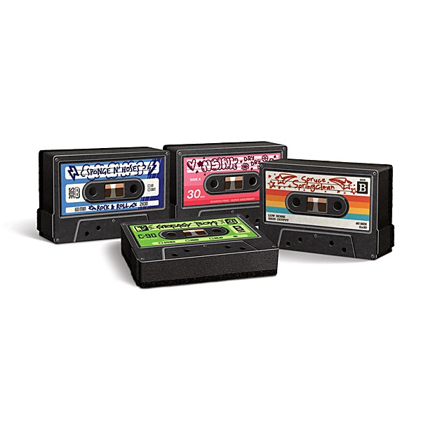

# Mix Tape from Linda

By **Various Artists**

## Album Data

- **Catalog:** Beets
- **Format:** Digital, Album
- **Album:** Mix Tape from Linda
- **Artist:** Various Artists
- **Albumartist:** Various Artists
- **Genre:** Soft Rock
- **MusicBrainz Album Artist ID:** 
- **MusicBrainz Album ID:** 
- **MusicBrainz Release Group ID:** 
- **Year:** 0000
- **Catalog #:** 
- **Label:** Peter Pan
- **Total Tracks:** 00

## Album Tracks

### Track 01 - Monster Mash

- **Artist:** Bobby "Boris" Pickett
- **Format:** MP3
- **Genre:** Rock And Roll
- **Length:** 3:20
- **MusicBrainz Track ID:** 
- **Title:** Monster Mash
- **Track:** 01
- **Year:** 1995

### Track 03 - Doin' The Zombie

- **Artist:** Chubby Checker
- **Format:** MP3
- **Genre:** Rockabilly
- **Length:** 3:12
- **MusicBrainz Track ID:** 
- **Title:** Doin' The Zombie
- **Track:** 03
- **Year:** 1995

### Track 10 - Spooky

- **Artist:** Classics IV
- **Format:** MP3
- **Genre:** Pop
- **Length:** 2:38
- **MusicBrainz Track ID:** 
- **Title:** Spooky
- **Track:** 10
- **Year:** 1995

### Track 08 - Dead Man's Curve

- **Artist:** Jan & Dean
- **Format:** MP3
- **Genre:** Surf Rock
- **Length:** 2:27
- **MusicBrainz Track ID:** 
- **Title:** Dead Man's Curve
- **Track:** 08
- **Year:** 1995

### Track 07 - Haunted House

- **Artist:** Jumpin' Gene Simmons
- **Format:** MP3
- **Genre:** Psychobilly
- **Length:** 2:33
- **MusicBrainz Track ID:** 
- **Title:** Haunted House
- **Track:** 07
- **Year:** 1995

### Track 02 - It's My Party

- **Artist:** Lesley Gore
- **Format:** MP3
- **Genre:** Pop
- **Length:** 2:16
- **MusicBrainz Track ID:** 
- **Title:** It's My Party
- **Track:** 02
- **Year:** 1995

### Track 06 - In The Midnight Hour

- **Artist:** Martha Reeves
- **Format:** MP3
- **Genre:** Close Harmony
- **Length:** 2:22
- **MusicBrainz Track ID:** 
- **Title:** In The Midnight Hour
- **Track:** 06
- **Year:** 1995

### Track 09 - Li'l Red Riding Hood

- **Artist:** Sam The Sham & The Pharohs
- **Format:** MP3
- **Genre:** Garage Rock
- **Length:** 2:44
- **MusicBrainz Track ID:** 
- **Title:** Li'l Red Riding Hood
- **Track:** 09
- **Year:** 1995

### Track 04 - Witch Doctor

- **Artist:** Sha Na Na
- **Format:** MP3
- **Genre:** Humor
- **Length:** 2:22
- **MusicBrainz Track ID:** 
- **Title:** Witch Doctor
- **Track:** 04
- **Year:** 1995

### Track 05 - The Purple People Eater

- **Artist:** Sheb Wooley
- **Format:** MP3
- **Genre:** Rockabilly
- **Length:** 2:15
- **MusicBrainz Track ID:** 
- **Title:** The Purple People Eater
- **Track:** 05
- **Year:** 1995

