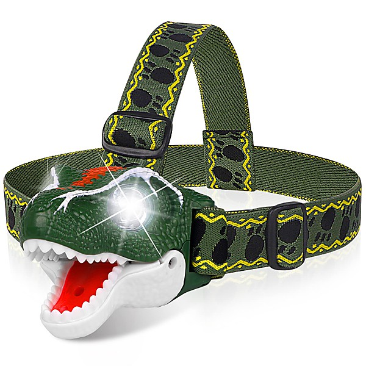

# Not Lame Brand Super Charged Flash Light Pops

By **Various Artists**

## Album Data

- **Catalog:** Beets
- **Format:** Digital, Album
- **Album:** Not Lame Brand Super Charged Flash Light Pops
- **Artist:** Various Artists
- **Albumartist:** Various Artists
- **Genre:** Power Pop
- **MusicBrainz Album Artist ID:** 
- **MusicBrainz Album ID:** 
- **MusicBrainz Release Group ID:** 
- **Year:** 2003
- **Catalog #:** 
- **Label:** 
- **Total Tracks:** 17

## Album Tracks

### Track 07 - Never Ever

- **Artist:** All Saints
- **Format:** ALAC
- **Genre:** Britpop
- **Length:** 4:46
- **MusicBrainz Track ID:** 
- **Title:** Never Ever
- **Track:** 07
- **Year:** 1998

### Track 13 - Barbie Girl

- **Artist:** Aqua
- **Format:** ALAC
- **Genre:** Europop
- **Length:** 3:16
- **MusicBrainz Track ID:** 
- **Title:** Barbie Girl
- **Track:** 13
- **Year:** 1997

### Track 02 - As Long As You Love Me

- **Artist:** Backstreet Boys
- **Format:** ALAC
- **Genre:** Pop
- **Length:** 3:32
- **MusicBrainz Track ID:** 
- **Title:** As Long As You Love Me
- **Track:** 02
- **Year:** 1997

### Track 12 - Anytime

- **Artist:** Brian McKnight
- **Format:** ALAC
- **Genre:** Soul
- **Length:** 4:34
- **MusicBrainz Track ID:** 
- **Title:** Anytime
- **Track:** 12
- **Year:** 1997

### Track 10 - Zoot Suit Riot

- **Artist:** Cherry Poppin' Daddies
- **Format:** ALAC
- **Genre:** Swing
- **Length:** 3:54
- **MusicBrainz Track ID:** 
- **Title:** Zoot Suit Riot
- **Track:** 10
- **Year:** 1998

### Track 15 - I Will Buy You A New Life

- **Artist:** Everclear
- **Format:** ALAC
- **Genre:** Grunge
- **Length:** 3:58
- **MusicBrainz Track ID:** 
- **Title:** I Will Buy You A New Life
- **Track:** 15
- **Year:** 1998

### Track 03 - The Way

- **Artist:** Fastball
- **Format:** ALAC
- **Genre:** Alternative Rock
- **Length:** 4:16
- **MusicBrainz Track ID:** 
- **Title:** The Way
- **Track:** 03
- **Year:** 1998

### Track 09 - Mmmbop

- **Artist:** Hanson
- **Format:** ALAC
- **Genre:** Teen Pop
- **Length:** 4:29
- **MusicBrainz Track ID:** 
- **Title:** Mmmbop
- **Track:** 09
- **Year:** 1997

### Track 04 - Flagpole Sitta

- **Artist:** Harvey Danger
- **Format:** ALAC
- **Genre:** Indie Rock
- **Length:** 3:37
- **MusicBrainz Track ID:** 
- **Title:** Flagpole Sitta
- **Track:** 04
- **Year:** 1998

### Track 11 - Shorty (You Keep Playin' With My Mind)

- **Artist:** Imajin
- **Format:** ALAC
- **Genre:** Pop
- **Length:** 4:13
- **MusicBrainz Track ID:** 
- **Title:** Shorty (You Keep Playin' With My Mind)
- **Track:** 11
- **Year:** 1998

### Track 01 - Together Again

- **Artist:** Janet Jackson
- **Format:** ALAC
- **Genre:** Soul
- **Length:** 5:02
- **MusicBrainz Track ID:** 
- **Title:** Together Again
- **Track:** 01
- **Year:** 1998

### Track 06 - All My Life

- **Artist:** K-Ci & JoJo
- **Format:** ALAC
- **Genre:** Soul
- **Length:** 3:41
- **MusicBrainz Track ID:** 
- **Title:** All My Life
- **Track:** 06
- **Year:** 1997

### Track 16 - Fly Away

- **Artist:** Lenny Kravitz
- **Format:** ALAC
- **Genre:** Funk
- **Length:** 3:43
- **MusicBrainz Track ID:** 
- **Title:** Fly Away
- **Track:** 16
- **Year:** 1998

### Track 17 - Sex And Candy

- **Artist:** Marcy Playground
- **Format:** ALAC
- **Genre:** Post-Grunge
- **Length:** 2:52
- **MusicBrainz Track ID:** 
- **Title:** Sex And Candy
- **Track:** 17
- **Year:** 1997

### Track 14 - Karma Police

- **Artist:** Radiohead
- **Format:** ALAC
- **Genre:** Indie Rock
- **Length:** 4:19
- **MusicBrainz Track ID:** 
- **Title:** Karma Police
- **Track:** 14
- **Year:** 1997

### Track 05 - Say You'll Be There

- **Artist:** Spice Girls
- **Format:** ALAC
- **Genre:** Pop
- **Length:** 3:57
- **MusicBrainz Track ID:** 
- **Title:** Say You'll Be There
- **Track:** 05
- **Year:** 1996

### Track 08 - If You Could See

- **Artist:** Tonic
- **Format:** ALAC
- **Genre:** Post-Grunge
- **Length:** 4:23
- **MusicBrainz Track ID:** 
- **Title:** If You Could See
- **Track:** 08
- **Year:** 1998

