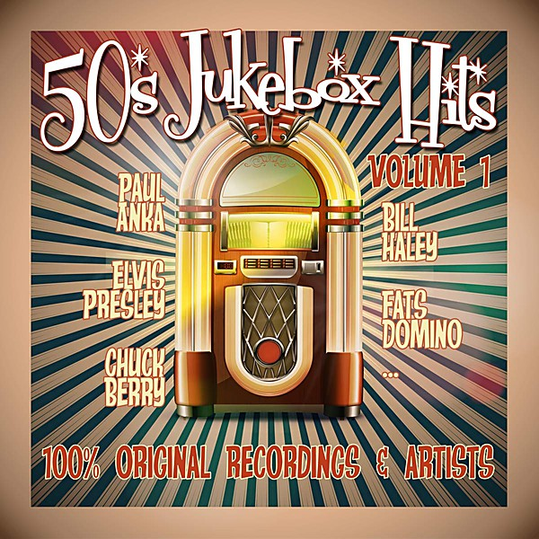

# Oldies But Goodies, Vol. 1

By **Various Artists**

## Album Data

- **Catalog:** Beets
- **Format:** Digital, Album
- **Album:** Oldies But Goodies, Vol. 1
- **Artist:** Various Artists
- **Albumartist:** Various Artists
- **Genre:** Swing
- **MusicBrainz Album Artist ID:** 
- **MusicBrainz Album ID:** 
- **MusicBrainz Release Group ID:** 
- **Year:** 1987
- **Catalog #:** 
- **Label:** 
- **Total Tracks:** 00

## Album Tracks

### Track 11 - Fire

- **Artist:** Crazy World Of Arthur Brown
- **Format:** MP3
- **Genre:** Psychedelic Rock
- **Length:** 2:55
- **MusicBrainz Track ID:** 
- **Title:** Fire
- **Track:** 11
- **Year:** 0000

### Track 14 - Love Child

- **Artist:** Diana Ross & the Supremes
- **Format:** MP3
- **Genre:** Soul
- **Length:** 2:57
- **MusicBrainz Track ID:** 
- **Title:** Love Child
- **Track:** 14
- **Year:** 0000

### Track 18 - I'm Gonna Make You Love Me

- **Artist:** Diana Ross & the Supremes and The Temptations
- **Format:** MP3
- **Genre:** Soul
- **Length:** 3:10
- **MusicBrainz Track ID:** 
- **Title:** I'm Gonna Make You Love Me
- **Track:** 18
- **Year:** 0000

### Track 02 - Lady Willpower

- **Artist:** Gary Puckett & The Union Gap
- **Format:** MP3
- **Genre:** Pop
- **Length:** 2:49
- **MusicBrainz Track ID:** 
- **Title:** Lady Willpower
- **Track:** 02
- **Year:** 0000

### Track 19 - Wichita Lineman

- **Artist:** Glen Campbell
- **Format:** MP3
- **Genre:** Classic Country
- **Length:** 3:04
- **MusicBrainz Track ID:** 
- **Title:** Wichita Lineman
- **Track:** 19
- **Year:** 0000

### Track 01 - Grazing In The Grass

- **Artist:** Hugh Masekela
- **Format:** MP3
- **Genre:** Soul
- **Length:** 2:42
- **MusicBrainz Track ID:** 
- **Title:** Grazing In The Grass
- **Track:** 01
- **Year:** 0000

### Track 09 - Harper Valley P.T.A.

- **Artist:** Jeannie C. Riley
- **Format:** MP3
- **Genre:** Classic Country
- **Length:** 3:18
- **MusicBrainz Track ID:** 
- **Title:** Harper Valley P.T.A.
- **Track:** 09
- **Year:** 0000

### Track 08 - Light My Fire

- **Artist:** José Feliciano
- **Format:** MP3
- **Genre:** Uk Garage
- **Length:** 3:39
- **MusicBrainz Track ID:** 
- **Title:** Light My Fire
- **Track:** 08
- **Year:** 0000

### Track 16 - I Heard It Through The Grapevine

- **Artist:** Marvin Gaye
- **Format:** MP3
- **Genre:** Soul
- **Length:** 3:12
- **MusicBrainz Track ID:** 
- **Title:** I Heard It Through The Grapevine
- **Track:** 16
- **Year:** 0000

### Track 13 - Those Were The Days

- **Artist:** Mary Hopkin
- **Format:** MP3
- **Genre:** Pop
- **Length:** 4:58
- **MusicBrainz Track ID:** 
- **Title:** Those Were The Days
- **Track:** 13
- **Year:** 0000

### Track 04 - Classical Gas

- **Artist:** Mason Williams
- **Format:** MP3
- **Genre:** Rock
- **Length:** 3:05
- **MusicBrainz Track ID:** 
- **Title:** Classical Gas
- **Track:** 04
- **Year:** 0000

### Track 12 - Little Green Apples

- **Artist:** O.C. Smith
- **Format:** MP3
- **Genre:** Soul
- **Length:** 3:57
- **MusicBrainz Track ID:** 
- **Title:** Little Green Apples
- **Track:** 12
- **Year:** 0000

### Track 22 - Oh How Happy

- **Artist:** Shades Of Blue
- **Format:** MP3
- **Genre:** Soul
- **Length:** 3:01
- **MusicBrainz Track ID:** 
- **Title:** Oh How Happy
- **Track:** 22
- **Year:** 0000

### Track 07 - Born To Be Wild

- **Artist:** Steppenwolf
- **Format:** MP3
- **Genre:** Hard Rock
- **Length:** 3:30
- **MusicBrainz Track ID:** 
- **Title:** Born To Be Wild
- **Track:** 07
- **Year:** 0000

### Track 15 - Magic Carpet Ride

- **Artist:** Steppenwolf
- **Format:** MP3
- **Genre:** Psychedelic Rock
- **Length:** 4:29
- **MusicBrainz Track ID:** 
- **Title:** Magic Carpet Ride
- **Track:** 15
- **Year:** 0000

### Track 17 - For Once In My Life

- **Artist:** Stevie Wonder
- **Format:** MP3
- **Genre:** Soul
- **Length:** 2:49
- **MusicBrainz Track ID:** 
- **Title:** For Once In My Life
- **Track:** 17
- **Year:** 0000

### Track 03 - Stoned Soul Picnic

- **Artist:** The 5th Dimension
- **Format:** MP3
- **Genre:** Soul
- **Length:** 3:28
- **MusicBrainz Track ID:** 
- **Title:** Stoned Soul Picnic
- **Track:** 03
- **Year:** 0000

### Track 10 - Hey Jude

- **Artist:** The Beatles
- **Format:** MP3
- **Genre:** Rock
- **Length:** 7:10
- **MusicBrainz Track ID:** 
- **Title:** Hey Jude
- **Track:** 10
- **Year:** 0000

### Track 05 - Hello, I Love You

- **Artist:** The Doors
- **Format:** MP3
- **Genre:** Psychedelic Rock
- **Length:** 2:16
- **MusicBrainz Track ID:** 
- **Title:** Hello, I Love You
- **Track:** 05
- **Year:** 0000

### Track 06 - People Got To Be Free

- **Artist:** The Rascals
- **Format:** MP3
- **Genre:** Blue-Eyed Soul
- **Length:** 3:00
- **MusicBrainz Track ID:** 
- **Title:** People Got To Be Free
- **Track:** 06
- **Year:** 0000

### Track 21 - Crimson And Clover

- **Artist:** Tommy James & The Shondells
- **Format:** MP3
- **Genre:** Rock
- **Length:** 5:29
- **MusicBrainz Track ID:** 
- **Title:** Crimson And Clover
- **Track:** 21
- **Year:** 0000

### Track 20 - Soulful Strut

- **Artist:** Young-Holt Unlimited
- **Format:** MP3
- **Genre:** Soul Jazz
- **Length:** 3:03
- **MusicBrainz Track ID:** 
- **Title:** Soulful Strut
- **Track:** 20
- **Year:** 0000

