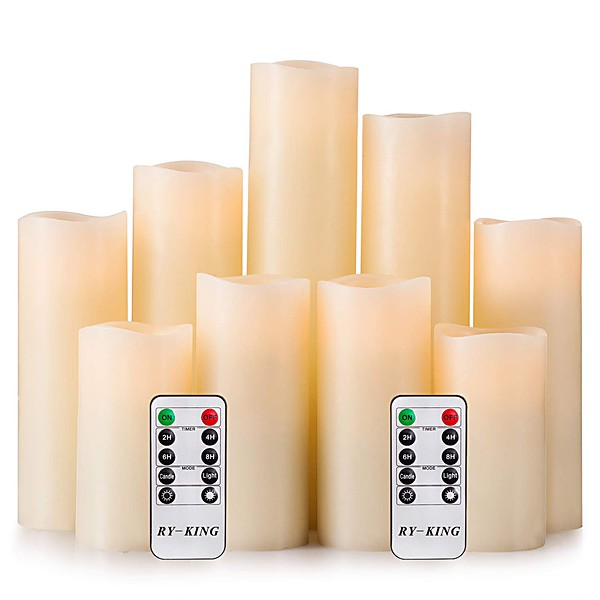

# Oldies But Goodies, Vol. 6

By **Various Artists**

## Album Data

- **Catalog:** Beets
- **Format:** Digital, Album
- **Album:** Oldies But Goodies, Vol. 6
- **Artist:** Various Artists
- **Albumartist:** Various Artists
- **Genre:** Rock
- **MusicBrainz Album Artist ID:** 
- **MusicBrainz Album ID:** 
- **MusicBrainz Release Group ID:** 
- **Year:** 0000
- **Catalog #:** 
- **Label:** 
- **Total Tracks:** 00

## Album Tracks

### Track 02 - Honky Tonk

- **Artist:** Bill Doggett
- **Format:** MP3
- **Genre:** Honky Tonk
- **Length:** 3:13
- **MusicBrainz Track ID:** 
- **Title:** Honky Tonk
- **Track:** 02
- **Year:** 0000

### Track 13 - True Love

- **Artist:** Bing Crosby & Grace Kelly
- **Format:** MP3
- **Genre:** Rockabilly
- **Length:** 3:07
- **MusicBrainz Track ID:** 
- **Title:** True Love
- **Track:** 13
- **Year:** 0000

### Track 05 - Que Sera, Sera (Whatever Will Be, Will Be)

- **Artist:** Doris Day
- **Format:** MP3
- **Genre:** Swing
- **Length:** 2:09
- **MusicBrainz Track ID:** 
- **Title:** Que Sera, Sera (Whatever Will Be, Will Be)
- **Track:** 05
- **Year:** 0000

### Track 08 - Canadian Sunset

- **Artist:** Eddie Heywood and Hugo Winterhalter
- **Format:** MP3
- **Genre:** Rockabilly
- **Length:** 3:00
- **MusicBrainz Track ID:** 
- **Title:** Canadian Sunset
- **Track:** 08
- **Year:** 0000

### Track 09 - Hound Dog

- **Artist:** Elvis Presley
- **Format:** MP3
- **Genre:** Rockabilly
- **Length:** 2:18
- **MusicBrainz Track ID:** 
- **Title:** Hound Dog
- **Track:** 09
- **Year:** 0000

### Track 10 - Don't Be Cruel

- **Artist:** Elvis Presley
- **Format:** MP3
- **Genre:** Rockabilly
- **Length:** 2:06
- **MusicBrainz Track ID:** 
- **Title:** Don't Be Cruel
- **Track:** 10
- **Year:** 0000

### Track 11 - Love Me Tender

- **Artist:** Elvis Presley
- **Format:** MP3
- **Genre:** Rock And Roll
- **Length:** 2:51
- **MusicBrainz Track ID:** 
- **Title:** Love Me Tender
- **Track:** 11
- **Year:** 0000

### Track 24 - All Shook Up

- **Artist:** Elvis Presley
- **Format:** MP3
- **Genre:** Rockabilly
- **Length:** 2:04
- **MusicBrainz Track ID:** 
- **Title:** All Shook Up
- **Track:** 24
- **Year:** 0000

### Track 14 - Blueberry Hill

- **Artist:** Fats Domino
- **Format:** MP3
- **Genre:** Rock And Roll
- **Length:** 2:23
- **MusicBrainz Track ID:** 
- **Title:** Blueberry Hill
- **Track:** 14
- **Year:** 0000

### Track 03 - The Wayward Wind

- **Artist:** Gogi Grant
- **Format:** MP3
- **Genre:** Classic Country
- **Length:** 2:59
- **MusicBrainz Track ID:** 
- **Title:** The Wayward Wind
- **Track:** 03
- **Year:** 0000

### Track 16 - Singing The Blues

- **Artist:** Guy Mitchell
- **Format:** MP3
- **Genre:** Rockabilly
- **Length:** 2:31
- **MusicBrainz Track ID:** 
- **Title:** Singing The Blues
- **Track:** 16
- **Year:** 0000

### Track 17 - Day-O (Banana Boat Song)

- **Artist:** Harry Belafonte
- **Format:** MP3
- **Genre:** Calypso
- **Length:** 3:07
- **MusicBrainz Track ID:** 
- **Title:** Day-O (Banana Boat Song)
- **Track:** 17
- **Year:** 0000

### Track 23 - Whole Lotta Shakin' Goin' On

- **Artist:** Jerry Lee Lewis
- **Format:** MP3
- **Genre:** Rockabilly
- **Length:** 2:55
- **MusicBrainz Track ID:** 
- **Title:** Whole Lotta Shakin' Goin' On
- **Track:** 23
- **Year:** 0000

### Track 15 - The Green Door

- **Artist:** Jim Lowe
- **Format:** MP3
- **Genre:** Rockabilly
- **Length:** 2:17
- **MusicBrainz Track ID:** 
- **Title:** The Green Door
- **Track:** 15
- **Year:** 0000

### Track 28 - So Rare

- **Artist:** Jimmy Dorsey
- **Format:** MP3
- **Genre:** Swing
- **Length:** 2:35
- **MusicBrainz Track ID:** 
- **Title:** So Rare
- **Track:** 28
- **Year:** 0000

### Track 12 - Just Walking In The Rain

- **Artist:** Johnnie Ray
- **Format:** MP3
- **Genre:** Easy Listening
- **Length:** 2:43
- **MusicBrainz Track ID:** 
- **Title:** Just Walking In The Rain
- **Track:** 12
- **Year:** 0000

### Track 29 - A White Sport Coat (And A Pink Carnation)

- **Artist:** Marty Robbins
- **Format:** MP3
- **Genre:** Honky Tonk
- **Length:** 2:34
- **MusicBrainz Track ID:** 
- **Title:** A White Sport Coat (And A Pink Carnation)
- **Track:** 29
- **Year:** 0000

### Track 27 - Love Letters In The Sand

- **Artist:** Pat Boone
- **Format:** MP3
- **Genre:** Pop
- **Length:** 2:16
- **MusicBrainz Track ID:** 
- **Title:** Love Letters In The Sand
- **Track:** 27
- **Year:** 0000

### Track 21 - Round And Round

- **Artist:** Perry Como
- **Format:** MP3
- **Genre:** Close Harmony
- **Length:** 2:37
- **MusicBrainz Track ID:** 
- **Title:** Round And Round
- **Track:** 21
- **Year:** 0000

### Track 22 - You Send Me

- **Artist:** Sam Cooke
- **Format:** MP3
- **Genre:** Soul
- **Length:** 2:45
- **MusicBrainz Track ID:** 
- **Title:** You Send Me
- **Track:** 22
- **Year:** 0000

### Track 18 - Young Love

- **Artist:** Sonny James
- **Format:** MP3
- **Genre:** Classic Country
- **Length:** 2:31
- **MusicBrainz Track ID:** 
- **Title:** Young Love
- **Track:** 18
- **Year:** 0000

### Track 19 - Young Love

- **Artist:** Tab Hunter
- **Format:** MP3
- **Genre:** Swing
- **Length:** 2:33
- **MusicBrainz Track ID:** 
- **Title:** Young Love
- **Track:** 19
- **Year:** 0000

### Track 26 - Searchin'

- **Artist:** The Coasters
- **Format:** MP3
- **Genre:** Soul
- **Length:** 2:44
- **MusicBrainz Track ID:** 
- **Title:** Searchin'
- **Track:** 26
- **Year:** 0000

### Track 25 - Little Darlin'

- **Artist:** The Diamonds
- **Format:** MP3
- **Genre:** Rock And Roll
- **Length:** 2:07
- **MusicBrainz Track ID:** 
- **Title:** Little Darlin'
- **Track:** 25
- **Year:** 0000

### Track 30 - Bye Bye Love

- **Artist:** The Everly Brothers
- **Format:** MP3
- **Genre:** Rockabilly
- **Length:** 2:21
- **MusicBrainz Track ID:** 
- **Title:** Bye Bye Love
- **Track:** 30
- **Year:** 0000

### Track 20 - Marianne

- **Artist:** The Hilltoppers
- **Format:** MP3
- **Genre:** Close Harmony
- **Length:** 2:17
- **MusicBrainz Track ID:** 
- **Title:** Marianne
- **Track:** 20
- **Year:** 0000

### Track 01 - Picnic

- **Artist:** The McGuire Sisters
- **Format:** MP3
- **Genre:** Close Harmony
- **Length:** 2:47
- **MusicBrainz Track ID:** 
- **Title:** Picnic
- **Track:** 01
- **Year:** 0000

### Track 06 - My Prayer

- **Artist:** The Platters
- **Format:** MP3
- **Genre:** Soul
- **Length:** 2:44
- **MusicBrainz Track ID:** 
- **Title:** My Prayer
- **Track:** 06
- **Year:** 0000

### Track 07 - The Great Pretender

- **Artist:** The Platters
- **Format:** MP3
- **Genre:** Soul
- **Length:** 2:43
- **MusicBrainz Track ID:** 
- **Title:** The Great Pretender
- **Track:** 07
- **Year:** 0000

### Track 04 - On The Street Where You Live

- **Artist:** Vic Damone
- **Format:** MP3
- **Genre:** Swing
- **Length:** 2:42
- **MusicBrainz Track ID:** 
- **Title:** On The Street Where You Live
- **Track:** 04
- **Year:** 0000

