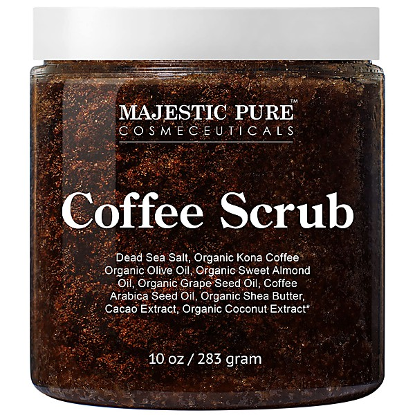

# Only Rock 'N Roll 1960-1964

By **Various Artists**

## Album Data

- **Catalog:** Beets
- **Format:** Digital, Album
- **Album:** Only Rock 'N Roll 1960-1964
- **Artist:** Various Artists
- **Albumartist:** Various Artists
- **Genre:** Pop
- **MusicBrainz Album Artist ID:** 
- **MusicBrainz Album ID:** 
- **MusicBrainz Release Group ID:** 
- **Year:** 1996
- **Catalog #:** 
- **Label:** 
- **Total Tracks:** 23

## Album Tracks

### Track 03 - Les Aventures Extraordinaires d'un Billet de Banque

- **Artist:** Bernard Lavilliers
- **Format:** ALAC
- **Genre:** Chanson
- **Length:** 3:19
- **MusicBrainz Track ID:** 
- **Title:** Les Aventures Extraordinaires d'un Billet de Banque
- **Track:** 03
- **Year:** 0000

### Track 07 - Dommage Que Tu Sois Mort

- **Artist:** Brigitte Fontaine
- **Format:** ALAC
- **Genre:** French Pop
- **Length:** 2:24
- **MusicBrainz Track ID:** 
- **Title:** Dommage Que Tu Sois Mort
- **Track:** 07
- **Year:** 0000

### Track 10 - Chanson d'un Jour d'Hiver

- **Artist:** Cortex
- **Format:** ALAC
- **Genre:** Jazz-Funk
- **Length:** 5:24
- **MusicBrainz Track ID:** 
- **Title:** Chanson d'un Jour d'Hiver
- **Track:** 10
- **Year:** 0000

### Track 21 - Chanson Pour Que Tu M'Aimes un Peu

- **Artist:** France Gall
- **Format:** ALAC
- **Genre:** French Pop
- **Length:** 2:25
- **MusicBrainz Track ID:** 
- **Title:** Chanson Pour Que Tu M'Aimes un Peu
- **Track:** 21
- **Year:** 0000

### Track 15 - Baleines

- **Artist:** Francois De Roubaix
- **Format:** ALAC
- **Genre:** Jazz
- **Length:** 3:17
- **MusicBrainz Track ID:** 
- **Title:** Baleines
- **Track:** 15
- **Year:** 0000

### Track 11 - Viens

- **Artist:** Françoise Hardy
- **Format:** ALAC
- **Genre:** French Pop
- **Length:** 2:14
- **MusicBrainz Track ID:** 
- **Title:** Viens
- **Track:** 11
- **Year:** 0000

### Track 05 - L'Élu

- **Artist:** Ilous & Decuyper
- **Format:** ALAC
- **Genre:** Soft Rock
- **Length:** 2:43
- **MusicBrainz Track ID:** 
- **Title:** L'Élu
- **Track:** 05
- **Year:** 0000

### Track 06 - La Métaphore

- **Artist:** Jacques Dutronc
- **Format:** ALAC
- **Genre:** French Pop
- **Length:** 3:19
- **MusicBrainz Track ID:** 
- **Title:** La Métaphore
- **Track:** 06
- **Year:** 0000

### Track 16 - Encore Lui

- **Artist:** Jane Birkin
- **Format:** ALAC
- **Genre:** French Pop
- **Length:** 2:25
- **MusicBrainz Track ID:** 
- **Title:** Encore Lui
- **Track:** 16
- **Year:** 0000

### Track 04 - Roses and Revolvers

- **Artist:** Janko Nilovic
- **Format:** ALAC
- **Genre:** Psychedelic Rock
- **Length:** 3:40
- **MusicBrainz Track ID:** 
- **Title:** Roses and Revolvers
- **Track:** 04
- **Year:** 0000

### Track 08 - Les Garde Violent au Secours du Roi

- **Artist:** Jean-Claude Vannier
- **Format:** ALAC
- **Genre:** Psychedelic Rock
- **Length:** 4:00
- **MusicBrainz Track ID:** 
- **Title:** Les Garde Violent au Secours du Roi
- **Track:** 08
- **Year:** 0000

### Track 01 - La Victime (Part 1)

- **Artist:** Karl Heinz Schäfer
- **Format:** ALAC
- **Genre:** French Pop
- **Length:** 2:08
- **MusicBrainz Track ID:** 
- **Title:** La Victime (Part 1)
- **Track:** 01
- **Year:** 0000

### Track 22 - La Victime (Part 2)

- **Artist:** Karl Heinz Schäfer
- **Format:** ALAC
- **Genre:** French Pop
- **Length:** 1:30
- **MusicBrainz Track ID:** 
- **Title:** La Victime (Part 2)
- **Track:** 22
- **Year:** 0000

### Track 12 - Couleurs

- **Artist:** Léonie
- **Format:** ALAC
- **Genre:** Pop Rock
- **Length:** 3:22
- **MusicBrainz Track ID:** 
- **Title:** Couleurs
- **Track:** 12
- **Year:** 0000

### Track 19 - Lileth

- **Artist:** Léonie
- **Format:** ALAC
- **Genre:** Pop Rock
- **Length:** 2:23
- **MusicBrainz Track ID:** 
- **Title:** Lileth
- **Track:** 19
- **Year:** 0000

### Track 18 - Le Bal des Laze

- **Artist:** Michel Polnareff
- **Format:** ALAC
- **Genre:** French Pop
- **Length:** 4:55
- **MusicBrainz Track ID:** 
- **Title:** Le Bal des Laze
- **Track:** 18
- **Year:** 0000

### Track 02 - Hélicoptère

- **Artist:** Mireille Darc
- **Format:** ALAC
- **Genre:** French Pop
- **Length:** 2:47
- **MusicBrainz Track ID:** 
- **Title:** Hélicoptère
- **Track:** 02
- **Year:** 0000

### Track 09 - Looking for You

- **Artist:** Nino Ferrer
- **Format:** ALAC
- **Genre:** Soul
- **Length:** 5:53
- **MusicBrainz Track ID:** 
- **Title:** Looking for You
- **Track:** 09
- **Year:** 0000

### Track 23 - La Chanson d'Hélène

- **Artist:** Romy Schneider & Michel Piccoli
- **Format:** ALAC
- **Genre:** French Pop
- **Length:** 2:47
- **MusicBrainz Track ID:** 
- **Title:** La Chanson d'Hélène
- **Track:** 23
- **Year:** 0000

### Track 17 - Evelyne

- **Artist:** Serge Gainsbourg
- **Format:** ALAC
- **Genre:** French Pop
- **Length:** 2:10
- **MusicBrainz Track ID:** 
- **Title:** Evelyne
- **Track:** 17
- **Year:** 0000

### Track 14 - Litanies

- **Artist:** Triangle
- **Format:** ALAC
- **Genre:** Progressive Rock
- **Length:** 5:09
- **MusicBrainz Track ID:** 
- **Title:** Litanies
- **Track:** 14
- **Year:** 0000

### Track 13 - Leslie Simone

- **Artist:** William Sheller
- **Format:** ALAC
- **Genre:** French Pop
- **Length:** 2:49
- **MusicBrainz Track ID:** 
- **Title:** Leslie Simone
- **Track:** 13
- **Year:** 0000

### Track 20 - Ystor

- **Artist:** Ys
- **Format:** ALAC
- **Genre:** Black Metal
- **Length:** 5:46
- **MusicBrainz Track ID:** 
- **Title:** Ystor
- **Track:** 20
- **Year:** 0000

