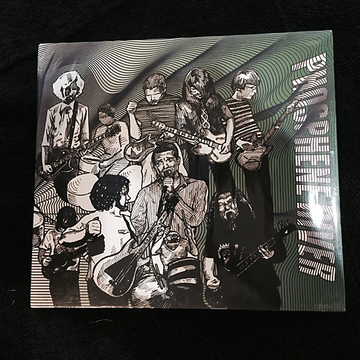

# Phosphene River

By **Various Artists**

## Album Data

- **Catalog:** Beets
- **Format:** Digital, Album
- **Album:** Phosphene River
- **Artist:** Various Artists
- **Albumartist:** Various Artists
- **Genre:** Stoner Rock
- **MusicBrainz Album Artist ID:** 
- **MusicBrainz Album ID:** 
- **MusicBrainz Release Group ID:** 
- **Year:** 2008
- **Catalog #:** 
- **Label:** 
- **Total Tracks:** 11

## Album Tracks

### Track 01 - Better Than This

- **Artist:** Jeff Finlin
- **Format:** MP3
- **Genre:** Americana
- **Length:** 3:01
- **MusicBrainz Track ID:** 
- **Title:** Better Than This
- **Track:** 01
- **Year:** 2004

### Track 02 - Nothings Enough

- **Artist:** Jeff Finlin
- **Format:** MP3
- **Genre:** Americana
- **Length:** 4:40
- **MusicBrainz Track ID:** 
- **Title:** Nothings Enough
- **Track:** 02
- **Year:** 2004

### Track 02 - Sugar Blue

- **Artist:** Jeff Finlin
- **Format:** MP3
- **Genre:** Americana
- **Length:** 3:44
- **MusicBrainz Track ID:** 
- **Title:** Sugar Blue
- **Track:** 02
- **Year:** 2003

### Track 01 - Falling Slowly

- **Artist:** Nine Times Blue
- **Format:** MP3
- **Genre:** Indie Rock
- **Length:** 3:43
- **MusicBrainz Track ID:** 
- **Title:** Falling Slowly
- **Track:** 01
- **Year:** 2012

### Track 03 - Ron Nasty

- **Artist:** Red Jacket Mine
- **Format:** MP3
- **Genre:** Indie Rock
- **Length:** 3:23
- **MusicBrainz Track ID:** 
- **Title:** Ron Nasty
- **Track:** 03
- **Year:** 2013

### Track 01 - Right Here Now

- **Artist:** Rich McCulley
- **Format:** MP3
- **Genre:** Indie Rock
- **Length:** 3:14
- **MusicBrainz Track ID:** 
- **Title:** Right Here Now
- **Track:** 01
- **Year:** 0000

### Track 03 - Eyman Prison

- **Artist:** Rollo Time
- **Format:** MP3
- **Genre:** Indie Rock
- **Length:** 3:18
- **MusicBrainz Track ID:** 
- **Title:** Eyman Prison
- **Track:** 03
- **Year:** 2011

### Track 03 - Soul On Fire

- **Artist:** Shake Some Action!
- **Format:** MP3
- **Genre:** Indie Rock
- **Length:** 3:18
- **MusicBrainz Track ID:** 
- **Title:** Soul On Fire
- **Track:** 03
- **Year:** 2013

### Track 10 - Last Match in the Tinderbox

- **Artist:** Shplang
- **Format:** MP3
- **Genre:** Indie Rock
- **Length:** 2:16
- **MusicBrainz Track ID:** 
- **Title:** Last Match in the Tinderbox
- **Track:** 10
- **Year:** 2009

### Track 05 - The Simple Thing

- **Artist:** Sitcom Neighbor
- **Format:** MP3
- **Genre:** Pop Rock
- **Length:** 2:35
- **MusicBrainz Track ID:** 
- **Title:** The Simple Thing
- **Track:** 05
- **Year:** 0000

### Track 11 - Giving way to Trains

- **Artist:** Spygenius
- **Format:** MP3
- **Genre:** Indie Rock
- **Length:** 3:38
- **MusicBrainz Track ID:** 
- **Title:** Giving way to Trains
- **Track:** 11
- **Year:** 2012

### Track 15 - Violette

- **Artist:** Stephen Bunovsky
- **Format:** MP3
- **Genre:** Indie Rock
- **Length:** 3:29
- **MusicBrainz Track ID:** 
- **Title:** Violette
- **Track:** 15
- **Year:** 2013

### Track 02 - Obscuriosity

- **Artist:** Stephen Lawrenson
- **Format:** MP3
- **Genre:** Power Pop
- **Length:** 4:15
- **MusicBrainz Track ID:** 
- **Title:** Obscuriosity
- **Track:** 02
- **Year:** 2012

### Track 02 - I Wanna

- **Artist:** Steven Wright-Mark
- **Format:** MP3
- **Genre:** Rock
- **Length:** 4:19
- **MusicBrainz Track ID:** 
- **Title:** I Wanna
- **Track:** 02
- **Year:** 2012

### Track 03 - Dreaming (2 Meter Sessies - Dutch radio/TV)

- **Artist:** The Posies
- **Format:** MP3
- **Genre:** Indie Rock
- **Length:** 3:10
- **MusicBrainz Track ID:** 
- **Title:** Dreaming (2 Meter Sessies - Dutch radio/TV)
- **Track:** 03
- **Year:** 0000

### Track 17 - Magnifying Mirror (Studio Outtake)

- **Artist:** The Posies
- **Format:** MP3
- **Genre:** Indie Rock
- **Length:** 3:28
- **MusicBrainz Track ID:** 
- **Title:** Magnifying Mirror (Studio Outtake)
- **Track:** 17
- **Year:** 0000

### Track 06 - What's Going Ahn? (outtake)

- **Artist:** The Posies
- **Format:** MP3
- **Genre:** Indie Rock
- **Length:** 3:23
- **MusicBrainz Track ID:** 
- **Title:** What's Going Ahn? (outtake)
- **Track:** 06
- **Year:** 0000

### Track 14 - Suddenly Mary (Muzak version)

- **Artist:** The Posies
- **Format:** MP3
- **Genre:** Indie Rock
- **Length:** 3:01
- **MusicBrainz Track ID:** 
- **Title:** Suddenly Mary (Muzak version)
- **Track:** 14
- **Year:** 0000

