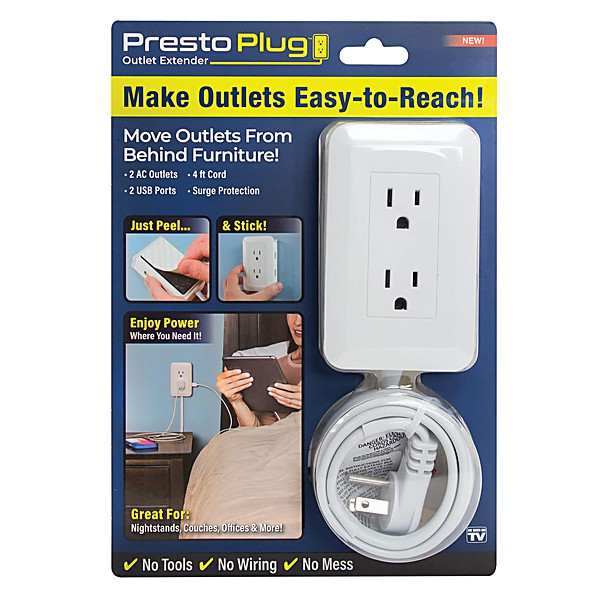

# PopGeekHeaven Present Power Pop Prime Vol. 9 [Disc 3]

By **Various Artists**

## Album Data

- **Catalog:** Beets
- **Format:** Digital, Album
- **Album:** PopGeekHeaven Present Power Pop Prime Vol. 9 [Disc 3]
- **Artist:** Various Artists
- **Albumartist:** Various Artists
- **Genre:** Power Pop
- **MusicBrainz Album Artist ID:** 
- **MusicBrainz Album ID:** 
- **MusicBrainz Release Group ID:** 
- **Year:** 0000
- **Catalog #:** 
- **Label:** 
- **Total Tracks:** 14

## Album Tracks

### Track 12 - Bored

- **Artist:** Alan Berhoft
- **Format:** AAC
- **Genre:** Power Pop
- **Length:** 3:32
- **MusicBrainz Track ID:** 
- **Title:** Bored
- **Track:** 12
- **Year:** 2012

### Track 08 - I Quit

- **Artist:** Benjimin R
- **Format:** AAC
- **Genre:** Hard Trance
- **Length:** 4:20
- **MusicBrainz Track ID:** 
- **Title:** I Quit
- **Track:** 08
- **Year:** 2012

### Track 03 - Can't Stop Thinking

- **Artist:** Buva
- **Format:** AAC
- **Genre:** Power Pop
- **Length:** 4:13
- **MusicBrainz Track ID:** 
- **Title:** Can't Stop Thinking
- **Track:** 03
- **Year:** 2012

### Track 10 - Symbols 'n Mascots

- **Artist:** Edward Rogers
- **Format:** AAC
- **Genre:** Classical
- **Length:** 2:40
- **MusicBrainz Track ID:** 
- **Title:** Symbols 'n Mascots
- **Track:** 10
- **Year:** 2012

### Track 02 - Don't Leave, Don't Go

- **Artist:** Elvyn
- **Format:** AAC
- **Genre:** Power Pop
- **Length:** 2:45
- **MusicBrainz Track ID:** 
- **Title:** Don't Leave, Don't Go
- **Track:** 02
- **Year:** 2012

### Track 01 - Froggy Mountain Shakedown

- **Artist:** Hans Rotenberry & Brad Jones
- **Format:** AAC
- **Genre:** Power Pop
- **Length:** 3:54
- **MusicBrainz Track ID:** 
- **Title:** Froggy Mountain Shakedown
- **Track:** 01
- **Year:** 2012

### Track 07 - Like A Bird In Its Gilded Cage

- **Artist:** Joel Streeter
- **Format:** AAC
- **Genre:** Power Pop
- **Length:** 4:02
- **MusicBrainz Track ID:** 
- **Title:** Like A Bird In Its Gilded Cage
- **Track:** 07
- **Year:** 2012

### Track 14 - Borrowed Sunshine

- **Artist:** Maple Mars
- **Format:** AAC
- **Genre:** Power Pop
- **Length:** 5:05
- **MusicBrainz Track ID:** 
- **Title:** Borrowed Sunshine
- **Track:** 14
- **Year:** 2012

### Track 06 - Here's To Feeling Fine

- **Artist:** Nushu
- **Format:** AAC
- **Genre:** Indie Rock
- **Length:** 3:06
- **MusicBrainz Track ID:** 
- **Title:** Here's To Feeling Fine
- **Track:** 06
- **Year:** 2012

### Track 04 - Her Camera

- **Artist:** Oranjuly
- **Format:** AAC
- **Genre:** Pop
- **Length:** 3:31
- **MusicBrainz Track ID:** 
- **Title:** Her Camera
- **Track:** 04
- **Year:** 2012

### Track 09 - I'm So In Love

- **Artist:** Secret Powers
- **Format:** AAC
- **Genre:** Power Pop
- **Length:** 3:42
- **MusicBrainz Track ID:** 
- **Title:** I'm So In Love
- **Track:** 09
- **Year:** 2012

### Track 05 - Dancing With Her Friends

- **Artist:** Sidewalk Driver
- **Format:** AAC
- **Genre:** Power Pop
- **Length:** 3:57
- **MusicBrainz Track ID:** 
- **Title:** Dancing With Her Friends
- **Track:** 05
- **Year:** 2012

### Track 11 - Comeback

- **Artist:** The Offbeat
- **Format:** AAC
- **Genre:** Power Pop
- **Length:** 2:33
- **MusicBrainz Track ID:** 
- **Title:** Comeback
- **Track:** 11
- **Year:** 2012

### Track 13 - Greenacre Land

- **Artist:** The Sunchymes
- **Format:** AAC
- **Genre:** Psychedelic Pop
- **Length:** 3:08
- **MusicBrainz Track ID:** 
- **Title:** Greenacre Land
- **Track:** 13
- **Year:** 2012

