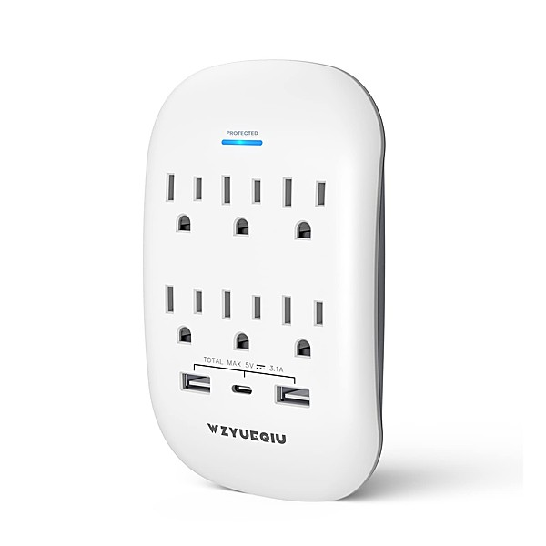

# PopGeekHeaven Presents Power Pop Prime Volume 9 [Disc 2]

By **Various Artists**

## Album Data

- **Catalog:** Beets
- **Format:** Digital, Album
- **Album:** PopGeekHeaven Presents Power Pop Prime Volume 9 [Disc 2]
- **Artist:** Various Artists
- **Albumartist:** Various Artists
- **Genre:** Power Pop
- **MusicBrainz Album Artist ID:** 
- **MusicBrainz Album ID:** 
- **MusicBrainz Release Group ID:** 
- **Year:** 2012
- **Catalog #:** 
- **Label:** 
- **Total Tracks:** 15

## Album Tracks

### Track 01 - Tell Me

- **Artist:** Chris Lund
- **Format:** ALAC
- **Genre:** Power Pop
- **Length:** 2:27
- **MusicBrainz Track ID:** 
- **Title:** Tell Me
- **Track:** 01
- **Year:** 2017

### Track 05 - All Right, All Night

- **Artist:** Cirrone
- **Format:** ALAC
- **Genre:** Power Pop
- **Length:** 2:42
- **MusicBrainz Track ID:** 
- **Title:** All Right, All Night
- **Track:** 05
- **Year:** 2017

### Track 04 - Fear The Summer

- **Artist:** Colman Gota
- **Format:** ALAC
- **Genre:** Power Pop
- **Length:** 2:50
- **MusicBrainz Track ID:** 
- **Title:** Fear The Summer
- **Track:** 04
- **Year:** 2017

### Track 12 - Let's Skip To The Good Bit

- **Artist:** Duncan Reid And The Big Heads
- **Format:** ALAC
- **Genre:** Power Pop
- **Length:** 3:19
- **MusicBrainz Track ID:** 
- **Title:** Let's Skip To The Good Bit
- **Track:** 12
- **Year:** 2017

### Track 03 - A Long Way From Here

- **Artist:** Everet Almond
- **Format:** ALAC
- **Genre:** Power Pop
- **Length:** 2:37
- **MusicBrainz Track ID:** 
- **Title:** A Long Way From Here
- **Track:** 03
- **Year:** 2017

### Track 02 - Majorca

- **Artist:** Eyerollers
- **Format:** ALAC
- **Genre:** Power Pop
- **Length:** 2:18
- **MusicBrainz Track ID:** 
- **Title:** Majorca
- **Track:** 02
- **Year:** 2017

### Track 03 - Tea & Butter Tarts

- **Artist:** Gentle Brent
- **Format:** ALAC
- **Genre:** Indie Pop
- **Length:** 2:30
- **MusicBrainz Track ID:** 
- **Title:** Tea & Butter Tarts
- **Track:** 03
- **Year:** 2017

### Track 08 - My Little Red Tape

- **Artist:** John San Juan
- **Format:** ALAC
- **Genre:** Power Pop
- **Length:** 2:12
- **MusicBrainz Track ID:** 
- **Title:** My Little Red Tape
- **Track:** 08
- **Year:** 2017

### Track 09 - I'll Move Closer

- **Artist:** Justin Levinson
- **Format:** ALAC
- **Genre:** Power Pop
- **Length:** 2:30
- **MusicBrainz Track ID:** 
- **Title:** I'll Move Closer
- **Track:** 09
- **Year:** 2017

### Track 01 - No More Girls

- **Artist:** Michael Simmons
- **Format:** ALAC
- **Genre:** Power Pop
- **Length:** 2:46
- **MusicBrainz Track ID:** 
- **Title:** No More Girls
- **Track:** 01
- **Year:** 2017

### Track 02 - Count To 10

- **Artist:** Michael Slawter
- **Format:** ALAC
- **Genre:** Power Pop
- **Length:** 3:30
- **MusicBrainz Track ID:** 
- **Title:** Count To 10
- **Track:** 02
- **Year:** 2017

### Track 06 - Postcard From Bondi

- **Artist:** P76
- **Format:** ALAC
- **Genre:** Power Pop
- **Length:** 2:07
- **MusicBrainz Track ID:** 
- **Title:** Postcard From Bondi
- **Track:** 06
- **Year:** 2017

### Track 05 - Therapy

- **Artist:** Plasticsoul
- **Format:** ALAC
- **Genre:** Power Pop
- **Length:** 4:16
- **MusicBrainz Track ID:** 
- **Title:** Therapy
- **Track:** 05
- **Year:** 2017

### Track 10 - Girl Gone

- **Artist:** PROPELLER
- **Format:** ALAC
- **Genre:** Punk Rock
- **Length:** 3:04
- **MusicBrainz Track ID:** 
- **Title:** Girl Gone
- **Track:** 10
- **Year:** 2017

### Track 10 - All The Little Things

- **Artist:** Pseudonym
- **Format:** ALAC
- **Genre:** Indie Pop
- **Length:** 2:55
- **MusicBrainz Track ID:** 
- **Title:** All The Little Things
- **Track:** 10
- **Year:** 2017

### Track 11 - I Don't Need You

- **Artist:** Richard Turgeon
- **Format:** ALAC
- **Genre:** Power Pop
- **Length:** 3:13
- **MusicBrainz Track ID:** 
- **Title:** I Don't Need You
- **Track:** 11
- **Year:** 2017

### Track 08 - Owe To The Man

- **Artist:** Ruby Free
- **Format:** ALAC
- **Genre:** Power Pop
- **Length:** 3:46
- **MusicBrainz Track ID:** 
- **Title:** Owe To The Man
- **Track:** 08
- **Year:** 2017

### Track 04 - Insomnia

- **Artist:** Sitcom Neighbor
- **Format:** ALAC
- **Genre:** Pop Rock
- **Length:** 3:09
- **MusicBrainz Track ID:** 
- **Title:** Insomnia
- **Track:** 04
- **Year:** 2017

### Track 07 - What Did We Do?

- **Artist:** The Belmondos
- **Format:** ALAC
- **Genre:** Indie Rock
- **Length:** 3:44
- **MusicBrainz Track ID:** 
- **Title:** What Did We Do?
- **Track:** 07
- **Year:** 2017

### Track 14 - And Such And Such

- **Artist:** The Forty Nineteens
- **Format:** ALAC
- **Genre:** Indie Rock
- **Length:** 2:58
- **MusicBrainz Track ID:** 
- **Title:** And Such And Such
- **Track:** 14
- **Year:** 2017

### Track 06 - Homecoming

- **Artist:** The Glad Machine
- **Format:** ALAC
- **Genre:** Power Pop
- **Length:** 3:12
- **MusicBrainz Track ID:** 
- **Title:** Homecoming
- **Track:** 06
- **Year:** 2017

### Track 12 - Cricket Time

- **Artist:** The Hangabouts
- **Format:** ALAC
- **Genre:** Power Pop
- **Length:** 3:09
- **MusicBrainz Track ID:** 
- **Title:** Cricket Time
- **Track:** 12
- **Year:** 2017

### Track 16 - Only Game In Town

- **Artist:** The Morning Line
- **Format:** ALAC
- **Genre:** Alternative Rock
- **Length:** 7:16
- **MusicBrainz Track ID:** 
- **Title:** Only Game In Town
- **Track:** 16
- **Year:** 2017

### Track 11 - Mary Go Round

- **Artist:** The Naturals
- **Format:** ALAC
- **Genre:** Noise Rock
- **Length:** 3:18
- **MusicBrainz Track ID:** 
- **Title:** Mary Go Round
- **Track:** 11
- **Year:** 2017

### Track 15 - Radio Generation

- **Artist:** The New Frustrations
- **Format:** ALAC
- **Genre:** Power Pop
- **Length:** 3:52
- **MusicBrainz Track ID:** 
- **Title:** Radio Generation
- **Track:** 15
- **Year:** 2017

### Track 15 - Dance With Me Tonight

- **Artist:** The Popdudes
- **Format:** ALAC
- **Genre:** Power Pop
- **Length:** 2:03
- **MusicBrainz Track ID:** 
- **Title:** Dance With Me Tonight
- **Track:** 15
- **Year:** 2017

### Track 07 - Don't Give Up

- **Artist:** The Rallies
- **Format:** ALAC
- **Genre:** Power Pop
- **Length:** 3:26
- **MusicBrainz Track ID:** 
- **Title:** Don't Give Up
- **Track:** 07
- **Year:** 2017

### Track 13 - Kidnapped Information

- **Artist:** Third Of Never
- **Format:** ALAC
- **Genre:** Power Pop
- **Length:** 2:47
- **MusicBrainz Track ID:** 
- **Title:** Kidnapped Information
- **Track:** 13
- **Year:** 2017

### Track 14 - Every Time With You

- **Artist:** Thrift Store Halo
- **Format:** ALAC
- **Genre:** Rock
- **Length:** 3:09
- **MusicBrainz Track ID:** 
- **Title:** Every Time With You
- **Track:** 14
- **Year:** 2017

### Track 13 - Long Days Gone

- **Artist:** Trip Wire
- **Format:** ALAC
- **Genre:** Heavy Metal
- **Length:** 2:45
- **MusicBrainz Track ID:** 
- **Title:** Long Days Gone
- **Track:** 13
- **Year:** 2017

### Track 09 - Never Been So Blind

- **Artist:** Your Gracious Host
- **Format:** ALAC
- **Genre:** Power Pop
- **Length:** 3:29
- **MusicBrainz Track ID:** 
- **Title:** Never Been So Blind
- **Track:** 09
- **Year:** 2017

