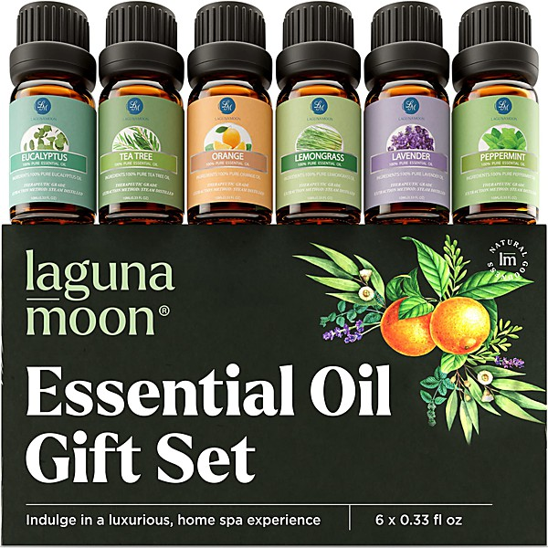

# Pottery Barn

By **Various Artists**

## Album Data

- **Catalog:** Beets
- **Format:** Digital, Album
- **Album:** Pottery Barn
- **Artist:** Various Artists
- **Albumartist:** Various Artists
- **Genre:** Vocal Jazz
- **MusicBrainz Album Artist ID:** 
- **MusicBrainz Album ID:** 
- **MusicBrainz Release Group ID:** 
- **Year:** 1996
- **Catalog #:** 
- **Label:** 
- **Total Tracks:** 20

## Album Tracks

### Track 04 - You're Not In Love

- **Artist:** Coke Belda
- **Format:** ALAC
- **Genre:** Power Pop
- **Length:** 3:48
- **MusicBrainz Track ID:** 
- **Title:** You're Not In Love
- **Track:** 04
- **Year:** 0000

### Track 05 - Highlighter

- **Artist:** David Divad
- **Format:** ALAC
- **Genre:** Power Pop
- **Length:** 3:05
- **MusicBrainz Track ID:** 
- **Title:** Highlighter
- **Track:** 05
- **Year:** 0000

### Track 09 - Till I Get To Your House

- **Artist:** Donny Grace
- **Format:** ALAC
- **Genre:** Power Pop
- **Length:** 2:56
- **MusicBrainz Track ID:** 
- **Title:** Till I Get To Your House
- **Track:** 09
- **Year:** 0000

### Track 06 - Ellie

- **Artist:** Elvyn
- **Format:** ALAC
- **Genre:** Power Pop
- **Length:** 2:56
- **MusicBrainz Track ID:** 
- **Title:** Ellie
- **Track:** 06
- **Year:** 0000

### Track 07 - Repeat Deceiver

- **Artist:** Graham Alexander
- **Format:** ALAC
- **Genre:** Power Pop
- **Length:** 3:00
- **MusicBrainz Track ID:** 
- **Title:** Repeat Deceiver
- **Track:** 07
- **Year:** 0000

### Track 02 - Five Separate Lives

- **Artist:** Jared Lekites
- **Format:** ALAC
- **Genre:** Lo-Fi
- **Length:** 2:28
- **MusicBrainz Track ID:** 
- **Title:** Five Separate Lives
- **Track:** 02
- **Year:** 0000

### Track 08 - Big Black Hole

- **Artist:** Jimmy Haber
- **Format:** ALAC
- **Genre:** Power Pop
- **Length:** 4:45
- **MusicBrainz Track ID:** 
- **Title:** Big Black Hole
- **Track:** 08
- **Year:** 0000

### Track 19 - Sunday

- **Artist:** Marco Rea
- **Format:** ALAC
- **Genre:** Power Pop
- **Length:** 2:52
- **MusicBrainz Track ID:** 
- **Title:** Sunday
- **Track:** 19
- **Year:** 0000

### Track 01 - Heartbreak

- **Artist:** Maureen
- **Format:** ALAC
- **Genre:** Dancehall
- **Length:** 3:14
- **MusicBrainz Track ID:** 
- **Title:** Heartbreak
- **Track:** 01
- **Year:** 0000

### Track 11 - Don't Open That Door

- **Artist:** Michael Carpenter
- **Format:** ALAC
- **Genre:** Power Pop
- **Length:** 3:11
- **MusicBrainz Track ID:** 
- **Title:** Don't Open That Door
- **Track:** 11
- **Year:** 0000

### Track 16 - See Some Lights

- **Artist:** Nato Coles And The Blue Diamond Band
- **Format:** ALAC
- **Genre:** Punk Rock
- **Length:** 4:14
- **MusicBrainz Track ID:** 
- **Title:** See Some Lights
- **Track:** 16
- **Year:** 0000

### Track 12 - Freak Flag

- **Artist:** Ryan Hamilton And The Traitors
- **Format:** ALAC
- **Genre:** Power Pop
- **Length:** 3:32
- **MusicBrainz Track ID:** 
- **Title:** Freak Flag
- **Track:** 12
- **Year:** 0000

### Track 10 - Something's Happening

- **Artist:** Secret Friend
- **Format:** ALAC
- **Genre:** Power Pop
- **Length:** 4:03
- **MusicBrainz Track ID:** 
- **Title:** Something's Happening
- **Track:** 10
- **Year:** 0000

### Track 15 - Mariamne

- **Artist:** Stereo Twins
- **Format:** ALAC
- **Genre:** Power Pop
- **Length:** 2:30
- **MusicBrainz Track ID:** 
- **Title:** Mariamne
- **Track:** 15
- **Year:** 0000

### Track 13 - So Long

- **Artist:** Taylor Locke & The Roughs
- **Format:** ALAC
- **Genre:** Indie Rock
- **Length:** 2:48
- **MusicBrainz Track ID:** 
- **Title:** So Long
- **Track:** 13
- **Year:** 0000

### Track 14 - Apollo

- **Artist:** The Lunar Laugh
- **Format:** ALAC
- **Genre:** Power Pop
- **Length:** 2:42
- **MusicBrainz Track ID:** 
- **Title:** Apollo
- **Track:** 14
- **Year:** 0000

### Track 03 - Tambareen

- **Artist:** The Ravines
- **Format:** ALAC
- **Genre:** Power Pop
- **Length:** 3:22
- **MusicBrainz Track ID:** 
- **Title:** Tambareen
- **Track:** 03
- **Year:** 0000

### Track 17 - A Place for Me

- **Artist:** The Turnback
- **Format:** ALAC
- **Genre:** Power Pop
- **Length:** 2:54
- **MusicBrainz Track ID:** 
- **Title:** A Place for Me
- **Track:** 17
- **Year:** 0000

### Track 18 - Afterlife

- **Artist:** Three Hour Tour
- **Format:** ALAC
- **Genre:** Power Pop
- **Length:** 3:08
- **MusicBrainz Track ID:** 
- **Title:** Afterlife
- **Track:** 18
- **Year:** 0000

### Track 20 - Validated

- **Artist:** Wits End
- **Format:** ALAC
- **Genre:** Screamo
- **Length:** 3:14
- **MusicBrainz Track ID:** 
- **Title:** Validated
- **Track:** 20
- **Year:** 0000

