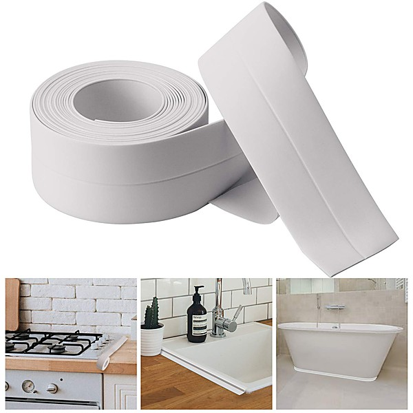

# Power Pop - The Best of 2015

By **Various Artists**

## Album Data

- **Catalog:** Beets
- **Format:** Digital, Album
- **Album:** Power Pop - The Best of 2015
- **Artist:** Various Artists
- **Albumartist:** Various Artists
- **Genre:** Power Pop
- **MusicBrainz Album Artist ID:** 
- **MusicBrainz Album ID:** 
- **MusicBrainz Release Group ID:** 
- **Year:** 0000
- **Catalog #:** 
- **Label:** 
- **Total Tracks:** 19

## Album Tracks

### Track 14 - Cannibal

- **Artist:** Andy Bopp
- **Format:** ALAC
- **Genre:** Pop
- **Length:** 3:18
- **MusicBrainz Track ID:** 
- **Title:** Cannibal
- **Track:** 14
- **Year:** 0000

### Track 03 - What There Could Have Been

- **Artist:** Automat
- **Format:** ALAC
- **Genre:** Synthpop
- **Length:** 3:52
- **MusicBrainz Track ID:** 
- **Title:** What There Could Have Been
- **Track:** 03
- **Year:** 0000

### Track 09 - Going Out

- **Artist:** Biltmore
- **Format:** ALAC
- **Genre:** Power Pop
- **Length:** 4:34
- **MusicBrainz Track ID:** 
- **Title:** Going Out
- **Track:** 09
- **Year:** 0000

### Track 08 - Place We Can Go

- **Artist:** David Brookings & The Average Lookings
- **Format:** ALAC
- **Genre:** Power Pop
- **Length:** 3:01
- **MusicBrainz Track ID:** 
- **Title:** Place We Can Go
- **Track:** 08
- **Year:** 0000

### Track 07 - Today

- **Artist:** Fireking
- **Format:** ALAC
- **Genre:** Power Pop
- **Length:** 3:52
- **MusicBrainz Track ID:** 
- **Title:** Today
- **Track:** 07
- **Year:** 0000

### Track 01 - Guiding Star

- **Artist:** Greg Pope
- **Format:** ALAC
- **Genre:** Power Pop
- **Length:** 2:41
- **MusicBrainz Track ID:** 
- **Title:** Guiding Star
- **Track:** 01
- **Year:** 0000

### Track 10 - That's American Life

- **Artist:** Joey Sykes
- **Format:** ALAC
- **Genre:** Power Pop
- **Length:** 3:12
- **MusicBrainz Track ID:** 
- **Title:** That's American Life
- **Track:** 10
- **Year:** 0000

### Track 02 - Bad News

- **Artist:** Ken Sharp
- **Format:** ALAC
- **Genre:** Power Pop
- **Length:** 3:54
- **MusicBrainz Track ID:** 
- **Title:** Bad News
- **Track:** 02
- **Year:** 0000

### Track 18 - Not Tonight

- **Artist:** London Egg
- **Format:** ALAC
- **Genre:** Power Pop
- **Length:** 2:34
- **MusicBrainz Track ID:** 
- **Title:** Not Tonight
- **Track:** 18
- **Year:** 0000

### Track 13 - One More Fall

- **Artist:** Mark Roebuck
- **Format:** ALAC
- **Genre:** Power Pop
- **Length:** 2:36
- **MusicBrainz Track ID:** 
- **Title:** One More Fall
- **Track:** 13
- **Year:** 0000

### Track 12 - Photo

- **Artist:** Michael Carpenter And The Cuban Heels
- **Format:** ALAC
- **Genre:** Power Pop
- **Length:** 4:08
- **MusicBrainz Track ID:** 
- **Title:** Photo
- **Track:** 12
- **Year:** 0000

### Track 11 - Sowannadoit

- **Artist:** Orange Humble Band
- **Format:** ALAC
- **Genre:** Indie Pop
- **Length:** 3:53
- **MusicBrainz Track ID:** 
- **Title:** Sowannadoit
- **Track:** 11
- **Year:** 0000

### Track 05 - Alex Whiz

- **Artist:** Ryan Allen And His Extra Arms
- **Format:** ALAC
- **Genre:** Power Pop
- **Length:** 3:46
- **MusicBrainz Track ID:** 
- **Title:** Alex Whiz
- **Track:** 05
- **Year:** 0000

### Track 15 - Trying To Keep It Simple

- **Artist:** Seth Swirsky
- **Format:** ALAC
- **Genre:** Indie Pop
- **Length:** 3:11
- **MusicBrainz Track ID:** 
- **Title:** Trying To Keep It Simple
- **Track:** 15
- **Year:** 0000

### Track 17 - The Coolest Kid In The Room

- **Artist:** Somerdale
- **Format:** ALAC
- **Genre:** Indie Rock
- **Length:** 3:05
- **MusicBrainz Track ID:** 
- **Title:** The Coolest Kid In The Room
- **Track:** 17
- **Year:** 0000

### Track 04 - On My Way

- **Artist:** The Forresters
- **Format:** ALAC
- **Genre:** Power Pop
- **Length:** 2:44
- **MusicBrainz Track ID:** 
- **Title:** On My Way
- **Track:** 04
- **Year:** 0000

### Track 19 - Rock All Night

- **Artist:** The Pinx
- **Format:** ALAC
- **Genre:** Psychedelic Rock
- **Length:** 2:50
- **MusicBrainz Track ID:** 
- **Title:** Rock All Night
- **Track:** 19
- **Year:** 0000

### Track 06 - A Geek Like Me

- **Artist:** The Simple Carnival
- **Format:** ALAC
- **Genre:** Indie Pop
- **Length:** 3:44
- **MusicBrainz Track ID:** 
- **Title:** A Geek Like Me
- **Track:** 06
- **Year:** 0000

### Track 16 - Silverdome

- **Artist:** Todd Wicks Dream Cruise
- **Format:** ALAC
- **Genre:** Power Pop
- **Length:** 2:53
- **MusicBrainz Track ID:** 
- **Title:** Silverdome
- **Track:** 16
- **Year:** 0000

