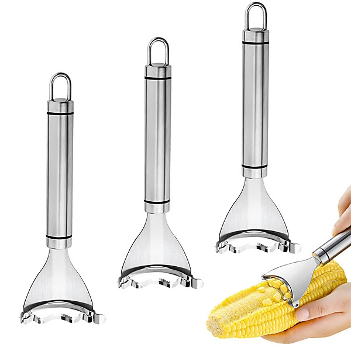

# Power Pop Planet Volume 1 [Disc 2]

By **Various Artists**

## Album Data

- **Catalog:** Beets
- **Format:** Digital, Album
- **Album:** Power Pop Planet Volume 1 [Disc 2]
- **Artist:** Various Artists
- **Albumartist:** Various Artists
- **Genre:** Power Pop
- **MusicBrainz Album Artist ID:** 
- **MusicBrainz Album ID:** 
- **MusicBrainz Release Group ID:** 
- **Year:** 2012
- **Catalog #:** 
- **Label:** 
- **Total Tracks:** 15

## Album Tracks

### Track 13 - Unicorns

- **Artist:** Baby Scream
- **Format:** MP3
- **Genre:** Power Pop
- **Length:** 2:19
- **MusicBrainz Track ID:** 
- **Title:** Unicorns
- **Track:** 13
- **Year:** 2013

### Track 08 - Lucky Numbers

- **Artist:** Ballard
- **Format:** MP3
- **Genre:** Crust Punk
- **Length:** 1:34
- **MusicBrainz Track ID:** 
- **Title:** Lucky Numbers
- **Track:** 08
- **Year:** 2013

### Track 02 - On Holiday

- **Artist:** Barao, Eric
- **Format:** MP3
- **Genre:** Power Pop
- **Length:** 2:37
- **MusicBrainz Track ID:** 
- **Title:** On Holiday
- **Track:** 02
- **Year:** 2013

### Track 06 - Dreaming Beautiful Songs

- **Artist:** Blue Cartoon
- **Format:** MP3
- **Genre:** Progressive Rock
- **Length:** 4:40
- **MusicBrainz Track ID:** 
- **Title:** Dreaming Beautiful Songs
- **Track:** 06
- **Year:** 2013

### Track 11 - Aches And Shakes

- **Artist:** Bryan Estepa
- **Format:** MP3
- **Genre:** Power Pop
- **Length:** 3:57
- **MusicBrainz Track ID:** 
- **Title:** Aches And Shakes
- **Track:** 11
- **Year:** 2013

### Track 13 - Lemon Kicks

- **Artist:** Deserters
- **Format:** MP3
- **Genre:** Metalcore
- **Length:** 3:59
- **MusicBrainz Track ID:** 
- **Title:** Lemon Kicks
- **Track:** 13
- **Year:** 2013

### Track 07 - Nice Guys

- **Artist:** Grand Atlantic
- **Format:** MP3
- **Genre:** Indie Rock
- **Length:** 3:30
- **MusicBrainz Track ID:** 
- **Title:** Nice Guys
- **Track:** 07
- **Year:** 2013

### Track 04 - Lucky One

- **Artist:** Honeychain
- **Format:** MP3
- **Genre:** Pop Punk
- **Length:** 3:02
- **MusicBrainz Track ID:** 
- **Title:** Lucky One
- **Track:** 04
- **Year:** 2013

### Track 14 - Everywhere

- **Artist:** Jim Camacho
- **Format:** MP3
- **Genre:** Power Pop
- **Length:** 2:30
- **MusicBrainz Track ID:** 
- **Title:** Everywhere
- **Track:** 14
- **Year:** 2013

### Track 10 - The Misunderstood

- **Artist:** Kilber, Dan
- **Format:** MP3
- **Genre:** Power Pop
- **Length:** 2:28
- **MusicBrainz Track ID:** 
- **Title:** The Misunderstood
- **Track:** 10
- **Year:** 2013

### Track 05 - Ryan Gosling

- **Artist:** Late Cambrian
- **Format:** MP3
- **Genre:** Indie Rock
- **Length:** 4:25
- **MusicBrainz Track ID:** 
- **Title:** Ryan Gosling
- **Track:** 05
- **Year:** 2013

### Track 12 - Words To Say

- **Artist:** Lawrenson, Stephen
- **Format:** MP3
- **Genre:** Power Pop
- **Length:** 4:07
- **MusicBrainz Track ID:** 
- **Title:** Words To Say
- **Track:** 12
- **Year:** 2013

### Track 03 - Tell Me Why

- **Artist:** Lee, Kevin & The Kings
- **Format:** MP3
- **Genre:** Power Pop
- **Length:** 3:15
- **MusicBrainz Track ID:** 
- **Title:** Tell Me Why
- **Track:** 03
- **Year:** 2013

### Track 07 - Breateh

- **Artist:** Luke Potter
- **Format:** MP3
- **Genre:** Power Pop
- **Length:** 3:19
- **MusicBrainz Track ID:** 
- **Title:** Breateh
- **Track:** 07
- **Year:** 2013

### Track 15 - Tomorrow's Coming

- **Artist:** Modulators, The
- **Format:** MP3
- **Genre:** Power Pop
- **Length:** 2:42
- **MusicBrainz Track ID:** 
- **Title:** Tomorrow's Coming
- **Track:** 15
- **Year:** 2013

### Track 02 - Single Songwriter

- **Artist:** Private Jets
- **Format:** MP3
- **Genre:** Power Pop
- **Length:** 2:23
- **MusicBrainz Track ID:** 
- **Title:** Single Songwriter
- **Track:** 02
- **Year:** 2013

### Track 11 - No One Knows

- **Artist:** Shplang
- **Format:** MP3
- **Genre:** Power Pop
- **Length:** 2:47
- **MusicBrainz Track ID:** 
- **Title:** No One Knows
- **Track:** 11
- **Year:** 2013

### Track 01 - To A City I Have Known

- **Artist:** Sons Of A Great Dane
- **Format:** MP3
- **Genre:** Power Pop
- **Length:** 4:27
- **MusicBrainz Track ID:** 
- **Title:** To A City I Have Known
- **Track:** 01
- **Year:** 2013

### Track 09 - Elephants Into Swans

- **Artist:** Sun Sawed In ½, The
- **Format:** MP3
- **Genre:** Power Pop
- **Length:** 2:45
- **MusicBrainz Track ID:** 
- **Title:** Elephants Into Swans
- **Track:** 09
- **Year:** 2013

### Track 08 - This Summers Day

- **Artist:** Super Fuzz, The
- **Format:** MP3
- **Genre:** Power Pop
- **Length:** 2:48
- **MusicBrainz Track ID:** 
- **Title:** This Summers Day
- **Track:** 08
- **Year:** 2013

### Track 05 - Showdown

- **Artist:** The Pencils
- **Format:** MP3
- **Genre:** Power Pop
- **Length:** 3:18
- **MusicBrainz Track ID:** 
- **Title:** Showdown
- **Track:** 05
- **Year:** 2013

### Track 12 - Tears (On My Shoulder)

- **Artist:** The Robert Goodman Band
- **Format:** MP3
- **Genre:** Power Pop
- **Length:** 4:23
- **MusicBrainz Track ID:** 
- **Title:** Tears (On My Shoulder)
- **Track:** 12
- **Year:** 2013

### Track 03 - Pretty Penny

- **Artist:** The Solicitors
- **Format:** MP3
- **Genre:** Ska
- **Length:** 3:00
- **MusicBrainz Track ID:** 
- **Title:** Pretty Penny
- **Track:** 03
- **Year:** 2013

### Track 04 - Every Little Thing For You

- **Artist:** The Tor Guides
- **Format:** MP3
- **Genre:** Power Pop
- **Length:** 2:59
- **MusicBrainz Track ID:** 
- **Title:** Every Little Thing For You
- **Track:** 04
- **Year:** 2013

### Track 01 - Century To Start

- **Artist:** The Ultra Gods
- **Format:** MP3
- **Genre:** Power Pop
- **Length:** 2:36
- **MusicBrainz Track ID:** 
- **Title:** Century To Start
- **Track:** 01
- **Year:** 2013

### Track 14 - Never Be

- **Artist:** Townies, The
- **Format:** MP3
- **Genre:** Power Pop
- **Length:** 3:05
- **MusicBrainz Track ID:** 
- **Title:** Never Be
- **Track:** 14
- **Year:** 2013

### Track 15 - Cars (Are Better Than Girls)

- **Artist:** Tree House Society
- **Format:** MP3
- **Genre:** Power Pop
- **Length:** 2:35
- **MusicBrainz Track ID:** 
- **Title:** Cars (Are Better Than Girls)
- **Track:** 15
- **Year:** 2013

### Track 10 - Above The Blue

- **Artist:** Vegas With Randolph
- **Format:** MP3
- **Genre:** Power Pop
- **Length:** 3:28
- **MusicBrainz Track ID:** 
- **Title:** Above The Blue
- **Track:** 10
- **Year:** 2013

### Track 06 - What It Feels Like

- **Artist:** Voeks, Erik
- **Format:** MP3
- **Genre:** Power Pop
- **Length:** 3:38
- **MusicBrainz Track ID:** 
- **Title:** What It Feels Like
- **Track:** 06
- **Year:** 2013

### Track 09 - Tow The Line

- **Artist:** Wendy Bailey & True Stories
- **Format:** MP3
- **Genre:** Power Pop
- **Length:** 2:54
- **MusicBrainz Track ID:** 
- **Title:** Tow The Line
- **Track:** 09
- **Year:** 2013

