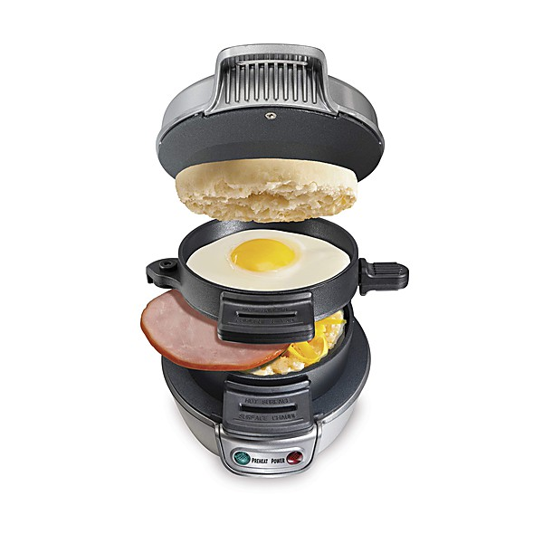

# Power Pop Prime - Volume 1

By **Various Artists**

## Album Data

- **Catalog:** Beets
- **Format:** Digital, Album
- **Album:** Power Pop Prime - Volume 1
- **Artist:** Various Artists
- **Albumartist:** Various Artists
- **Genre:** Power Pop
- **MusicBrainz Album Artist ID:** 
- **MusicBrainz Album ID:** 
- **MusicBrainz Release Group ID:** 
- **Year:** 0000
- **Catalog #:** 
- **Label:** 
- **Total Tracks:** 19

## Album Tracks

### Track 15 - Dot-To-Dot Elvis

- **Artist:** Barely Pink
- **Format:** MP3
- **Genre:** Power Pop
- **Length:** 4:09
- **MusicBrainz Track ID:** 
- **Title:** Dot-To-Dot Elvis
- **Track:** 15
- **Year:** 0000

### Track 09 - The Boy Won't Listen

- **Artist:** Blue Ash
- **Format:** MP3
- **Genre:** Power Pop
- **Length:** 3:14
- **MusicBrainz Track ID:** 
- **Title:** The Boy Won't Listen
- **Track:** 09
- **Year:** 0000

### Track 07 - I Want You Only

- **Artist:** Chewy Marble
- **Format:** MP3
- **Genre:** Indie Pop
- **Length:** 4:29
- **MusicBrainz Track ID:** 
- **Title:** I Want You Only
- **Track:** 07
- **Year:** 0000

### Track 14 - Blinded Eyes

- **Artist:** Chris von Sneidern
- **Format:** MP3
- **Genre:** Indie Pop
- **Length:** 3:39
- **MusicBrainz Track ID:** 
- **Title:** Blinded Eyes
- **Track:** 14
- **Year:** 0000

### Track 04 - Torn

- **Artist:** Doug Powell
- **Format:** MP3
- **Genre:** Indie Pop
- **Length:** 4:30
- **MusicBrainz Track ID:** 
- **Title:** Torn
- **Track:** 04
- **Year:** 0000

### Track 19 - Matterhorn

- **Artist:** KC Bowman
- **Format:** MP3
- **Genre:** Power Pop
- **Length:** 3:14
- **MusicBrainz Track ID:** 
- **Title:** Matterhorn
- **Track:** 19
- **Year:** 0000

### Track 05 - Every Minute

- **Artist:** P. Hux
- **Format:** MP3
- **Genre:** Power Pop
- **Length:** 3:31
- **MusicBrainz Track ID:** 
- **Title:** Every Minute
- **Track:** 05
- **Year:** 0000

### Track 17 - Working too hard

- **Artist:** Paul Collins
- **Format:** MP3
- **Genre:** Punk Rock
- **Length:** 2:48
- **MusicBrainz Track ID:** 
- **Title:** Working too hard
- **Track:** 17
- **Year:** 0000

### Track 12 - She´s So Real

- **Artist:** Starbelly
- **Format:** MP3
- **Genre:** Power Pop
- **Length:** 3:45
- **MusicBrainz Track ID:** 
- **Title:** She´s So Real
- **Track:** 12
- **Year:** 0000

### Track 03 - It's A Sin

- **Artist:** The Days
- **Format:** MP3
- **Genre:** Indie Rock
- **Length:** 5:12
- **MusicBrainz Track ID:** 
- **Title:** It's A Sin
- **Track:** 03
- **Year:** 0000

### Track 16 - Five Personalities

- **Artist:** The Flashcubes
- **Format:** MP3
- **Genre:** Punk Rock
- **Length:** 2:47
- **MusicBrainz Track ID:** 
- **Title:** Five Personalities
- **Track:** 16
- **Year:** 0000

### Track 11 - We're Not Getting Through

- **Artist:** The Grip Weeds
- **Format:** MP3
- **Genre:** Neo-Psychedelia
- **Length:** 3:00
- **MusicBrainz Track ID:** 
- **Title:** We're Not Getting Through
- **Track:** 11
- **Year:** 0000

### Track 18 - Speechless

- **Artist:** The Jellybricks
- **Format:** MP3
- **Genre:** Indie Rock
- **Length:** 3:43
- **MusicBrainz Track ID:** 
- **Title:** Speechless
- **Track:** 18
- **Year:** 0000

### Track 02 - She Was Good

- **Artist:** The Montgomery Cliffs
- **Format:** MP3
- **Genre:** Power Pop
- **Length:** 3:01
- **MusicBrainz Track ID:** 
- **Title:** She Was Good
- **Track:** 02
- **Year:** 0000

### Track 10 - That Girl Is Emily

- **Artist:** The Records
- **Format:** MP3
- **Genre:** Power Pop
- **Length:** 5:04
- **MusicBrainz Track ID:** 
- **Title:** That Girl Is Emily
- **Track:** 10
- **Year:** 0000

### Track 01 - Silver Ship

- **Artist:** The Revelers
- **Format:** MP3
- **Genre:** Pop Rock
- **Length:** 2:38
- **MusicBrainz Track ID:** 
- **Title:** Silver Ship
- **Track:** 01
- **Year:** 0000

### Track 08 - Nothing Can Be Everything

- **Artist:** The Shambles
- **Format:** MP3
- **Genre:** Indie Pop
- **Length:** 1:54
- **MusicBrainz Track ID:** 
- **Title:** Nothing Can Be Everything
- **Track:** 08
- **Year:** 0000

### Track 06 - Oceans Cracked

- **Artist:** Tube Top
- **Format:** MP3
- **Genre:** Power Pop
- **Length:** 2:54
- **MusicBrainz Track ID:** 
- **Title:** Oceans Cracked
- **Track:** 06
- **Year:** 0000

### Track 13 - World's Biggest Fan

- **Artist:** Wanderlust
- **Format:** MP3
- **Genre:** Synthpop
- **Length:** 4:15
- **MusicBrainz Track ID:** 
- **Title:** World's Biggest Fan
- **Track:** 13
- **Year:** 0000

