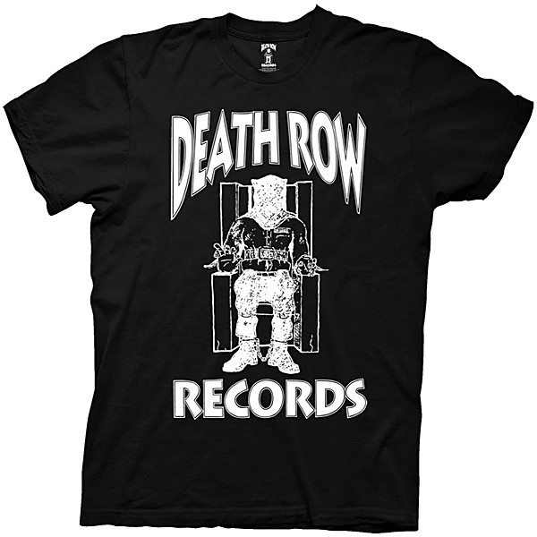

# Record Store Day April 22, 2017 (Blue CD Sampler)

By **Various Artists**

## Album Data

- **Catalog:** Beets
- **Format:** Digital, Album
- **Album:** Record Store Day April 22, 2017 (Blue CD Sampler)
- **Artist:** Various Artists
- **Albumartist:** Various Artists
- **Genre:** Indie Rock
- **MusicBrainz Album Artist ID:** 
- **MusicBrainz Album ID:** 
- **MusicBrainz Release Group ID:** 
- **Year:** 2017
- **Catalog #:** 
- **Label:** 
- **Total Tracks:** 19

## Album Tracks

### Track 05 - All Together Now

- **Artist:** Andre 3000
- **Format:** ALAC
- **Genre:** Soul
- **Length:** 2:14
- **MusicBrainz Track ID:** 
- **Title:** All Together Now
- **Track:** 05
- **Year:** 2017

### Track 19 - Monster At The End

- **Artist:** Anthrax
- **Format:** ALAC
- **Genre:** Thrash Metal
- **Length:** 3:56
- **MusicBrainz Track ID:** 
- **Title:** Monster At The End
- **Track:** 19
- **Year:** 2017

### Track 07 - Some Kind Of Wonderful

- **Artist:** Betty Who
- **Format:** ALAC
- **Genre:** Synthpop
- **Length:** 3:13
- **MusicBrainz Track ID:** 
- **Title:** Some Kind Of Wonderful
- **Track:** 07
- **Year:** 2017

### Track 08 - Sweet Disaster

- **Artist:** Dreamers
- **Format:** ALAC
- **Genre:** Indie Rock
- **Length:** 3:25
- **MusicBrainz Track ID:** 
- **Title:** Sweet Disaster
- **Track:** 08
- **Year:** 2017

### Track 11 - Back For Me

- **Artist:** Electric Guest
- **Format:** ALAC
- **Genre:** Indie Pop
- **Length:** 3:21
- **MusicBrainz Track ID:** 
- **Title:** Back For Me
- **Track:** 11
- **Year:** 2017

### Track 01 - Evermore

- **Artist:** Grandaddy
- **Format:** ALAC
- **Genre:** Rock
- **Length:** 4:40
- **MusicBrainz Track ID:** 
- **Title:** Evermore
- **Track:** 01
- **Year:** 2017

### Track 16 - Mofongo

- **Artist:** Jungle Fire
- **Format:** ALAC
- **Genre:** Soul
- **Length:** 2:48
- **MusicBrainz Track ID:** 
- **Title:** Mofongo
- **Track:** 16
- **Year:** 2017

### Track 12 - High Enough

- **Artist:** K. Flay
- **Format:** ALAC
- **Genre:** Hip Hop
- **Length:** 3:50
- **MusicBrainz Track ID:** 
- **Title:** High Enough
- **Track:** 12
- **Year:** 2017

### Track 02 - Ilysb

- **Artist:** LANY
- **Format:** ALAC
- **Genre:** Synthpop
- **Length:** 3:31
- **MusicBrainz Track ID:** 
- **Title:** Ilysb
- **Track:** 02
- **Year:** 2017

### Track 14 - Boyfriend

- **Artist:** Marika Hackman
- **Format:** ALAC
- **Genre:** Indie Rock
- **Length:** 3:59
- **MusicBrainz Track ID:** 
- **Title:** Boyfriend
- **Track:** 14
- **Year:** 2017

### Track 03 - Keep The Voices Distant

- **Artist:** Monster Movie
- **Format:** ALAC
- **Genre:** Shoegaze
- **Length:** 3:44
- **MusicBrainz Track ID:** 
- **Title:** Keep The Voices Distant
- **Track:** 03
- **Year:** 2017

### Track 17 - Everybody Use Your Goddam Turn Signal

- **Artist:** Paul Gilbert
- **Format:** ALAC
- **Genre:** Heavy Metal
- **Length:** 4:16
- **MusicBrainz Track ID:** 
- **Title:** Everybody Use Your Goddam Turn Signal
- **Track:** 17
- **Year:** 2017

### Track 13 - What It Feels Like

- **Artist:** Sandro Cavazzo
- **Format:** ALAC
- **Genre:** Synthpop
- **Length:** 3:05
- **MusicBrainz Track ID:** 
- **Title:** What It Feels Like
- **Track:** 13
- **Year:** 2017

### Track 18 - Baptised In The Rio Grande

- **Artist:** Sons Of Texas
- **Format:** ALAC
- **Genre:** Post-Grunge
- **Length:** 3:44
- **MusicBrainz Track ID:** 
- **Title:** Baptised In The Rio Grande
- **Track:** 18
- **Year:** 2017

### Track 06 - Keep Running

- **Artist:** Tei Shi
- **Format:** ALAC
- **Genre:** Synthpop
- **Length:** 3:20
- **MusicBrainz Track ID:** 
- **Title:** Keep Running
- **Track:** 06
- **Year:** 2017

### Track 04 - Demon In The Profile

- **Artist:** The Afghan Whigs
- **Format:** ALAC
- **Genre:** Indie Rock
- **Length:** 3:25
- **MusicBrainz Track ID:** 
- **Title:** Demon In The Profile
- **Track:** 04
- **Year:** 2017

### Track 15 - Wallflowers

- **Artist:** The Chain Gang Of 1974
- **Format:** ALAC
- **Genre:** Electropop
- **Length:** 3:52
- **MusicBrainz Track ID:** 
- **Title:** Wallflowers
- **Track:** 15
- **Year:** 2017

### Track 10 - Stupid For You

- **Artist:** Waterparks
- **Format:** ALAC
- **Genre:** Pop Punk
- **Length:** 3:11
- **MusicBrainz Track ID:** 
- **Title:** Stupid For You
- **Track:** 10
- **Year:** 2017

### Track 09 - Breathe

- **Artist:** Zipper Club
- **Format:** ALAC
- **Genre:** Electronic
- **Length:** 3:07
- **MusicBrainz Track ID:** 
- **Title:** Breathe
- **Track:** 09
- **Year:** 2017

