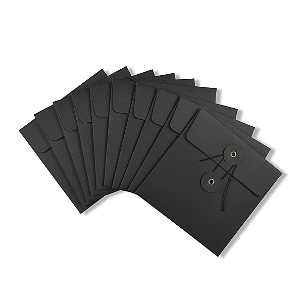

# Record Store Day April 22, 2017 (Yellow CD Sampler)

By **Various Artists**

## Album Data

- **Catalog:** Beets
- **Format:** Digital, Album
- **Album:** Record Store Day April 22, 2017 (Yellow CD Sampler)
- **Artist:** Various Artists
- **Albumartist:** Various Artists
- **Genre:** Synthpop
- **MusicBrainz Album Artist ID:** 
- **MusicBrainz Album ID:** 
- **MusicBrainz Release Group ID:** 
- **Year:** 2017
- **Catalog #:** 
- **Label:** 
- **Total Tracks:** 18

## Album Tracks

### Track 17 - The Best Girls Don't Always Win

- **Artist:** Betty Wright
- **Format:** ALAC
- **Genre:** Soul
- **Length:** 3:12
- **MusicBrainz Track ID:** 
- **Title:** The Best Girls Don't Always Win
- **Track:** 17
- **Year:** 0000

### Track 01 - Let Me Down Easy

- **Artist:** Bettye LaVette
- **Format:** ALAC
- **Genre:** Northern Soul
- **Length:** 2:49
- **MusicBrainz Track ID:** 
- **Title:** Let Me Down Easy
- **Track:** 01
- **Year:** 0000

### Track 04 - It's In The Wind

- **Artist:** Don Covay
- **Format:** ALAC
- **Genre:** Soul
- **Length:** 2:55
- **MusicBrainz Track ID:** 
- **Title:** It's In The Wind
- **Track:** 04
- **Year:** 0000

### Track 08 - I Cried

- **Artist:** James Brown
- **Format:** ALAC
- **Genre:** Soul
- **Length:** 3:35
- **MusicBrainz Track ID:** 
- **Title:** I Cried
- **Track:** 08
- **Year:** 0000

### Track 09 - What Will Later On Be Like

- **Artist:** Jeanne & The Darlings
- **Format:** ALAC
- **Genre:** Soul
- **Length:** 2:51
- **MusicBrainz Track ID:** 
- **Title:** What Will Later On Be Like
- **Track:** 09
- **Year:** 0000

### Track 10 - Please Take A Chance On Me

- **Artist:** Jimmy Shaw
- **Format:** ALAC
- **Genre:** Indie Rock
- **Length:** 2:29
- **MusicBrainz Track ID:** 
- **Title:** Please Take A Chance On Me
- **Track:** 10
- **Year:** 0000

### Track 18 - Party Life

- **Artist:** King Hannibal
- **Format:** ALAC
- **Genre:** Deep Funk
- **Length:** 4:12
- **MusicBrainz Track ID:** 
- **Title:** Party Life
- **Track:** 18
- **Year:** 0000

### Track 11 - Taking Up Another Man's Place

- **Artist:** Mable John
- **Format:** ALAC
- **Genre:** Soul
- **Length:** 2:56
- **MusicBrainz Track ID:** 
- **Title:** Taking Up Another Man's Place
- **Track:** 11
- **Year:** 0000

### Track 13 - Your Good Thing

- **Artist:** Mable John
- **Format:** ALAC
- **Genre:** Soul
- **Length:** 3:00
- **MusicBrainz Track ID:** 
- **Title:** Your Good Thing
- **Track:** 13
- **Year:** 0000

### Track 02 - Hymn No. 5

- **Artist:** Mighty Hannibal
- **Format:** ALAC
- **Genre:** Soul
- **Length:** 3:24
- **MusicBrainz Track ID:** 
- **Title:** Hymn No. 5
- **Track:** 02
- **Year:** 0000

### Track 06 - I Just Want Some Love

- **Artist:** Mighty Hannibal
- **Format:** ALAC
- **Genre:** Soul
- **Length:** 3:23
- **MusicBrainz Track ID:** 
- **Title:** I Just Want Some Love
- **Track:** 06
- **Year:** 0000

### Track 12 - I Know I Got A Sure Thing

- **Artist:** Ollie & The Nightingales
- **Format:** ALAC
- **Genre:** Soul
- **Length:** 2:41
- **MusicBrainz Track ID:** 
- **Title:** I Know I Got A Sure Thing
- **Track:** 12
- **Year:** 0000

### Track 03 - When My Love Comes Down

- **Artist:** Ruby Johnson
- **Format:** ALAC
- **Genre:** Soul
- **Length:** 2:50
- **MusicBrainz Track ID:** 
- **Title:** When My Love Comes Down
- **Track:** 03
- **Year:** 0000

### Track 05 - If I Ever Needed Love (I Sure Do Need It Now)

- **Artist:** Ruby Johnson
- **Format:** ALAC
- **Genre:** Soul
- **Length:** 2:25
- **MusicBrainz Track ID:** 
- **Title:** If I Ever Needed Love (I Sure Do Need It Now)
- **Track:** 05
- **Year:** 0000

### Track 15 - I'll Run Your Hurt Away

- **Artist:** Ruby Johnson
- **Format:** ALAC
- **Genre:** Northern Soul
- **Length:** 3:11
- **MusicBrainz Track ID:** 
- **Title:** I'll Run Your Hurt Away
- **Track:** 15
- **Year:** 0000

### Track 07 - After The Laughter

- **Artist:** Wendy Rene
- **Format:** ALAC
- **Genre:** Northern Soul
- **Length:** 3:04
- **MusicBrainz Track ID:** 
- **Title:** After The Laughter
- **Track:** 07
- **Year:** 0000

### Track 14 - Everyday Will be Like a Holiday

- **Artist:** William Bell
- **Format:** ALAC
- **Genre:** Soul
- **Length:** 2:40
- **MusicBrainz Track ID:** 
- **Title:** Everyday Will be Like a Holiday
- **Track:** 14
- **Year:** 0000

### Track 16 - Every Man Oughta Have A Woman Like You

- **Artist:** William Bell
- **Format:** ALAC
- **Genre:** Soul
- **Length:** 2:48
- **MusicBrainz Track ID:** 
- **Title:** Every Man Oughta Have A Woman Like You
- **Track:** 16
- **Year:** 0000

