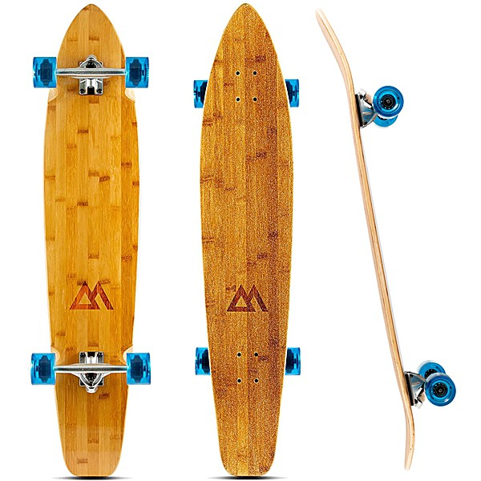

# Retrospace Podcasts

By **Various Artists**

## Album Data

- **Catalog:** Beets
- **Format:** Digital, Album
- **Album:** Retrospace Podcasts
- **Artist:** Various Artists
- **Albumartist:** Various Artists
- **Genre:** Unknown
- **MusicBrainz Album Artist ID:** 
- **MusicBrainz Album ID:** 
- **MusicBrainz Release Group ID:** 
- **Year:** 0000
- **Catalog #:** 
- **Label:** 
- **Total Tracks:** 10

## Album Tracks

### Track 02 - This Diamond Ring

- **Artist:** Gary Lewis & The Playboys
- **Format:** AAC
- **Genre:** Pop
- **Length:** 2:06
- **MusicBrainz Track ID:** 
- **Title:** This Diamond Ring
- **Track:** 02
- **Year:** 2006

### Track 04 - Light My Fire

- **Artist:** José Feliciano
- **Format:** AAC
- **Genre:** Uk Garage
- **Length:** 3:02
- **MusicBrainz Track ID:** 
- **Title:** Light My Fire
- **Track:** 04
- **Year:** 2006

### Track 10 - Stay

- **Artist:** Maurice Williams
- **Format:** AAC
- **Genre:** Close Harmony
- **Length:** 1:44
- **MusicBrainz Track ID:** 
- **Title:** Stay
- **Track:** 10
- **Year:** 2006

### Track 09 - When A Man Loves A Woman

- **Artist:** Percy Sledge
- **Format:** AAC
- **Genre:** Soul
- **Length:** 2:53
- **MusicBrainz Track ID:** 
- **Title:** When A Man Loves A Woman
- **Track:** 09
- **Year:** 2006

### Track 05 - Cherish

- **Artist:** The Association
- **Format:** AAC
- **Genre:** Sunshine Pop
- **Length:** 3:23
- **MusicBrainz Track ID:** 
- **Title:** Cherish
- **Track:** 05
- **Year:** 2006

### Track 01 - Midnight Confessions

- **Artist:** The Grass Roots
- **Format:** AAC
- **Genre:** Rock
- **Length:** 2:43
- **MusicBrainz Track ID:** 
- **Title:** Midnight Confessions
- **Track:** 01
- **Year:** 2006

### Track 03 - You've Really Got A Hold On Me

- **Artist:** The Miracles
- **Format:** AAC
- **Genre:** Soul
- **Length:** 3:07
- **MusicBrainz Track ID:** 
- **Title:** You've Really Got A Hold On Me
- **Track:** 03
- **Year:** 2006

### Track 06 - Harbor Lights

- **Artist:** The Platters
- **Format:** AAC
- **Genre:** Rhythm And Blues
- **Length:** 3:11
- **MusicBrainz Track ID:** 
- **Title:** Harbor Lights
- **Track:** 06
- **Year:** 2006

### Track 07 - Love Is All Around

- **Artist:** The Troggs
- **Format:** AAC
- **Genre:** Rock
- **Length:** 2:40
- **MusicBrainz Track ID:** 
- **Title:** Love Is All Around
- **Track:** 07
- **Year:** 2006

### Track 08 - Turn Around, Look At Me

- **Artist:** The Vogues
- **Format:** AAC
- **Genre:** Rock
- **Length:** 2:35
- **MusicBrainz Track ID:** 
- **Title:** Turn Around, Look At Me
- **Track:** 08
- **Year:** 2006

