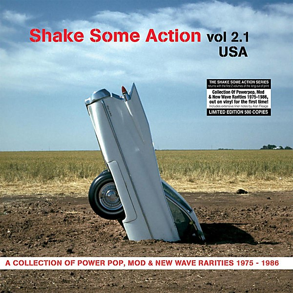

# Shake Some Action

By **Various Artists**

## Album Data

- **Catalog:** Beets
- **Format:** Digital, Album
- **Album:** Shake Some Action
- **Artist:** Various Artists
- **Albumartist:** Various Artists
- **Genre:** Power Pop
- **MusicBrainz Album Artist ID:** 
- **MusicBrainz Album ID:** 
- **MusicBrainz Release Group ID:** 
- **Year:** 2007
- **Catalog #:** 
- **Label:** 
- **Total Tracks:** 24

## Album Tracks

### Track 22 - No Matter What

- **Artist:** Badfinger
- **Format:** MP3
- **Genre:** Power Pop
- **Length:** 2:57
- **MusicBrainz Track ID:** 
- **Title:** No Matter What
- **Track:** 22
- **Year:** 0000

### Track 23 - September Gurls

- **Artist:** Big Star
- **Format:** MP3
- **Genre:** Power Pop
- **Length:** 2:48
- **MusicBrainz Track ID:** 
- **Title:** September Gurls
- **Track:** 23
- **Year:** 0000

### Track 14 - Surrender

- **Artist:** Cheap Trick
- **Format:** MP3
- **Genre:** Power Pop
- **Length:** 4:11
- **MusicBrainz Track ID:** 
- **Title:** Surrender
- **Track:** 14
- **Year:** 0000

### Track 13 - I Am The Cosmos

- **Artist:** Chris Bell
- **Format:** MP3
- **Genre:** Power Pop
- **Length:** 3:43
- **MusicBrainz Track ID:** 
- **Title:** I Am The Cosmos
- **Track:** 13
- **Year:** 0000

### Track 17 - I'm On Fire

- **Artist:** Dwight Twilley Band
- **Format:** MP3
- **Genre:** Progressive Rock
- **Length:** 3:17
- **MusicBrainz Track ID:** 
- **Title:** I'm On Fire
- **Track:** 17
- **Year:** 0000

### Track 12 - Bled White

- **Artist:** Elliott Smith
- **Format:** MP3
- **Genre:** Indie Rock
- **Length:** 3:20
- **MusicBrainz Track ID:** 
- **Title:** Bled White
- **Track:** 12
- **Year:** 0000

### Track 05 - Long Time No See

- **Artist:** Emmitt Rhodes
- **Format:** MP3
- **Genre:** Power Pop
- **Length:** 3:19
- **MusicBrainz Track ID:** 
- **Title:** Long Time No See
- **Track:** 05
- **Year:** 0000

### Track 09 - Someday, Someway

- **Artist:** Marshall Crenshaw
- **Format:** MP3
- **Genre:** Rockabilly
- **Length:** 2:52
- **MusicBrainz Track ID:** 
- **Title:** Someday, Someway
- **Track:** 09
- **Year:** 0000

### Track 16 - Valerie Loves Me

- **Artist:** Material Issue
- **Format:** MP3
- **Genre:** Power Pop
- **Length:** 3:06
- **MusicBrainz Track ID:** 
- **Title:** Valerie Loves Me
- **Track:** 16
- **Year:** 0000

### Track 15 - Devil With The Green Eyes

- **Artist:** Matthew Sweet
- **Format:** MP3
- **Genre:** Indie Pop
- **Length:** 4:43
- **MusicBrainz Track ID:** 
- **Title:** Devil With The Green Eyes
- **Track:** 15
- **Year:** 0000

### Track 08 - I Wanna Be With You

- **Artist:** Raspberries
- **Format:** MP3
- **Genre:** Rock And Roll
- **Length:** 3:01
- **MusicBrainz Track ID:** 
- **Title:** I Wanna Be With You
- **Track:** 08
- **Year:** 0000

### Track 10 - Love Is For Lovers

- **Artist:** The dB's
- **Format:** MP3
- **Genre:** Indie Pop
- **Length:** 3:18
- **MusicBrainz Track ID:** 
- **Title:** Love Is For Lovers
- **Track:** 10
- **Year:** 0000

### Track 03 - Shake Some Action

- **Artist:** The Flamin' Groovies
- **Format:** MP3
- **Genre:** Rock And Roll
- **Length:** 4:33
- **MusicBrainz Track ID:** 
- **Title:** Shake Some Action
- **Track:** 03
- **Year:** 1976

### Track 11 - So You Are A Star

- **Artist:** The Hudson Brothers
- **Format:** MP3
- **Genre:** Pop
- **Length:** 3:49
- **MusicBrainz Track ID:** 
- **Title:** So You Are A Star
- **Track:** 11
- **Year:** 0000

### Track 24 - Good Girls Don't

- **Artist:** The Knack
- **Format:** MP3
- **Genre:** Power Pop
- **Length:** 3:10
- **MusicBrainz Track ID:** 
- **Title:** Good Girls Don't
- **Track:** 24
- **Year:** 0000

### Track 07 - There She Goes

- **Artist:** The La's
- **Format:** MP3
- **Genre:** Indie Rock
- **Length:** 2:43
- **MusicBrainz Track ID:** 
- **Title:** There She Goes
- **Track:** 07
- **Year:** 0000

### Track 01 - Hanging On The Telephone

- **Artist:** The Nerves
- **Format:** MP3
- **Genre:** Power Pop
- **Length:** 2:05
- **MusicBrainz Track ID:** 
- **Title:** Hanging On The Telephone
- **Track:** 01
- **Year:** 0000

### Track 04 - From Blown Speakers

- **Artist:** The New Pornographers
- **Format:** MP3
- **Genre:** Indie Rock
- **Length:** 2:49
- **MusicBrainz Track ID:** 
- **Title:** From Blown Speakers
- **Track:** 04
- **Year:** 0000

### Track 20 - Another Girl, Another Planet

- **Artist:** The Only Ones
- **Format:** MP3
- **Genre:** Punk Rock
- **Length:** 3:00
- **MusicBrainz Track ID:** 
- **Title:** Another Girl, Another Planet
- **Track:** 20
- **Year:** 0000

### Track 02 - Dream All Day

- **Artist:** The Posies
- **Format:** MP3
- **Genre:** Indie Rock
- **Length:** 3:04
- **MusicBrainz Track ID:** 
- **Title:** Dream All Day
- **Track:** 02
- **Year:** 0000

### Track 19 - I Will Dare

- **Artist:** The Replacements
- **Format:** MP3
- **Genre:** Indie Rock
- **Length:** 3:18
- **MusicBrainz Track ID:** 
- **Title:** I Will Dare
- **Track:** 19
- **Year:** 0000

### Track 18 - Caring Is Creepy

- **Artist:** The Shins
- **Format:** MP3
- **Genre:** Indie Rock
- **Length:** 3:20
- **MusicBrainz Track ID:** 
- **Title:** Caring Is Creepy
- **Track:** 18
- **Year:** 0000

### Track 06 - Couldn't I Just Tell You

- **Artist:** Todd Rundgren
- **Format:** MP3
- **Genre:** Blue-Eyed Soul
- **Length:** 3:22
- **MusicBrainz Track ID:** 
- **Title:** Couldn't I Just Tell You
- **Track:** 06
- **Year:** 0000

### Track 21 - Island In The Sun

- **Artist:** Weezer
- **Format:** MP3
- **Genre:** Indie Rock
- **Length:** 3:20
- **MusicBrainz Track ID:** 
- **Title:** Island In The Sun
- **Track:** 21
- **Year:** 2001

