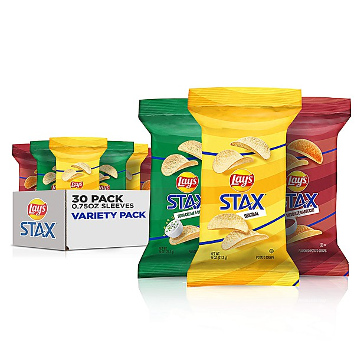

# Stax

By **Various Artists**

## Album Data

- **Catalog:** Beets
- **Format:** Digital, Album
- **Album:** Stax
- **Artist:** Various Artists
- **Albumartist:** Various Artists
- **Genre:** Soul
- **MusicBrainz Album Artist ID:** 
- **MusicBrainz Album ID:** 
- **MusicBrainz Release Group ID:** 
- **Year:** 1988
- **Catalog #:** 
- **Label:** 
- **Total Tracks:** 24

## Album Tracks

### Track 14 - No More Mr. Nice Guy

- **Artist:** Alice Cooper
- **Format:** MP3
- **Genre:** Heavy Metal
- **Length:** 3:07
- **MusicBrainz Track ID:** 
- **Title:** No More Mr. Nice Guy
- **Track:** 14
- **Year:** 1974

### Track 03 - A Little Bird Told Me So

- **Artist:** Brian Stevens and The Flip
- **Format:** MP3
- **Genre:** Power Pop
- **Length:** 3:36
- **MusicBrainz Track ID:** 
- **Title:** A Little Bird Told Me So
- **Track:** 03
- **Year:** 1994

### Track 11 - Radio Nowhere

- **Artist:** Bruce Springsteen
- **Format:** MP3
- **Genre:** Rock
- **Length:** 3:20
- **MusicBrainz Track ID:** 
- **Title:** Radio Nowhere
- **Track:** 11
- **Year:** 2007

### Track 17 - Locked Out

- **Artist:** Crowded House
- **Format:** MP3
- **Genre:** Alternative Rock
- **Length:** 3:18
- **MusicBrainz Track ID:** 
- **Title:** Locked Out
- **Track:** 17
- **Year:** 0000

### Track 18 - Ah! Leah!

- **Artist:** Donnie Iris
- **Format:** MP3
- **Genre:** Power Pop
- **Length:** 3:46
- **MusicBrainz Track ID:** 
- **Title:** Ah! Leah!
- **Track:** 18
- **Year:** 0000

### Track 16 - Lip Service

- **Artist:** Elvis Costello and The Attractions
- **Format:** MP3
- **Genre:** Power Pop
- **Length:** 2:38
- **MusicBrainz Track ID:** 
- **Title:** Lip Service
- **Track:** 16
- **Year:** 1978

### Track 12 - Headache

- **Artist:** Frank Black
- **Format:** MP3
- **Genre:** Noise Pop
- **Length:** 2:52
- **MusicBrainz Track ID:** 
- **Title:** Headache
- **Track:** 12
- **Year:** 1994

### Track 15 - Can't Sink This Town

- **Artist:** Freedy Johnston
- **Format:** MP3
- **Genre:** Americana
- **Length:** 3:52
- **MusicBrainz Track ID:** 
- **Title:** Can't Sink This Town
- **Track:** 15
- **Year:** 1994

### Track 10 - It Won't Last

- **Artist:** Hurricane Fighter Plane
- **Format:** MP3
- **Genre:** Freakbeat
- **Length:** 2:31
- **MusicBrainz Track ID:** 
- **Title:** It Won't Last
- **Track:** 10
- **Year:** 2011

### Track 13 - I Live

- **Artist:** Jason Falkner
- **Format:** MP3
- **Genre:** Neo-Psychedelia
- **Length:** 3:11
- **MusicBrainz Track ID:** 
- **Title:** I Live
- **Track:** 13
- **Year:** 1996

### Track 21 - Confetti

- **Artist:** Lemonheads
- **Format:** MP3
- **Genre:** Indie Rock
- **Length:** 2:44
- **MusicBrainz Track ID:** 
- **Title:** Confetti
- **Track:** 21
- **Year:** 1992

### Track 08 - Do It Again

- **Artist:** Nada Surf
- **Format:** MP3
- **Genre:** Indie Rock
- **Length:** 3:37
- **MusicBrainz Track ID:** 
- **Title:** Do It Again
- **Track:** 08
- **Year:** 2005

### Track 09 - It Don't Come Easy

- **Artist:** Ringo Starr
- **Format:** MP3
- **Genre:** Rock
- **Length:** 3:01
- **MusicBrainz Track ID:** 
- **Title:** It Don't Come Easy
- **Track:** 09
- **Year:** 1971

### Track 05 - Tomorrow Night

- **Artist:** Shoes
- **Format:** MP3
- **Genre:** Power Pop
- **Length:** 2:59
- **MusicBrainz Track ID:** 
- **Title:** Tomorrow Night
- **Track:** 05
- **Year:** 0000

### Track 22 - Happy Meal II

- **Artist:** The Cardigans
- **Format:** MP3
- **Genre:** Indie Pop
- **Length:** 2:36
- **MusicBrainz Track ID:** 
- **Title:** Happy Meal II
- **Track:** 22
- **Year:** 1996

### Track 01 - Let's Go

- **Artist:** The Cars
- **Format:** MP3
- **Genre:** Pop Rock
- **Length:** 3:36
- **MusicBrainz Track ID:** 
- **Title:** Let's Go
- **Track:** 01
- **Year:** 0000

### Track 02 - Back Of My Hand (i've Got Your Number)

- **Artist:** The Jags
- **Format:** MP3
- **Genre:** Power Pop
- **Length:** 3:23
- **MusicBrainz Track ID:** 
- **Title:** Back Of My Hand (i've Got Your Number)
- **Track:** 02
- **Year:** 0000

### Track 19 - The Hard Way

- **Artist:** The Kinks
- **Format:** MP3
- **Genre:** Rock
- **Length:** 2:36
- **MusicBrainz Track ID:** 
- **Title:** The Hard Way
- **Track:** 19
- **Year:** 1975

### Track 23 - The Weakest Shade of Blue

- **Artist:** The Pernice Brothers
- **Format:** MP3
- **Genre:** Shoegaze
- **Length:** 3:10
- **MusicBrainz Track ID:** 
- **Title:** The Weakest Shade of Blue
- **Track:** 23
- **Year:** 0000

### Track 20 - She's So Young

- **Artist:** The Pursuit Of Happiness
- **Format:** MP3
- **Genre:** Power Pop
- **Length:** 3:36
- **MusicBrainz Track ID:** 
- **Title:** She's So Young
- **Track:** 20
- **Year:** 1988

### Track 07 - Steady, As She Goes

- **Artist:** The Raconteurs
- **Format:** MP3
- **Genre:** Indie Rock
- **Length:** 3:35
- **MusicBrainz Track ID:** 
- **Title:** Steady, As She Goes
- **Track:** 07
- **Year:** 2006

### Track 04 - Floating By

- **Artist:** The Red Button
- **Format:** MP3
- **Genre:** Power Pop
- **Length:** 3:29
- **MusicBrainz Track ID:** 
- **Title:** Floating By
- **Track:** 04
- **Year:** 2007

### Track 24 - Sometimes That's All We Have

- **Artist:** The Sneetches
- **Format:** MP3
- **Genre:** Indie Pop
- **Length:** 4:41
- **MusicBrainz Track ID:** 
- **Title:** Sometimes That's All We Have
- **Track:** 24
- **Year:** 1989

### Track 06 - She Opens Heaven's Door

- **Artist:** Wondermints
- **Format:** MP3
- **Genre:** Power Pop
- **Length:** 3:17
- **MusicBrainz Track ID:** 
- **Title:** She Opens Heaven's Door
- **Track:** 06
- **Year:** 1995

