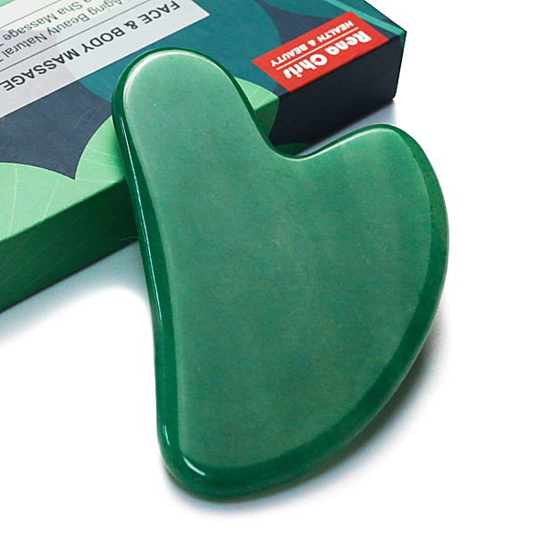

# Super Charged Flashlight Pops V. II

By **Various Artists**

## Album Data

- **Catalog:** Beets
- **Format:** Digital, Album
- **Album:** Super Charged Flashlight Pops V. II
- **Artist:** Various Artists
- **Albumartist:** Various Artists
- **Genre:** Power Pop
- **MusicBrainz Album Artist ID:** 
- **MusicBrainz Album ID:** 
- **MusicBrainz Release Group ID:** 
- **Year:** 2004
- **Catalog #:** 
- **Label:** 
- **Total Tracks:** 00

## Album Tracks

### Track 00 - 02-Heatwave

- **Artist:** Various Artists
- **Format:** ALAC
- **Genre:** Emo
- **Length:** 2:50
- **MusicBrainz Track ID:** 
- **Title:** 02-Heatwave
- **Track:** 00
- **Year:** 0000

### Track 00 - 03-Johnny Get Angry

- **Artist:** Various Artists
- **Format:** ALAC
- **Genre:** Emo
- **Length:** 2:38
- **MusicBrainz Track ID:** 
- **Title:** 03-Johnny Get Angry
- **Track:** 00
- **Year:** 0000

### Track 00 - 04-Don't Say Nothin' Bad (About My Baby)

- **Artist:** Various Artists
- **Format:** ALAC
- **Genre:** Emo
- **Length:** 2:53
- **MusicBrainz Track ID:** 
- **Title:** 04-Don't Say Nothin' Bad (About My Baby)
- **Track:** 00
- **Year:** 0000

### Track 00 - 05-My Guy

- **Artist:** Various Artists
- **Format:** ALAC
- **Genre:** Emo
- **Length:** 2:53
- **MusicBrainz Track ID:** 
- **Title:** 05-My Guy
- **Track:** 00
- **Year:** 0000

### Track 00 - 06-Stop In The Name Of Love

- **Artist:** Various Artists
- **Format:** ALAC
- **Genre:** Emo
- **Length:** 2:54
- **MusicBrainz Track ID:** 
- **Title:** 06-Stop In The Name Of Love
- **Track:** 00
- **Year:** 0000

### Track 00 - 07-Please Mr. Postman

- **Artist:** Various Artists
- **Format:** ALAC
- **Genre:** Emo
- **Length:** 2:36
- **MusicBrainz Track ID:** 
- **Title:** 07-Please Mr. Postman
- **Track:** 00
- **Year:** 0000

### Track 00 - 08-Nitty Gritty

- **Artist:** Various Artists
- **Format:** ALAC
- **Genre:** Emo
- **Length:** 2:20
- **MusicBrainz Track ID:** 
- **Title:** 08-Nitty Gritty
- **Track:** 00
- **Year:** 0000

### Track 00 - 09-Chapel Of Love

- **Artist:** Various Artists
- **Format:** ALAC
- **Genre:** Emo
- **Length:** 2:53
- **MusicBrainz Track ID:** 
- **Title:** 09-Chapel Of Love
- **Track:** 00
- **Year:** 0000

### Track 00 - 10-Hello Stranger

- **Artist:** Various Artists
- **Format:** ALAC
- **Genre:** Emo
- **Length:** 2:47
- **MusicBrainz Track ID:** 
- **Title:** 10-Hello Stranger
- **Track:** 00
- **Year:** 0000

### Track 00 - 11-Easier Said Than Done

- **Artist:** Various Artists
- **Format:** ALAC
- **Genre:** Emo
- **Length:** 2:14
- **MusicBrainz Track ID:** 
- **Title:** 11-Easier Said Than Done
- **Track:** 00
- **Year:** 0000

### Track 00 - 12-The Kind Of Boy You Can't Forget

- **Artist:** Various Artists
- **Format:** ALAC
- **Genre:** Emo
- **Length:** 2:12
- **MusicBrainz Track ID:** 
- **Title:** 12-The Kind Of Boy You Can't Forget
- **Track:** 00
- **Year:** 0000

### Track 00 - 13-Bobby's Girl

- **Artist:** Various Artists
- **Format:** ALAC
- **Genre:** Emo
- **Length:** 2:30
- **MusicBrainz Track ID:** 
- **Title:** 13-Bobby's Girl
- **Track:** 00
- **Year:** 0000

### Track 00 - 14-Popsicles and Icicles

- **Artist:** Various Artists
- **Format:** ALAC
- **Genre:** Emo
- **Length:** 2:38
- **MusicBrainz Track ID:** 
- **Title:** 14-Popsicles and Icicles
- **Track:** 00
- **Year:** 0000

### Track 00 - 15-I'm Into Something Good

- **Artist:** Various Artists
- **Format:** ALAC
- **Genre:** Emo
- **Length:** 2:53
- **MusicBrainz Track ID:** 
- **Title:** 15-I'm Into Something Good
- **Track:** 00
- **Year:** 0000

### Track 00 - 16-Johnny Angel

- **Artist:** Various Artists
- **Format:** ALAC
- **Genre:** Emo
- **Length:** 2:20
- **MusicBrainz Track ID:** 
- **Title:** 16-Johnny Angel
- **Track:** 00
- **Year:** 0000

### Track 00 - 17-He's So Fine

- **Artist:** Various Artists
- **Format:** ALAC
- **Genre:** Emo
- **Length:** 1:57
- **MusicBrainz Track ID:** 
- **Title:** 17-He's So Fine
- **Track:** 00
- **Year:** 0000

### Track 00 - 18-I Will Follow Him

- **Artist:** Various Artists
- **Format:** ALAC
- **Genre:** Emo
- **Length:** 2:31
- **MusicBrainz Track ID:** 
- **Title:** 18-I Will Follow Him
- **Track:** 00
- **Year:** 0000

### Track 00 - 19-I Wanna Love Him So Bad

- **Artist:** Various Artists
- **Format:** ALAC
- **Genre:** Emo
- **Length:** 2:46
- **MusicBrainz Track ID:** 
- **Title:** 19-I Wanna Love Him So Bad
- **Track:** 00
- **Year:** 0000

### Track 00 - 20-It's In His Kiss

- **Artist:** Various Artists
- **Format:** ALAC
- **Genre:** Emo
- **Length:** 2:14
- **MusicBrainz Track ID:** 
- **Title:** 20-It's In His Kiss
- **Track:** 00
- **Year:** 0000

### Track 00 - 21-Don't Hang Up

- **Artist:** Various Artists
- **Format:** ALAC
- **Genre:** Emo
- **Length:** 2:20
- **MusicBrainz Track ID:** 
- **Title:** 21-Don't Hang Up
- **Track:** 00
- **Year:** 0000

### Track 00 - 22-Lollipop

- **Artist:** Various Artists
- **Format:** ALAC
- **Genre:** Emo
- **Length:** 2:14
- **MusicBrainz Track ID:** 
- **Title:** 22-Lollipop
- **Track:** 00
- **Year:** 0000

### Track 00 - 23-Just One Look

- **Artist:** Various Artists
- **Format:** ALAC
- **Genre:** Emo
- **Length:** 2:30
- **MusicBrainz Track ID:** 
- **Title:** 23-Just One Look
- **Track:** 00
- **Year:** 0000

### Track 00 - 24-Navy Blue

- **Artist:** Various Artists
- **Format:** ALAC
- **Genre:** Emo
- **Length:** 2:31
- **MusicBrainz Track ID:** 
- **Title:** 24-Navy Blue
- **Track:** 00
- **Year:** 0000

### Track 00 - 25-I Can't Stay Mad At You

- **Artist:** Various Artists
- **Format:** ALAC
- **Genre:** Emo
- **Length:** 2:10
- **MusicBrainz Track ID:** 
- **Title:** 25-I Can't Stay Mad At You
- **Track:** 00
- **Year:** 0000

### Track 00 - 26-Locomotion

- **Artist:** Various Artists
- **Format:** ALAC
- **Genre:** Emo
- **Length:** 2:27
- **MusicBrainz Track ID:** 
- **Title:** 26-Locomotion
- **Track:** 00
- **Year:** 0000

### Track 00 - 27-Mashed Potato Time

- **Artist:** Various Artists
- **Format:** ALAC
- **Genre:** Emo
- **Length:** 2:34
- **MusicBrainz Track ID:** 
- **Title:** 27-Mashed Potato Time
- **Track:** 00
- **Year:** 0000

### Track 00 - 28-Party Lights

- **Artist:** Various Artists
- **Format:** ALAC
- **Genre:** Emo
- **Length:** 2:25
- **MusicBrainz Track ID:** 
- **Title:** 28-Party Lights
- **Track:** 00
- **Year:** 0000

### Track 00 - 29-Sweet Nothin's

- **Artist:** Various Artists
- **Format:** ALAC
- **Genre:** Emo
- **Length:** 2:25
- **MusicBrainz Track ID:** 
- **Title:** 29-Sweet Nothin's
- **Track:** 00
- **Year:** 0000

### Track 00 - 30-Wonderful Summer

- **Artist:** Various Artists
- **Format:** ALAC
- **Genre:** Emo
- **Length:** 2:30
- **MusicBrainz Track ID:** 
- **Title:** 30-Wonderful Summer
- **Track:** 00
- **Year:** 0000

### Track 01 - Leader Of The Pack

- **Artist:** Various Artists
- **Format:** AAC
- **Genre:** Rock
- **Length:** 2:55
- **MusicBrainz Track ID:** 
- **Title:** Leader Of The Pack
- **Track:** 01
- **Year:** 0000

### Track 02 - Heatwave

- **Artist:** Various Artists
- **Format:** AAC
- **Genre:** Emo
- **Length:** 2:50
- **MusicBrainz Track ID:** 
- **Title:** Heatwave
- **Track:** 02
- **Year:** 0000

### Track 03 - Johnny Get Angry

- **Artist:** Various Artists
- **Format:** AAC
- **Genre:** Emo
- **Length:** 2:38
- **MusicBrainz Track ID:** 
- **Title:** Johnny Get Angry
- **Track:** 03
- **Year:** 0000

### Track 04 - Don't Say Nothin' Bad (About My Baby)

- **Artist:** Various Artists
- **Format:** AAC
- **Genre:** Emo
- **Length:** 2:53
- **MusicBrainz Track ID:** 
- **Title:** Don't Say Nothin' Bad (About My Baby)
- **Track:** 04
- **Year:** 0000

### Track 05 - My Guy

- **Artist:** Various Artists
- **Format:** AAC
- **Genre:** Emo
- **Length:** 2:53
- **MusicBrainz Track ID:** 
- **Title:** My Guy
- **Track:** 05
- **Year:** 0000

### Track 06 - Stop In The Name Of Love

- **Artist:** Various Artists
- **Format:** AAC
- **Genre:** Emo
- **Length:** 2:54
- **MusicBrainz Track ID:** 
- **Title:** Stop In The Name Of Love
- **Track:** 06
- **Year:** 0000

### Track 07 - Please Mr. Postman

- **Artist:** Various Artists
- **Format:** AAC
- **Genre:** Soul
- **Length:** 2:36
- **MusicBrainz Track ID:** 
- **Title:** Please Mr. Postman
- **Track:** 07
- **Year:** 0000

### Track 08 - Nitty Gritty

- **Artist:** Various Artists
- **Format:** AAC
- **Genre:** Emo
- **Length:** 2:20
- **MusicBrainz Track ID:** 
- **Title:** Nitty Gritty
- **Track:** 08
- **Year:** 0000

### Track 09 - Chapel Of Love

- **Artist:** Various Artists
- **Format:** AAC
- **Genre:** Emo
- **Length:** 2:53
- **MusicBrainz Track ID:** 
- **Title:** Chapel Of Love
- **Track:** 09
- **Year:** 0000

### Track 10 - Hello Stranger

- **Artist:** Various Artists
- **Format:** AAC
- **Genre:** Emo
- **Length:** 2:47
- **MusicBrainz Track ID:** 
- **Title:** Hello Stranger
- **Track:** 10
- **Year:** 0000

### Track 11 - Easier Said Than Done

- **Artist:** Various Artists
- **Format:** AAC
- **Genre:** Emo
- **Length:** 2:14
- **MusicBrainz Track ID:** 
- **Title:** Easier Said Than Done
- **Track:** 11
- **Year:** 0000

### Track 12 - The Kind Of Boy You Can't Forget

- **Artist:** Various Artists
- **Format:** AAC
- **Genre:** Emo
- **Length:** 2:12
- **MusicBrainz Track ID:** 
- **Title:** The Kind Of Boy You Can't Forget
- **Track:** 12
- **Year:** 0000

### Track 13 - Bobby's Girl

- **Artist:** Various Artists
- **Format:** AAC
- **Genre:** Emo
- **Length:** 2:30
- **MusicBrainz Track ID:** 
- **Title:** Bobby's Girl
- **Track:** 13
- **Year:** 0000

### Track 14 - Popsicles and Icicles

- **Artist:** Various Artists
- **Format:** AAC
- **Genre:** Emo
- **Length:** 2:38
- **MusicBrainz Track ID:** 
- **Title:** Popsicles and Icicles
- **Track:** 14
- **Year:** 0000

### Track 15 - I'm Into Something Good

- **Artist:** Various Artists
- **Format:** AAC
- **Genre:** Emo
- **Length:** 2:53
- **MusicBrainz Track ID:** 
- **Title:** I'm Into Something Good
- **Track:** 15
- **Year:** 0000

### Track 16 - Johnny Angel

- **Artist:** Various Artists
- **Format:** AAC
- **Genre:** Emo
- **Length:** 2:20
- **MusicBrainz Track ID:** 
- **Title:** Johnny Angel
- **Track:** 16
- **Year:** 0000

### Track 17 - He's So Fine

- **Artist:** Various Artists
- **Format:** AAC
- **Genre:** Emo
- **Length:** 1:57
- **MusicBrainz Track ID:** 
- **Title:** He's So Fine
- **Track:** 17
- **Year:** 0000

### Track 18 - I Will Follow Him

- **Artist:** Various Artists
- **Format:** AAC
- **Genre:** Emo
- **Length:** 2:31
- **MusicBrainz Track ID:** 
- **Title:** I Will Follow Him
- **Track:** 18
- **Year:** 0000

### Track 19 - I Wanna Love Him So Bad

- **Artist:** Various Artists
- **Format:** AAC
- **Genre:** Emo
- **Length:** 2:46
- **MusicBrainz Track ID:** 
- **Title:** I Wanna Love Him So Bad
- **Track:** 19
- **Year:** 0000

### Track 20 - It's In His Kiss

- **Artist:** Various Artists
- **Format:** AAC
- **Genre:** Emo
- **Length:** 2:14
- **MusicBrainz Track ID:** 
- **Title:** It's In His Kiss
- **Track:** 20
- **Year:** 0000

### Track 21 - Don't Hang Up

- **Artist:** Various Artists
- **Format:** AAC
- **Genre:** Emo
- **Length:** 2:20
- **MusicBrainz Track ID:** 
- **Title:** Don't Hang Up
- **Track:** 21
- **Year:** 0000

### Track 22 - Lollipop

- **Artist:** Various Artists
- **Format:** AAC
- **Genre:** Emo
- **Length:** 2:14
- **MusicBrainz Track ID:** 
- **Title:** Lollipop
- **Track:** 22
- **Year:** 0000

### Track 23 - Just One Look

- **Artist:** Various Artists
- **Format:** AAC
- **Genre:** Rock
- **Length:** 2:30
- **MusicBrainz Track ID:** 
- **Title:** Just One Look
- **Track:** 23
- **Year:** 0000

### Track 24 - Navy Blue

- **Artist:** Various Artists
- **Format:** AAC
- **Genre:** Emo
- **Length:** 2:31
- **MusicBrainz Track ID:** 
- **Title:** Navy Blue
- **Track:** 24
- **Year:** 0000

### Track 25 - I Can't Stay Mad At You

- **Artist:** Various Artists
- **Format:** AAC
- **Genre:** Emo
- **Length:** 2:10
- **MusicBrainz Track ID:** 
- **Title:** I Can't Stay Mad At You
- **Track:** 25
- **Year:** 0000

### Track 26 - Locomotion

- **Artist:** Various Artists
- **Format:** AAC
- **Genre:** Emo
- **Length:** 2:27
- **MusicBrainz Track ID:** 
- **Title:** Locomotion
- **Track:** 26
- **Year:** 0000

### Track 27 - Mashed Potato Time

- **Artist:** Various Artists
- **Format:** AAC
- **Genre:** Emo
- **Length:** 2:34
- **MusicBrainz Track ID:** 
- **Title:** Mashed Potato Time
- **Track:** 27
- **Year:** 0000

### Track 28 - Party Lights

- **Artist:** Various Artists
- **Format:** AAC
- **Genre:** Emo
- **Length:** 2:25
- **MusicBrainz Track ID:** 
- **Title:** Party Lights
- **Track:** 28
- **Year:** 0000

### Track 29 - Sweet Nothin's

- **Artist:** Various Artists
- **Format:** AAC
- **Genre:** Emo
- **Length:** 2:25
- **MusicBrainz Track ID:** 
- **Title:** Sweet Nothin's
- **Track:** 29
- **Year:** 0000

### Track 30 - Wonderful Summer

- **Artist:** Various Artists
- **Format:** AAC
- **Genre:** Emo
- **Length:** 2:30
- **MusicBrainz Track ID:** 
- **Title:** Wonderful Summer
- **Track:** 30
- **Year:** 0000

