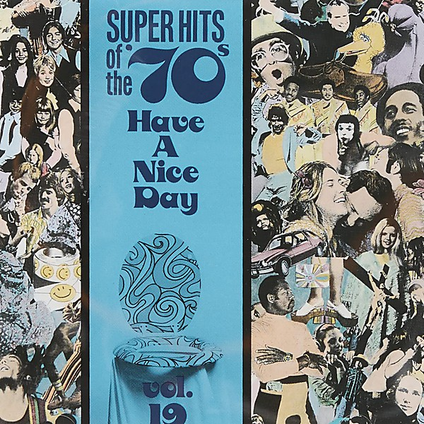

# Super Hits of the '70s

By **Various Artists**

## Album Data

- **Catalog:** Beets
- **Format:** Digital, Album
- **Album:** Super Hits of the '70s
- **Artist:** Various Artists
- **Albumartist:** Various Artists
- **Genre:** Psychedelic Rock
- **MusicBrainz Album Artist ID:** 
- **MusicBrainz Album ID:** 
- **MusicBrainz Release Group ID:** 
- **Year:** 1990
- **Catalog #:** 
- **Label:** 
- **Total Tracks:** 00

## Album Tracks

### Track 00 - 01-Nobody But Me

- **Artist:** Various Artists
- **Format:** ALAC
- **Genre:** Emo
- **Length:** 2:23
- **MusicBrainz Track ID:** 
- **Title:** 01-Nobody But Me
- **Track:** 00
- **Year:** 0000

### Track 00 - 02-Ode to Billie Jo

- **Artist:** Various Artists
- **Format:** ALAC
- **Genre:** Emo
- **Length:** 4:22
- **MusicBrainz Track ID:** 
- **Title:** 02-Ode to Billie Jo
- **Track:** 00
- **Year:** 0000

### Track 00 - 03-Time Won't Let Me

- **Artist:** Various Artists
- **Format:** ALAC
- **Genre:** Emo
- **Length:** 2:55
- **MusicBrainz Track ID:** 
- **Title:** 03-Time Won't Let Me
- **Track:** 00
- **Year:** 0000

### Track 00 - 04-Birds of a Feather

- **Artist:** Various Artists
- **Format:** ALAC
- **Genre:** Emo
- **Length:** 2:50
- **MusicBrainz Track ID:** 
- **Title:** 04-Birds of a Feather
- **Track:** 00
- **Year:** 0000

### Track 00 - 05-Dead End Street

- **Artist:** Various Artists
- **Format:** ALAC
- **Genre:** Emo
- **Length:** 2:28
- **MusicBrainz Track ID:** 
- **Title:** 05-Dead End Street
- **Track:** 00
- **Year:** 0000

### Track 00 - 06-Medley Goin' Out of My Head Can't Take My Eyes Off you

- **Artist:** Various Artists
- **Format:** ALAC
- **Genre:** Emo
- **Length:** 3:18
- **MusicBrainz Track ID:** 
- **Title:** 06-Medley Goin' Out of My Head Can't Take My Eyes Off you
- **Track:** 00
- **Year:** 0000

### Track 00 - 07-Mercy, Mercy, Mercy

- **Artist:** Various Artists
- **Format:** ALAC
- **Genre:** Emo
- **Length:** 5:20
- **MusicBrainz Track ID:** 
- **Title:** 07-Mercy, Mercy, Mercy
- **Track:** 00
- **Year:** 0000

### Track 00 - 08-Gentle on My Mond

- **Artist:** Various Artists
- **Format:** ALAC
- **Genre:** Emo
- **Length:** 3:00
- **MusicBrainz Track ID:** 
- **Title:** 08-Gentle on My Mond
- **Track:** 00
- **Year:** 0000

### Track 00 - 09-Knight In Rusty Armour

- **Artist:** Various Artists
- **Format:** ALAC
- **Genre:** Emo
- **Length:** 2:44
- **MusicBrainz Track ID:** 
- **Title:** 09-Knight In Rusty Armour
- **Track:** 00
- **Year:** 0000

### Track 00 - 11-By The Time I Get To Phoenix

- **Artist:** Various Artists
- **Format:** ALAC
- **Genre:** Emo
- **Length:** 3:00
- **MusicBrainz Track ID:** 
- **Title:** 11-By The Time I Get To Phoenix
- **Track:** 00
- **Year:** 0000

### Track 00 - 12-I Love You

- **Artist:** Various Artists
- **Format:** ALAC
- **Genre:** Emo
- **Length:** 4:38
- **MusicBrainz Track ID:** 
- **Title:** 12-I Love You
- **Track:** 00
- **Year:** 0000

### Track 00 - 13-Elvira

- **Artist:** Various Artists
- **Format:** ALAC
- **Genre:** Emo
- **Length:** 2:39
- **MusicBrainz Track ID:** 
- **Title:** 13-Elvira
- **Track:** 00
- **Year:** 0000

### Track 00 - 14-Help Me Girl

- **Artist:** Various Artists
- **Format:** ALAC
- **Genre:** Emo
- **Length:** 2:43
- **MusicBrainz Track ID:** 
- **Title:** 14-Help Me Girl
- **Track:** 00
- **Year:** 0000

### Track 00 - 15-If I Loved You

- **Artist:** Various Artists
- **Format:** ALAC
- **Genre:** Emo
- **Length:** 2:22
- **MusicBrainz Track ID:** 
- **Title:** 15-If I Loved You
- **Track:** 00
- **Year:** 0000

### Track 00 - 16-Turn On Your Love Light

- **Artist:** Various Artists
- **Format:** ALAC
- **Genre:** Emo
- **Length:** 2:37
- **MusicBrainz Track ID:** 
- **Title:** 16-Turn On Your Love Light
- **Track:** 00
- **Year:** 0000

### Track 00 - 17-Michelle

- **Artist:** Various Artists
- **Format:** ALAC
- **Genre:** Emo
- **Length:** 2:56
- **MusicBrainz Track ID:** 
- **Title:** 17-Michelle
- **Track:** 00
- **Year:** 0000

### Track 00 - 18-Love Is A Hurtin' Thing

- **Artist:** Various Artists
- **Format:** ALAC
- **Genre:** Emo
- **Length:** 2:20
- **MusicBrainz Track ID:** 
- **Title:** 18-Love Is A Hurtin' Thing
- **Track:** 00
- **Year:** 0000

### Track 00 - 19-Lady Godiva

- **Artist:** Various Artists
- **Format:** ALAC
- **Genre:** Emo
- **Length:** 2:30
- **MusicBrainz Track ID:** 
- **Title:** 19-Lady Godiva
- **Track:** 00
- **Year:** 0000

### Track 00 - 20-Get That Feeling

- **Artist:** Various Artists
- **Format:** ALAC
- **Genre:** Emo
- **Length:** 9:41
- **MusicBrainz Track ID:** 
- **Title:** 20-Get That Feeling
- **Track:** 00
- **Year:** 0000

### Track 01 - Nobody But Me

- **Artist:** Various Artists
- **Format:** AAC
- **Genre:** Emo
- **Length:** 2:23
- **MusicBrainz Track ID:** 
- **Title:** Nobody But Me
- **Track:** 01
- **Year:** 0000

### Track 02 - Ode to Billie Jo

- **Artist:** Various Artists
- **Format:** AAC
- **Genre:** Emo
- **Length:** 4:22
- **MusicBrainz Track ID:** 
- **Title:** Ode to Billie Jo
- **Track:** 02
- **Year:** 0000

### Track 03 - Time Won't Let Me

- **Artist:** Various Artists
- **Format:** AAC
- **Genre:** Emo
- **Length:** 2:55
- **MusicBrainz Track ID:** 
- **Title:** Time Won't Let Me
- **Track:** 03
- **Year:** 0000

### Track 04 - Birds of a Feather

- **Artist:** Various Artists
- **Format:** AAC
- **Genre:** Emo
- **Length:** 2:50
- **MusicBrainz Track ID:** 
- **Title:** Birds of a Feather
- **Track:** 04
- **Year:** 0000

### Track 05 - Dead End Street

- **Artist:** Various Artists
- **Format:** AAC
- **Genre:** Emo
- **Length:** 2:28
- **MusicBrainz Track ID:** 
- **Title:** Dead End Street
- **Track:** 05
- **Year:** 0000

### Track 06 - Medley Goin' Out of My Head Can't Take My Eyes Off you

- **Artist:** Various Artists
- **Format:** AAC
- **Genre:** Emo
- **Length:** 3:18
- **MusicBrainz Track ID:** 
- **Title:** Medley Goin' Out of My Head Can't Take My Eyes Off you
- **Track:** 06
- **Year:** 0000

### Track 07 - Mercy, Mercy, Mercy

- **Artist:** Various Artists
- **Format:** AAC
- **Genre:** Emo
- **Length:** 5:20
- **MusicBrainz Track ID:** 
- **Title:** Mercy, Mercy, Mercy
- **Track:** 07
- **Year:** 0000

### Track 08 - Gentle on My Mond

- **Artist:** Various Artists
- **Format:** AAC
- **Genre:** Emo
- **Length:** 3:00
- **MusicBrainz Track ID:** 
- **Title:** Gentle on My Mond
- **Track:** 08
- **Year:** 0000

### Track 09 - Knight In Rusty Armour

- **Artist:** Various Artists
- **Format:** AAC
- **Genre:** Emo
- **Length:** 2:44
- **MusicBrainz Track ID:** 
- **Title:** Knight In Rusty Armour
- **Track:** 09
- **Year:** 0000

### Track 10 - Different Drum

- **Artist:** Various Artists
- **Format:** AAC
- **Genre:** Emo
- **Length:** 2:40
- **MusicBrainz Track ID:** 
- **Title:** Different Drum
- **Track:** 10
- **Year:** 0000

### Track 11 - By The Time I Get To Phoenix

- **Artist:** Various Artists
- **Format:** AAC
- **Genre:** Emo
- **Length:** 3:00
- **MusicBrainz Track ID:** 
- **Title:** By The Time I Get To Phoenix
- **Track:** 11
- **Year:** 0000

### Track 12 - I Love You

- **Artist:** Various Artists
- **Format:** AAC
- **Genre:** House
- **Length:** 4:38
- **MusicBrainz Track ID:** 
- **Title:** I Love You
- **Track:** 12
- **Year:** 0000

### Track 13 - Elvira

- **Artist:** Various Artists
- **Format:** AAC
- **Genre:** Emo
- **Length:** 2:39
- **MusicBrainz Track ID:** 
- **Title:** Elvira
- **Track:** 13
- **Year:** 0000

### Track 14 - Help Me Girl

- **Artist:** Various Artists
- **Format:** AAC
- **Genre:** Emo
- **Length:** 2:43
- **MusicBrainz Track ID:** 
- **Title:** Help Me Girl
- **Track:** 14
- **Year:** 0000

### Track 15 - If I Loved You

- **Artist:** Various Artists
- **Format:** AAC
- **Genre:** Emo
- **Length:** 2:22
- **MusicBrainz Track ID:** 
- **Title:** If I Loved You
- **Track:** 15
- **Year:** 0000

### Track 16 - Turn On Your Love Light

- **Artist:** Various Artists
- **Format:** AAC
- **Genre:** Emo
- **Length:** 2:37
- **MusicBrainz Track ID:** 
- **Title:** Turn On Your Love Light
- **Track:** 16
- **Year:** 0000

### Track 17 - Michelle

- **Artist:** Various Artists
- **Format:** AAC
- **Genre:** Emo
- **Length:** 2:56
- **MusicBrainz Track ID:** 
- **Title:** Michelle
- **Track:** 17
- **Year:** 0000

### Track 18 - Love Is A Hurtin' Thing

- **Artist:** Various Artists
- **Format:** AAC
- **Genre:** Emo
- **Length:** 2:20
- **MusicBrainz Track ID:** 
- **Title:** Love Is A Hurtin' Thing
- **Track:** 18
- **Year:** 0000

### Track 19 - Lady Godiva

- **Artist:** Various Artists
- **Format:** AAC
- **Genre:** Emo
- **Length:** 2:30
- **MusicBrainz Track ID:** 
- **Title:** Lady Godiva
- **Track:** 19
- **Year:** 0000

### Track 20 - Get That Feeling

- **Artist:** Various Artists
- **Format:** AAC
- **Genre:** Emo
- **Length:** 9:41
- **MusicBrainz Track ID:** 
- **Title:** Get That Feeling
- **Track:** 20
- **Year:** 0000

