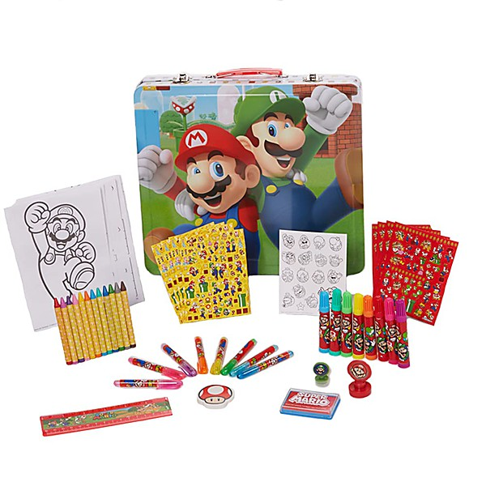

# Super Oldies Volume 3

By **Various Artists**

## Album Data

- **Catalog:** Beets
- **Format:** Digital, Album
- **Album:** Super Oldies Volume 3
- **Artist:** Various Artists
- **Albumartist:** Various Artists
- **Genre:** Emo
- **MusicBrainz Album Artist ID:** 
- **MusicBrainz Album ID:** 
- **MusicBrainz Release Group ID:** 
- **Year:** 0000
- **Catalog #:** 
- **Label:** 
- **Total Tracks:** 00

## Album Tracks

### Track 00 - 01-Surfin'

- **Artist:** Various Artists
- **Format:** ALAC
- **Genre:** Emo
- **Length:** 2:17
- **MusicBrainz Track ID:** 
- **Title:** 01-Surfin'
- **Track:** 00
- **Year:** 0000

### Track 00 - 02-Penetration

- **Artist:** Various Artists
- **Format:** ALAC
- **Genre:** Emo
- **Length:** 2:02
- **MusicBrainz Track ID:** 
- **Title:** 02-Penetration
- **Track:** 00
- **Year:** 0000

### Track 00 - 03-Let's Go Trippin'

- **Artist:** Various Artists
- **Format:** ALAC
- **Genre:** Emo
- **Length:** 2:34
- **MusicBrainz Track ID:** 
- **Title:** 03-Let's Go Trippin'
- **Track:** 00
- **Year:** 0000

### Track 00 - 04-Underwater

- **Artist:** Various Artists
- **Format:** ALAC
- **Genre:** Emo
- **Length:** 2:27
- **MusicBrainz Track ID:** 
- **Title:** 04-Underwater
- **Track:** 00
- **Year:** 0000

### Track 00 - 05-Surfer Girl

- **Artist:** Various Artists
- **Format:** ALAC
- **Genre:** Emo
- **Length:** 2:19
- **MusicBrainz Track ID:** 
- **Title:** 05-Surfer Girl
- **Track:** 00
- **Year:** 0000

### Track 00 - 06-Pipeline

- **Artist:** Various Artists
- **Format:** ALAC
- **Genre:** Emo
- **Length:** 2:22
- **MusicBrainz Track ID:** 
- **Title:** 06-Pipeline
- **Track:** 00
- **Year:** 0000

### Track 00 - 07-Latinia

- **Artist:** Various Artists
- **Format:** ALAC
- **Genre:** Emo
- **Length:** 2:31
- **MusicBrainz Track ID:** 
- **Title:** 07-Latinia
- **Track:** 00
- **Year:** 0000

### Track 00 - 08-Barbie

- **Artist:** Various Artists
- **Format:** ALAC
- **Genre:** Emo
- **Length:** 2:12
- **MusicBrainz Track ID:** 
- **Title:** 08-Barbie
- **Track:** 00
- **Year:** 0000

### Track 00 - 09-Surf Beat

- **Artist:** Various Artists
- **Format:** ALAC
- **Genre:** Emo
- **Length:** 2:05
- **MusicBrainz Track ID:** 
- **Title:** 09-Surf Beat
- **Track:** 00
- **Year:** 0000

### Track 00 - 10-Monkey's Uncle

- **Artist:** Various Artists
- **Format:** ALAC
- **Genre:** Emo
- **Length:** 2:36
- **MusicBrainz Track ID:** 
- **Title:** 10-Monkey's Uncle
- **Track:** 00
- **Year:** 0000

### Track 00 - 11-Surfin' Safari

- **Artist:** Various Artists
- **Format:** ALAC
- **Genre:** Emo
- **Length:** 2:00
- **MusicBrainz Track ID:** 
- **Title:** 11-Surfin' Safari
- **Track:** 00
- **Year:** 0000

### Track 00 - 12-Surfers Stomp

- **Artist:** Various Artists
- **Format:** ALAC
- **Genre:** Emo
- **Length:** 2:08
- **MusicBrainz Track ID:** 
- **Title:** 12-Surfers Stomp
- **Track:** 00
- **Year:** 0000

### Track 00 - 13-Church Key

- **Artist:** Various Artists
- **Format:** ALAC
- **Genre:** Emo
- **Length:** 2:16
- **MusicBrainz Track ID:** 
- **Title:** 13-Church Key
- **Track:** 00
- **Year:** 0000

### Track 00 - 14-Boss

- **Artist:** Various Artists
- **Format:** ALAC
- **Genre:** Emo
- **Length:** 2:20
- **MusicBrainz Track ID:** 
- **Title:** 14-Boss
- **Track:** 00
- **Year:** 0000

### Track 00 - 15-No One Could Be Prouder

- **Artist:** Various Artists
- **Format:** ALAC
- **Genre:** Emo
- **Length:** 2:25
- **MusicBrainz Track ID:** 
- **Title:** 15-No One Could Be Prouder
- **Track:** 00
- **Year:** 0000

### Track 00 - 16-Miserlou

- **Artist:** Various Artists
- **Format:** ALAC
- **Genre:** Emo
- **Length:** 2:40
- **MusicBrainz Track ID:** 
- **Title:** 16-Miserlou
- **Track:** 00
- **Year:** 0000

### Track 00 - 17-Wipe-Out

- **Artist:** Various Artists
- **Format:** ALAC
- **Genre:** Emo
- **Length:** 2:13
- **MusicBrainz Track ID:** 
- **Title:** 17-Wipe-Out
- **Track:** 00
- **Year:** 0000

### Track 00 - 18-Here Comes The Ho-Dads

- **Artist:** Various Artists
- **Format:** ALAC
- **Genre:** Emo
- **Length:** 2:07
- **MusicBrainz Track ID:** 
- **Title:** 18-Here Comes The Ho-Dads
- **Track:** 00
- **Year:** 0000

### Track 00 - 19-Tioga

- **Artist:** Various Artists
- **Format:** ALAC
- **Genre:** Emo
- **Length:** 2:23
- **MusicBrainz Track ID:** 
- **Title:** 19-Tioga
- **Track:** 00
- **Year:** 0000

### Track 00 - 20-Balboa Blue

- **Artist:** Various Artists
- **Format:** ALAC
- **Genre:** Emo
- **Length:** 2:39
- **MusicBrainz Track ID:** 
- **Title:** 20-Balboa Blue
- **Track:** 00
- **Year:** 0000

### Track 00 - 21-Those Memories Of You

- **Artist:** Various Artists
- **Format:** ALAC
- **Genre:** Emo
- **Length:** 2:49
- **MusicBrainz Track ID:** 
- **Title:** 21-Those Memories Of You
- **Track:** 00
- **Year:** 0000

### Track 01 - Surfin'

- **Artist:** Various Artists
- **Format:** AAC
- **Genre:** Emo
- **Length:** 2:17
- **MusicBrainz Track ID:** 
- **Title:** Surfin'
- **Track:** 01
- **Year:** 0000

### Track 02 - Penetration

- **Artist:** Various Artists
- **Format:** AAC
- **Genre:** Emo
- **Length:** 2:02
- **MusicBrainz Track ID:** 
- **Title:** Penetration
- **Track:** 02
- **Year:** 0000

### Track 03 - Let's Go Trippin'

- **Artist:** Various Artists
- **Format:** AAC
- **Genre:** Emo
- **Length:** 2:34
- **MusicBrainz Track ID:** 
- **Title:** Let's Go Trippin'
- **Track:** 03
- **Year:** 0000

### Track 04 - Underwater

- **Artist:** Various Artists
- **Format:** AAC
- **Genre:** Emo
- **Length:** 2:27
- **MusicBrainz Track ID:** 
- **Title:** Underwater
- **Track:** 04
- **Year:** 0000

### Track 05 - Surfer Girl

- **Artist:** Various Artists
- **Format:** AAC
- **Genre:** Emo
- **Length:** 2:19
- **MusicBrainz Track ID:** 
- **Title:** Surfer Girl
- **Track:** 05
- **Year:** 0000

### Track 06 - Pipeline

- **Artist:** Various Artists
- **Format:** AAC
- **Genre:** Emo
- **Length:** 2:22
- **MusicBrainz Track ID:** 
- **Title:** Pipeline
- **Track:** 06
- **Year:** 0000

### Track 07 - Latinia

- **Artist:** Various Artists
- **Format:** AAC
- **Genre:** Emo
- **Length:** 2:31
- **MusicBrainz Track ID:** 
- **Title:** Latinia
- **Track:** 07
- **Year:** 0000

### Track 08 - Barbie

- **Artist:** Various Artists
- **Format:** AAC
- **Genre:** Emo
- **Length:** 2:12
- **MusicBrainz Track ID:** 
- **Title:** Barbie
- **Track:** 08
- **Year:** 0000

### Track 09 - Surf Beat

- **Artist:** Various Artists
- **Format:** AAC
- **Genre:** Emo
- **Length:** 2:05
- **MusicBrainz Track ID:** 
- **Title:** Surf Beat
- **Track:** 09
- **Year:** 0000

### Track 10 - Monkey's Uncle

- **Artist:** Various Artists
- **Format:** AAC
- **Genre:** Emo
- **Length:** 2:36
- **MusicBrainz Track ID:** 
- **Title:** Monkey's Uncle
- **Track:** 10
- **Year:** 0000

### Track 11 - Surfin' Safari

- **Artist:** Various Artists
- **Format:** AAC
- **Genre:** Emo
- **Length:** 2:00
- **MusicBrainz Track ID:** 
- **Title:** Surfin' Safari
- **Track:** 11
- **Year:** 0000

### Track 12 - Surfers Stomp

- **Artist:** Various Artists
- **Format:** AAC
- **Genre:** Emo
- **Length:** 2:08
- **MusicBrainz Track ID:** 
- **Title:** Surfers Stomp
- **Track:** 12
- **Year:** 0000

### Track 13 - Church Key

- **Artist:** Various Artists
- **Format:** AAC
- **Genre:** Emo
- **Length:** 2:16
- **MusicBrainz Track ID:** 
- **Title:** Church Key
- **Track:** 13
- **Year:** 0000

### Track 14 - Boss

- **Artist:** Various Artists
- **Format:** AAC
- **Genre:** Emo
- **Length:** 2:21
- **MusicBrainz Track ID:** 
- **Title:** Boss
- **Track:** 14
- **Year:** 0000

### Track 15 - No One Could Be Prouder

- **Artist:** Various Artists
- **Format:** AAC
- **Genre:** Emo
- **Length:** 2:25
- **MusicBrainz Track ID:** 
- **Title:** No One Could Be Prouder
- **Track:** 15
- **Year:** 0000

### Track 16 - Miserlou

- **Artist:** Various Artists
- **Format:** AAC
- **Genre:** Emo
- **Length:** 2:40
- **MusicBrainz Track ID:** 
- **Title:** Miserlou
- **Track:** 16
- **Year:** 0000

### Track 17 - Wipe-Out

- **Artist:** Various Artists
- **Format:** AAC
- **Genre:** Emo
- **Length:** 2:13
- **MusicBrainz Track ID:** 
- **Title:** Wipe-Out
- **Track:** 17
- **Year:** 0000

### Track 18 - Here Comes The Ho-Dads

- **Artist:** Various Artists
- **Format:** AAC
- **Genre:** Emo
- **Length:** 2:07
- **MusicBrainz Track ID:** 
- **Title:** Here Comes The Ho-Dads
- **Track:** 18
- **Year:** 0000

### Track 19 - Tioga

- **Artist:** Various Artists
- **Format:** AAC
- **Genre:** Emo
- **Length:** 2:23
- **MusicBrainz Track ID:** 
- **Title:** Tioga
- **Track:** 19
- **Year:** 0000

### Track 20 - Balboa Blue

- **Artist:** Various Artists
- **Format:** AAC
- **Genre:** Emo
- **Length:** 2:39
- **MusicBrainz Track ID:** 
- **Title:** Balboa Blue
- **Track:** 20
- **Year:** 0000

### Track 21 - Those Memories Of You

- **Artist:** Various Artists
- **Format:** AAC
- **Genre:** Emo
- **Length:** 2:49
- **MusicBrainz Track ID:** 
- **Title:** Those Memories Of You
- **Track:** 21
- **Year:** 0000

