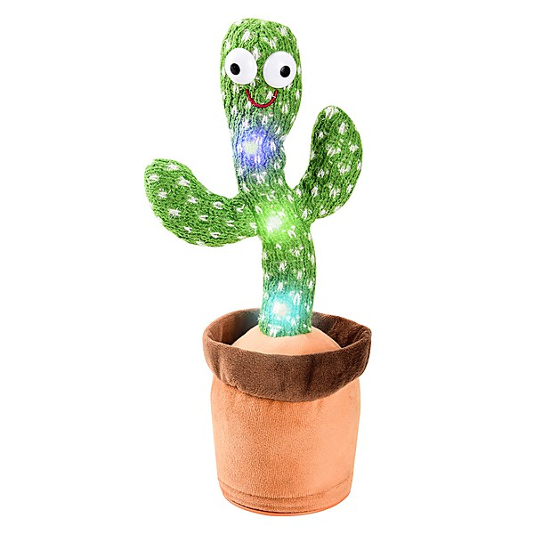

# The Best Of Power Pop Vol. 8

By **Various Artists**

## Album Data

- **Catalog:** Beets
- **Format:** Digital, Album
- **Album:** The Best Of Power Pop Vol. 8
- **Artist:** Various Artists
- **Albumartist:** Various Artists
- **Genre:** Indie Rock
- **MusicBrainz Album Artist ID:** 
- **MusicBrainz Album ID:** 
- **MusicBrainz Release Group ID:** 
- **Year:** 2010
- **Catalog #:** 
- **Label:** 
- **Total Tracks:** 00

## Album Tracks

### Track 02 - Do Wah Diddy Diddy

- **Artist:** Manfred Mann
- **Format:** AAC
- **Genre:** Rock
- **Length:** 2:22
- **MusicBrainz Track ID:** 
- **Title:** Do Wah Diddy Diddy
- **Track:** 02
- **Year:** 1988

