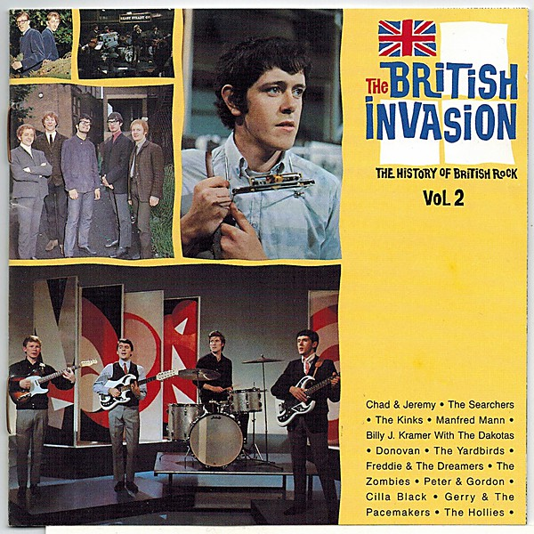

# The British Invasion

By **Various Artists**

## Album Data

- **Catalog:** Beets
- **Format:** Digital, Album
- **Album:** The British Invasion
- **Artist:** Various Artists
- **Albumartist:** Various Artists
- **Genre:** Rock
- **MusicBrainz Album Artist ID:** 
- **MusicBrainz Album ID:** 
- **MusicBrainz Release Group ID:** 
- **Year:** 1988
- **Catalog #:** 
- **Label:** 
- **Total Tracks:** 00

## Album Tracks

### Track 03 - Boogie Fever

- **Artist:** The Sylvers
- **Format:** AAC
- **Genre:** Soul
- **Length:** 3:29
- **MusicBrainz Track ID:** 
- **Title:** Boogie Fever
- **Track:** 03
- **Year:** 1992

