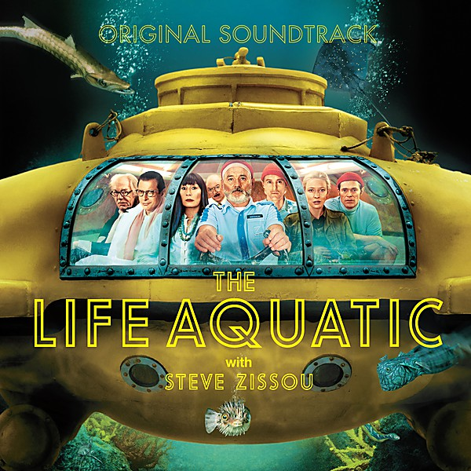

# The Life Aquatic

By **Various Artists**

## Album Data

- **Catalog:** Beets
- **Format:** Digital, Album
- **Album:** The Life Aquatic
- **Artist:** Various Artists
- **Albumartist:** Various Artists
- **Genre:** Jazz
- **MusicBrainz Album Artist ID:** 
- **MusicBrainz Album ID:** 
- **MusicBrainz Release Group ID:** 
- **Year:** 2004
- **Catalog #:** 
- **Label:** 
- **Total Tracks:** 00

## Album Tracks

### Track 00 - La niña de puerta oscura

- **Artist:** Paco de Lucía
- **Format:** ALAC
- **Genre:** Jazz
- **Length:** 2:58
- **MusicBrainz Track ID:** [0a8a4072-9dba-4f1a-a214-e0984035d175](https://musicbrainz.org/recording/0a8a4072-9dba-4f1a-a214-e0984035d175)
- **Title:** La niña de puerta oscura
- **Track:** 00
- **Year:** 0000

### Track 00 - Zissou Society Blue Star Cadets / Ned’s Theme Take 1

- **Artist:** Mark Mothersbaugh
- **Format:** ALAC
- **Genre:** Jazz
- **Length:** 2:52
- **MusicBrainz Track ID:** [1496223e-5737-41f9-8ce3-29cc2f09bf47](https://musicbrainz.org/recording/1496223e-5737-41f9-8ce3-29cc2f09bf47)
- **Title:** Zissou Society Blue Star Cadets / Ned’s Theme Take 1
- **Track:** 00
- **Year:** 0000

### Track 00 - 01-Shark Attack Theme

- **Artist:** Various Artists
- **Format:** ALAC
- **Genre:** Emo
- **Length:** 0:57
- **MusicBrainz Track ID:** 
- **Title:** 01-Shark Attack Theme
- **Track:** 00
- **Year:** 0000

### Track 00 - 02-Loquasto International Film Festival

- **Artist:** Various Artists
- **Format:** ALAC
- **Genre:** Emo
- **Length:** 4:40
- **MusicBrainz Track ID:** 
- **Title:** 02-Loquasto International Film Festival
- **Track:** 00
- **Year:** 0000

### Track 00 - 03-Life on Mars-

- **Artist:** Various Artists
- **Format:** ALAC
- **Genre:** Emo
- **Length:** 3:43
- **MusicBrainz Track ID:** 
- **Title:** 03-Life on Mars-
- **Track:** 00
- **Year:** 0000

### Track 00 - 04-Starman

- **Artist:** Various Artists
- **Format:** ALAC
- **Genre:** Emo
- **Length:** 3:21
- **MusicBrainz Track ID:** 
- **Title:** 04-Starman
- **Track:** 00
- **Year:** 0000

### Track 00 - 05-Let Me Tell You About My Boat

- **Artist:** Various Artists
- **Format:** ALAC
- **Genre:** Emo
- **Length:** 1:38
- **MusicBrainz Track ID:** 
- **Title:** 05-Let Me Tell You About My Boat
- **Track:** 00
- **Year:** 0000

### Track 00 - 06-Rebel Rebel

- **Artist:** Various Artists
- **Format:** ALAC
- **Genre:** Emo
- **Length:** 2:24
- **MusicBrainz Track ID:** 
- **Title:** 06-Rebel Rebel
- **Track:** 00
- **Year:** 0000

### Track 00 - 08-Gut Feeling

- **Artist:** Various Artists
- **Format:** ALAC
- **Genre:** Emo
- **Length:** 4:07
- **MusicBrainz Track ID:** 
- **Title:** 08-Gut Feeling
- **Track:** 00
- **Year:** 0000

### Track 00 - 09-Open Sea Theme

- **Artist:** Various Artists
- **Format:** ALAC
- **Genre:** Emo
- **Length:** 2:01
- **MusicBrainz Track ID:** 
- **Title:** 09-Open Sea Theme
- **Track:** 00
- **Year:** 0000

### Track 00 - 10-Rock & Roll Suicide

- **Artist:** Various Artists
- **Format:** ALAC
- **Genre:** Emo
- **Length:** 3:12
- **MusicBrainz Track ID:** 
- **Title:** 10-Rock & Roll Suicide
- **Track:** 00
- **Year:** 0000

### Track 00 - 11-Here's to You

- **Artist:** Various Artists
- **Format:** ALAC
- **Genre:** Emo
- **Length:** 3:07
- **MusicBrainz Track ID:** 
- **Title:** 11-Here's to You
- **Track:** 00
- **Year:** 0000

### Track 00 - 13-Search and Destroy

- **Artist:** Various Artists
- **Format:** ALAC
- **Genre:** Emo
- **Length:** 3:27
- **MusicBrainz Track ID:** 
- **Title:** 13-Search and Destroy
- **Track:** 00
- **Year:** 0000

### Track 00 - 15-Life on Mars-

- **Artist:** Various Artists
- **Format:** ALAC
- **Genre:** Emo
- **Length:** 3:24
- **MusicBrainz Track ID:** 
- **Title:** 15-Life on Mars-
- **Track:** 00
- **Year:** 0000

### Track 00 - 16-Ping Island-Lighting Strike Rescue Op

- **Artist:** Various Artists
- **Format:** ALAC
- **Genre:** Emo
- **Length:** 4:15
- **MusicBrainz Track ID:** 
- **Title:** 16-Ping Island-Lighting Strike Rescue Op
- **Track:** 00
- **Year:** 0000

### Track 00 - 17-Five Years

- **Artist:** Various Artists
- **Format:** ALAC
- **Genre:** Emo
- **Length:** 3:41
- **MusicBrainz Track ID:** 
- **Title:** 17-Five Years
- **Track:** 00
- **Year:** 0000

### Track 00 - 18-30 Century Man

- **Artist:** Various Artists
- **Format:** ALAC
- **Genre:** Emo
- **Length:** 1:27
- **MusicBrainz Track ID:** 
- **Title:** 18-30 Century Man
- **Track:** 00
- **Year:** 0000

### Track 00 - 19-The Way I Feel Inside

- **Artist:** Various Artists
- **Format:** ALAC
- **Genre:** Emo
- **Length:** 1:33
- **MusicBrainz Track ID:** 
- **Title:** 19-The Way I Feel Inside
- **Track:** 00
- **Year:** 0000

### Track 00 - 20-Queen Bitch

- **Artist:** Various Artists
- **Format:** ALAC
- **Genre:** Emo
- **Length:** 3:17
- **MusicBrainz Track ID:** 
- **Title:** 20-Queen Bitch
- **Track:** 00
- **Year:** 0000

