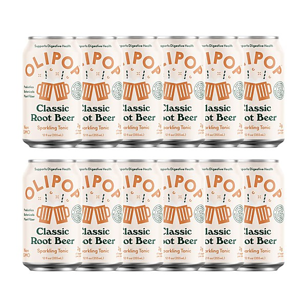

# The Retrospace 2011 Xmas Mix

By **Various Artists**

## Album Data

- **Catalog:** Beets
- **Format:** Digital, Album
- **Album:** The Retrospace 2011 Xmas Mix
- **Artist:** Various Artists
- **Albumartist:** Various Artists
- **Genre:** Soul
- **MusicBrainz Album Artist ID:** 
- **MusicBrainz Album ID:** 
- **MusicBrainz Release Group ID:** 
- **Year:** 2011
- **Catalog #:** 
- **Label:** 
- **Total Tracks:** 00

## Album Tracks

### Track 12 - Blueberry Hill

- **Artist:** Fats Domino
- **Format:** AAC
- **Genre:** Rock And Roll
- **Length:** 2:21
- **MusicBrainz Track ID:** 
- **Title:** Blueberry Hill
- **Track:** 12
- **Year:** 0000

### Track 10 - My Prayer

- **Artist:** The Platters
- **Format:** MP3
- **Genre:** Soul
- **Length:** 2:42
- **MusicBrainz Track ID:** 
- **Title:** My Prayer
- **Track:** 10
- **Year:** 0000

