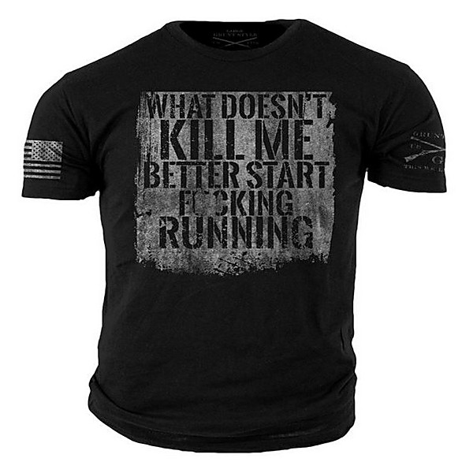

# There's a Riot Goin' On! The Rock 'N' Roll Classics of Lieber and Stoller

By **Various Artists**

## Album Data

- **Catalog:** Beets
- **Format:** Digital, Album
- **Album:** There's a Riot Goin' On! The Rock 'N' Roll Classics of Lieber and Stoller
- **Artist:** Various Artists
- **Albumartist:** Various Artists
- **Genre:** Rockabilly
- **MusicBrainz Album Artist ID:** 
- **MusicBrainz Album ID:** 
- **MusicBrainz Release Group ID:** 
- **Year:** 1991
- **Catalog #:** 
- **Label:** Uptown/Universal
- **Total Tracks:** 00

## Album Tracks

### Track 04 - Your Cheatin' Heart

- **Artist:** Beck
- **Format:** MP3
- **Genre:** Country
- **Length:** 3:41
- **MusicBrainz Track ID:** 
- **Title:** Your Cheatin' Heart
- **Track:** 04
- **Year:** 2001

### Track 01 - I Can't Get You off of My Mind

- **Artist:** Bob Dylan
- **Format:** MP3
- **Genre:** Folk Rock
- **Length:** 2:56
- **MusicBrainz Track ID:** 
- **Title:** I Can't Get You off of My Mind
- **Track:** 01
- **Year:** 2001

### Track 05 - Lost on the River

- **Artist:** Emmylou Harris/Mark & His Band Knopfler
- **Format:** MP3
- **Genre:** Blues
- **Length:** 3:03
- **MusicBrainz Track ID:** 
- **Title:** Lost on the River
- **Track:** 05
- **Year:** 2001

### Track 08 - Alone and Forsaken

- **Artist:** Emmylou Harris/Mark & His Band Knopfler
- **Format:** MP3
- **Genre:** Americana
- **Length:** 3:31
- **MusicBrainz Track ID:** 
- **Title:** Alone and Forsaken
- **Track:** 08
- **Year:** 2001

### Track 09 - I'm a Long Gone Daddy

- **Artist:** Hank III
- **Format:** MP3
- **Genre:** Western Swing
- **Length:** 3:37
- **MusicBrainz Track ID:** 
- **Title:** I'm a Long Gone Daddy
- **Track:** 09
- **Year:** 2001

### Track 12 - I Dreamed About Mama Last Night

- **Artist:** Johnny Cash
- **Format:** MP3
- **Genre:** Country
- **Length:** 3:13
- **MusicBrainz Track ID:** 
- **Title:** I Dreamed About Mama Last Night
- **Track:** 12
- **Year:** 2001

### Track 03 - I'm So Lonesome I Could Cry

- **Artist:** Keb' Mo'
- **Format:** MP3
- **Genre:** Blues
- **Length:** 4:01
- **MusicBrainz Track ID:** 
- **Title:** I'm So Lonesome I Could Cry
- **Track:** 03
- **Year:** 2001

### Track 07 - You Win Again

- **Artist:** Keith Richards
- **Format:** MP3
- **Genre:** Stoner Rock
- **Length:** 4:30
- **MusicBrainz Track ID:** 
- **Title:** You Win Again
- **Track:** 07
- **Year:** 2001

### Track 11 - Cold, Cold Heart

- **Artist:** Lucinda Williams
- **Format:** MP3
- **Genre:** Country
- **Length:** 5:08
- **MusicBrainz Track ID:** 
- **Title:** Cold, Cold Heart
- **Track:** 11
- **Year:** 2001

### Track 10 - Lovesick Blues

- **Artist:** Ryan Adams
- **Format:** MP3
- **Genre:** Blues
- **Length:** 3:23
- **MusicBrainz Track ID:** 
- **Title:** Lovesick Blues
- **Track:** 10
- **Year:** 2001

### Track 02 - Long Gone Lonesome Blues

- **Artist:** Sheryl Crow
- **Format:** MP3
- **Genre:** Country
- **Length:** 2:56
- **MusicBrainz Track ID:** 
- **Title:** Long Gone Lonesome Blues
- **Track:** 02
- **Year:** 2001

### Track 06 - You're Gonna Change (Or I'm Gonna Leave)

- **Artist:** Tom Petty
- **Format:** MP3
- **Genre:** Americana
- **Length:** 3:11
- **MusicBrainz Track ID:** 
- **Title:** You're Gonna Change (Or I'm Gonna Leave)
- **Track:** 06
- **Year:** 2001

