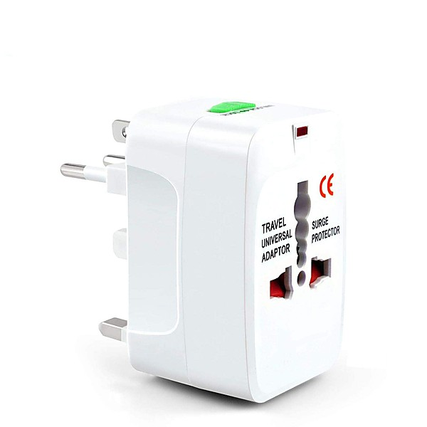

# Very Best of Country [Crimson] Disc 1

By **Various Artists**

## Album Data

- **Catalog:** Beets
- **Format:** Digital, Album
- **Album:** Very Best of Country [Crimson] Disc 1
- **Artist:** Various Artists
- **Albumartist:** Various Artists
- **Genre:** Rockabilly
- **MusicBrainz Album Artist ID:** 
- **MusicBrainz Album ID:** 
- **MusicBrainz Release Group ID:** 
- **Year:** 1998
- **Catalog #:** 
- **Label:** 
- **Total Tracks:** 00

## Album Tracks

### Track 24 - Chanson D'amour

- **Artist:** Art & Dottie Todd
- **Format:** MP3
- **Genre:** Pop
- **Length:** 2:55
- **MusicBrainz Track ID:** 
- **Title:** Chanson D'amour
- **Track:** 24
- **Year:** 0000

### Track 17 - Sail Along Silvery Moon

- **Artist:** Billy Vaughn
- **Format:** MP3
- **Genre:** Swing
- **Length:** 2:12
- **MusicBrainz Track ID:** 
- **Title:** Sail Along Silvery Moon
- **Track:** 17
- **Year:** 0000

### Track 15 - Peggy Sue

- **Artist:** Buddy Holly
- **Format:** MP3
- **Genre:** Rockabilly
- **Length:** 2:33
- **MusicBrainz Track ID:** 
- **Title:** Peggy Sue
- **Track:** 15
- **Year:** 0000

### Track 16 - At The Hop

- **Artist:** Danny & The Juniors
- **Format:** MP3
- **Genre:** Rock And Roll
- **Length:** 2:32
- **MusicBrainz Track ID:** 
- **Title:** At The Hop
- **Track:** 16
- **Year:** 0000

### Track 22 - Witch Doctor

- **Artist:** David Seville
- **Format:** MP3
- **Genre:** Pop
- **Length:** 2:23
- **MusicBrainz Track ID:** 
- **Title:** Witch Doctor
- **Track:** 22
- **Year:** 0000

### Track 03 - Tammy

- **Artist:** Debbie Reynolds
- **Format:** MP3
- **Genre:** Pop
- **Length:** 3:09
- **MusicBrainz Track ID:** 
- **Title:** Tammy
- **Track:** 03
- **Year:** 0000

### Track 30 - Volare (Nel Blu Dipinto Di Blu)

- **Artist:** Domenico Modugno
- **Format:** MP3
- **Genre:** Pop
- **Length:** 3:39
- **MusicBrainz Track ID:** 
- **Title:** Volare (Nel Blu Dipinto Di Blu)
- **Track:** 30
- **Year:** 0000

### Track 04 - Teddy Bear

- **Artist:** Elvis Presley
- **Format:** MP3
- **Genre:** Rockabilly
- **Length:** 1:53
- **MusicBrainz Track ID:** 
- **Title:** Teddy Bear
- **Track:** 04
- **Year:** 0000

### Track 11 - Jailhouse Rock

- **Artist:** Elvis Presley
- **Format:** MP3
- **Genre:** Rockabilly
- **Length:** 2:32
- **MusicBrainz Track ID:** 
- **Title:** Jailhouse Rock
- **Track:** 11
- **Year:** 0000

### Track 27 - Hard Headed Woman

- **Artist:** Elvis Presley
- **Format:** MP3
- **Genre:** Rockabilly
- **Length:** 1:58
- **MusicBrainz Track ID:** 
- **Title:** Hard Headed Woman
- **Track:** 27
- **Year:** 0000

### Track 14 - All The Way

- **Artist:** Frank Sinatra
- **Format:** MP3
- **Genre:** Vocal Jazz
- **Length:** 2:55
- **MusicBrainz Track ID:** 
- **Title:** All The Way
- **Track:** 14
- **Year:** 0000

### Track 07 - Fascination

- **Artist:** Jane Morgan
- **Format:** MP3
- **Genre:** Smooth Jazz
- **Length:** 2:27
- **MusicBrainz Track ID:** 
- **Title:** Fascination
- **Track:** 07
- **Year:** 0000

### Track 06 - Honeycomb

- **Artist:** Jimmie Rodgers
- **Format:** MP3
- **Genre:** Classic Country
- **Length:** 2:19
- **MusicBrainz Track ID:** 
- **Title:** Honeycomb
- **Track:** 06
- **Year:** 0000

### Track 01 - It's Not For Me To Say

- **Artist:** Johnny Mathis
- **Format:** MP3
- **Genre:** Pop
- **Length:** 3:07
- **MusicBrainz Track ID:** 
- **Title:** It's Not For Me To Say
- **Track:** 01
- **Year:** 0000

### Track 08 - Chances Are

- **Artist:** Johnny Mathis
- **Format:** MP3
- **Genre:** Pop
- **Length:** 3:05
- **MusicBrainz Track ID:** 
- **Title:** Chances Are
- **Track:** 08
- **Year:** 0000

### Track 09 - The Twelfth Of Never

- **Artist:** Johnny Mathis
- **Format:** MP3
- **Genre:** Pop
- **Length:** 2:32
- **MusicBrainz Track ID:** 
- **Title:** The Twelfth Of Never
- **Track:** 09
- **Year:** 0000

### Track 21 - He's Got the Whole World in His Hands

- **Artist:** Laurie London
- **Format:** MP3
- **Genre:** Close Harmony
- **Length:** 2:23
- **MusicBrainz Track ID:** 
- **Title:** He's Got the Whole World in His Hands
- **Track:** 21
- **Year:** 0000

### Track 02 - Around The World

- **Artist:** Mantovani Orchestra
- **Format:** MP3
- **Genre:** Easy Listening
- **Length:** 2:01
- **MusicBrainz Track ID:** 
- **Title:** Around The World
- **Track:** 02
- **Year:** 0000

### Track 13 - April Love

- **Artist:** Pat Boone
- **Format:** MP3
- **Genre:** Pop
- **Length:** 2:43
- **MusicBrainz Track ID:** 
- **Title:** April Love
- **Track:** 13
- **Year:** 0000

### Track 05 - Diana

- **Artist:** Paul Anka
- **Format:** MP3
- **Genre:** Swing
- **Length:** 2:27
- **MusicBrainz Track ID:** 
- **Title:** Diana
- **Track:** 05
- **Year:** 0000

### Track 18 - Catch A Falling Star

- **Artist:** Perry Como
- **Format:** MP3
- **Genre:** Swing
- **Length:** 2:32
- **MusicBrainz Track ID:** 
- **Title:** Catch A Falling Star
- **Track:** 18
- **Year:** 0000

### Track 28 - Patricia

- **Artist:** Pérez Prado
- **Format:** MP3
- **Genre:** Mambo
- **Length:** 2:08
- **MusicBrainz Track ID:** 
- **Title:** Patricia
- **Track:** 28
- **Year:** 0000

### Track 29 - Poor Little Fool

- **Artist:** Ricky Nelson
- **Format:** MP3
- **Genre:** Rockabilly
- **Length:** 2:37
- **MusicBrainz Track ID:** 
- **Title:** Poor Little Fool
- **Track:** 29
- **Year:** 0000

### Track 26 - The Purple People Eater

- **Artist:** Sheb Wooley
- **Format:** MP3
- **Genre:** Rockabilly
- **Length:** 2:17
- **MusicBrainz Track ID:** 
- **Title:** The Purple People Eater
- **Track:** 26
- **Year:** 0000

### Track 20 - Tequila

- **Artist:** The Champs
- **Format:** MP3
- **Genre:** Rock And Roll
- **Length:** 2:18
- **MusicBrainz Track ID:** 
- **Title:** Tequila
- **Track:** 20
- **Year:** 0000

### Track 10 - Come Go With Me

- **Artist:** The Del Vikings
- **Format:** MP3
- **Genre:** Rock And Roll
- **Length:** 2:45
- **MusicBrainz Track ID:** 
- **Title:** Come Go With Me
- **Track:** 10
- **Year:** 0000

### Track 31 - Little Star

- **Artist:** The Elegants
- **Format:** MP3
- **Genre:** Soul
- **Length:** 2:41
- **MusicBrainz Track ID:** 
- **Title:** Little Star
- **Track:** 31
- **Year:** 0000

### Track 12 - Wake Up Little Susie

- **Artist:** The Everly Brothers
- **Format:** MP3
- **Genre:** Rockabilly
- **Length:** 2:03
- **MusicBrainz Track ID:** 
- **Title:** Wake Up Little Susie
- **Track:** 12
- **Year:** 0000

### Track 25 - All I Have To Do Is Dream

- **Artist:** The Everly Brothers
- **Format:** MP3
- **Genre:** Pop
- **Length:** 2:24
- **MusicBrainz Track ID:** 
- **Title:** All I Have To Do Is Dream
- **Track:** 25
- **Year:** 0000

### Track 19 - Sugartime

- **Artist:** The McGuire Sisters
- **Format:** MP3
- **Genre:** Swing
- **Length:** 2:38
- **MusicBrainz Track ID:** 
- **Title:** Sugartime
- **Track:** 19
- **Year:** 0000

### Track 23 - Twilight Time

- **Artist:** The Platters
- **Format:** MP3
- **Genre:** Soul
- **Length:** 2:46
- **MusicBrainz Track ID:** 
- **Title:** Twilight Time
- **Track:** 23
- **Year:** 0000

