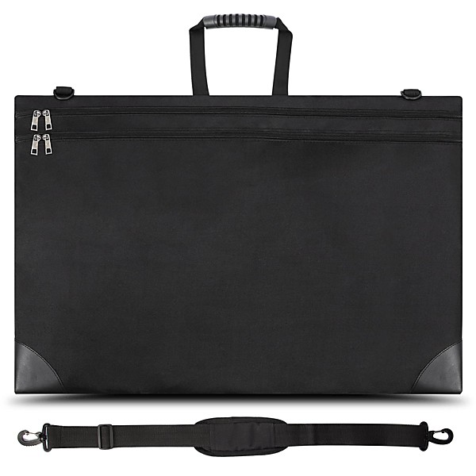

# What's Up Matador (Disc 2)

By **Various Artists**

## Album Data

- **Catalog:** Beets
- **Format:** Digital, Album
- **Album:** What's Up Matador (Disc 2)
- **Artist:** Various Artists
- **Albumartist:** Various Artists
- **Genre:** Indie Rock
- **MusicBrainz Album Artist ID:** 
- **MusicBrainz Album ID:** 
- **MusicBrainz Release Group ID:** 
- **Year:** 2000
- **Catalog #:** 
- **Label:** 
- **Total Tracks:** 00

## Album Tracks

### Track 00 - Dust Bowl

- **Artist:** Various Artists
- **Format:** AAC
- **Genre:** Americana
- **Length:** 5:20
- **MusicBrainz Track ID:** 
- **Title:** Dust Bowl
- **Track:** 00
- **Year:** 0000

### Track 00 - Kiara

- **Artist:** Bonobo
- **Format:** MP3
- **Genre:** Trip Hop
- **Length:** 5:02
- **MusicBrainz Track ID:** 
- **Title:** Kiara
- **Track:** 00
- **Year:** 0000

### Track 00 - Down to the River

- **Artist:** Brown Bird
- **Format:** AAC
- **Genre:** Americana
- **Length:** 2:44
- **MusicBrainz Track ID:** 
- **Title:** Down to the River
- **Track:** 00
- **Year:** 0000

### Track 00 - Ebb & Flow

- **Artist:** Brown Bird
- **Format:** MP3
- **Genre:** Americana
- **Length:** 2:25
- **MusicBrainz Track ID:** 
- **Title:** Ebb & Flow
- **Track:** 00
- **Year:** 0000

### Track 00 - Fingers to the Bone

- **Artist:** Brown Bird
- **Format:** AAC
- **Genre:** Americana
- **Length:** 3:11
- **MusicBrainz Track ID:** 
- **Title:** Fingers to the Bone
- **Track:** 00
- **Year:** 0000

### Track 00 - Gallows

- **Artist:** Brown Bird
- **Format:** AAC
- **Genre:** Americana
- **Length:** 2:35
- **MusicBrainz Track ID:** 
- **Title:** Gallows
- **Track:** 00
- **Year:** 0000

### Track 00 - Thunder & Lightning

- **Artist:** Brown Bird
- **Format:** AAC
- **Genre:** Americana
- **Length:** 3:28
- **MusicBrainz Track ID:** 
- **Title:** Thunder & Lightning
- **Track:** 00
- **Year:** 0000

### Track 00 - Mama Africa

- **Artist:** Chico Cesar
- **Format:** MP3
- **Genre:** Reggae
- **Length:** 4:17
- **MusicBrainz Track ID:** 
- **Title:** Mama Africa
- **Track:** 00
- **Year:** 0000

### Track 00 - Appletree

- **Artist:** Erykah Badu
- **Format:** MP3
- **Genre:** Soul
- **Length:** 5:13
- **MusicBrainz Track ID:** 
- **Title:** Appletree
- **Track:** 00
- **Year:** 0000

### Track 00 - My Baby's Got Sauce

- **Artist:** G. Love and Special Sauce
- **Format:** MP3
- **Genre:** Uk Garage
- **Length:** 3:55
- **MusicBrainz Track ID:** 
- **Title:** My Baby's Got Sauce
- **Track:** 00
- **Year:** 0000

### Track 00 - Down Home Girl

- **Artist:** Old Crow Medicine Show
- **Format:** AAC
- **Genre:** Bluegrass
- **Length:** 3:48
- **MusicBrainz Track ID:** 
- **Title:** Down Home Girl
- **Track:** 00
- **Year:** 0000

### Track 00 - In The Waiting Line

- **Artist:** Zero 7
- **Format:** MP3
- **Genre:** Electronica
- **Length:** 4:09
- **MusicBrainz Track ID:** 
- **Title:** In The Waiting Line
- **Track:** 00
- **Year:** 0000

