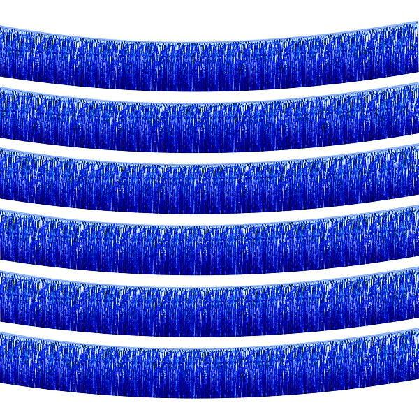

# Your Hit Parade

By **Various Artists**

## Album Data

- **Catalog:** Beets
- **Format:** Digital, Album
- **Album:** Your Hit Parade
- **Artist:** Various Artists
- **Albumartist:** Various Artists
- **Genre:** Rock And Roll
- **MusicBrainz Album Artist ID:** 
- **MusicBrainz Album ID:** 
- **MusicBrainz Release Group ID:** 
- **Year:** 1989
- **Catalog #:** 
- **Label:** 
- **Total Tracks:** 00

## Album Tracks

### Track 24 - The Ballad of Davy Crockett

- **Artist:** Bill Hayes
- **Format:** AAC
- **Genre:** Rockabilly
- **Length:** 2:23
- **MusicBrainz Track ID:** 
- **Title:** The Ballad of Davy Crockett
- **Track:** 24
- **Year:** 1989

### Track 11 - Hard to Get

- **Artist:** Gisele MacKenzie
- **Format:** ALAC
- **Genre:** Pop
- **Length:** 3:01
- **MusicBrainz Track ID:** 
- **Title:** Hard to Get
- **Track:** 11
- **Year:** 1989

### Track 05 - Let Me Go Lover

- **Artist:** Joan Weber
- **Format:** AAC
- **Genre:** Traditional Pop Music
- **Length:** 2:26
- **MusicBrainz Track ID:** 
- **Title:** Let Me Go Lover
- **Track:** 05
- **Year:** 1989

### Track 08 - Cherry Pink and Apple Blossom White

- **Artist:** Pérez Prado
- **Format:** MP3
- **Genre:** Mambo
- **Length:** 3:03
- **MusicBrainz Track ID:** 
- **Title:** Cherry Pink and Apple Blossom White
- **Track:** 08
- **Year:** 1989

