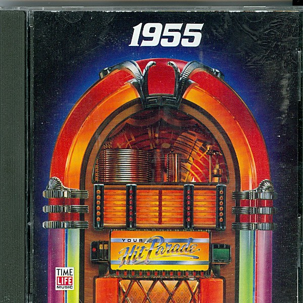

# Your Hit Parade

By **Various Artists**

## Album Data

- **Catalog:** Beets
- **Format:** Digital, Album
- **Album:** Your Hit Parade
- **Artist:** Various Artists
- **Albumartist:** Various Artists
- **Genre:** Rockabilly
- **MusicBrainz Album Artist ID:** 
- **MusicBrainz Album ID:** 
- **MusicBrainz Release Group ID:** 
- **Year:** 1989
- **Catalog #:** 
- **Label:** 
- **Total Tracks:** 00

## Album Tracks

### Track 23 - The Poor People of Paris (Jean's Song)

- **Artist:** Les Baxter
- **Format:** AAC
- **Genre:** Jazz
- **Length:** 2:26
- **MusicBrainz Track ID:** 
- **Title:** The Poor People of Paris (Jean's Song)
- **Track:** 23
- **Year:** 1990

