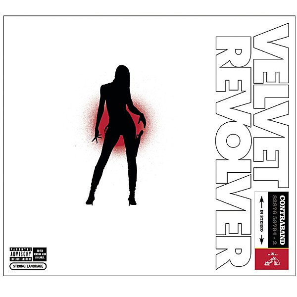

# Contraband

By **Velvet Revolver**

## Album Data

- **Catalog:** Beets
- **Format:** Digital, Album
- **Album:** Contraband
- **Artist:** Velvet Revolver
- **Albumartist:** Velvet Revolver
- **Genre:** Hard Rock
- **MusicBrainz Album Artist ID:** [3a528006-1429-47f4-ae9b-2ea95343e16a](https://musicbrainz.org/artist/3a528006-1429-47f4-ae9b-2ea95343e16a)
- **MusicBrainz Album ID:** [fda72006-31b0-3c8e-9235-f7728aac956e](https://musicbrainz.org/release/fda72006-31b0-3c8e-9235-f7728aac956e)
- **MusicBrainz Release Group ID:** [0dee8f91-e4a6-3891-9ec3-b014b403e65c](https://musicbrainz.org/release-group/0dee8f91-e4a6-3891-9ec3-b014b403e65c)
- **Year:** 2004
- **Catalog #:** RCA 82876 59794-2
- **Label:** RCA
- **Total Tracks:** 13

## Album Tracks

### Track 01 - Sucker Train Blues

- **Artist:** Velvet Revolver
- **Format:** ALAC
- **Genre:** Hard Rock
- **Length:** 4:27
- **MusicBrainz Track ID:** [8aebef13-08fa-46a3-a4a7-23f31c8ef8e4](https://musicbrainz.org/recording/8aebef13-08fa-46a3-a4a7-23f31c8ef8e4)
- **Title:** Sucker Train Blues
- **Track:** 01
- **Year:** 2004

### Track 02 - Do It for the Kids

- **Artist:** Velvet Revolver
- **Format:** ALAC
- **Genre:** Hard Rock
- **Length:** 3:55
- **MusicBrainz Track ID:** [83a71b1d-36dc-44a6-9e7f-18833a5b074c](https://musicbrainz.org/recording/83a71b1d-36dc-44a6-9e7f-18833a5b074c)
- **Title:** Do It for the Kids
- **Track:** 02
- **Year:** 2004

### Track 03 - Big Machine

- **Artist:** Velvet Revolver
- **Format:** ALAC
- **Genre:** Hard Rock
- **Length:** 4:25
- **MusicBrainz Track ID:** [ec9ad036-239c-4fa4-b9b6-5b493ceb24f9](https://musicbrainz.org/recording/ec9ad036-239c-4fa4-b9b6-5b493ceb24f9)
- **Title:** Big Machine
- **Track:** 03
- **Year:** 2004

### Track 04 - Illegal I Song

- **Artist:** Velvet Revolver
- **Format:** ALAC
- **Genre:** Hard Rock
- **Length:** 4:17
- **MusicBrainz Track ID:** [8d1dcd92-4431-4334-96f7-7557bba60642](https://musicbrainz.org/recording/8d1dcd92-4431-4334-96f7-7557bba60642)
- **Title:** Illegal I Song
- **Track:** 04
- **Year:** 2004

### Track 05 - Spectacle

- **Artist:** Velvet Revolver
- **Format:** ALAC
- **Genre:** Hard Rock
- **Length:** 3:41
- **MusicBrainz Track ID:** [19c6461f-fe07-4a3c-9b81-f6f59c65ed09](https://musicbrainz.org/recording/19c6461f-fe07-4a3c-9b81-f6f59c65ed09)
- **Title:** Spectacle
- **Track:** 05
- **Year:** 2004

### Track 06 - Fall to Pieces

- **Artist:** Velvet Revolver
- **Format:** ALAC
- **Genre:** Hard Rock
- **Length:** 4:30
- **MusicBrainz Track ID:** [76a8af17-0729-4d2f-9663-f3f16cc24f1f](https://musicbrainz.org/recording/76a8af17-0729-4d2f-9663-f3f16cc24f1f)
- **Title:** Fall to Pieces
- **Track:** 06
- **Year:** 2004

### Track 07 - Headspace

- **Artist:** Velvet Revolver
- **Format:** ALAC
- **Genre:** Grunge
- **Length:** 3:42
- **MusicBrainz Track ID:** [bcad9a75-e077-4c90-a321-74c9d346d793](https://musicbrainz.org/recording/bcad9a75-e077-4c90-a321-74c9d346d793)
- **Title:** Headspace
- **Track:** 07
- **Year:** 2004

### Track 08 - Superhuman

- **Artist:** Velvet Revolver
- **Format:** ALAC
- **Genre:** Hard Rock
- **Length:** 4:15
- **MusicBrainz Track ID:** [22cf8446-57d2-45b5-a5cc-1614c1f1ce78](https://musicbrainz.org/recording/22cf8446-57d2-45b5-a5cc-1614c1f1ce78)
- **Title:** Superhuman
- **Track:** 08
- **Year:** 2004

### Track 09 - Set Me Free

- **Artist:** Velvet Revolver
- **Format:** ALAC
- **Genre:** Hard Rock
- **Length:** 4:07
- **MusicBrainz Track ID:** [4b8ae7d2-3630-479a-b9ee-4c1aff88ea2f](https://musicbrainz.org/recording/4b8ae7d2-3630-479a-b9ee-4c1aff88ea2f)
- **Title:** Set Me Free
- **Track:** 09
- **Year:** 2004

### Track 10 - You Got No Right

- **Artist:** Velvet Revolver
- **Format:** ALAC
- **Genre:** Hard Rock
- **Length:** 5:35
- **MusicBrainz Track ID:** [ca531e1f-cccd-41d6-85ec-a1879f88e489](https://musicbrainz.org/recording/ca531e1f-cccd-41d6-85ec-a1879f88e489)
- **Title:** You Got No Right
- **Track:** 10
- **Year:** 2004

### Track 11 - Slither

- **Artist:** Velvet Revolver
- **Format:** ALAC
- **Genre:** Grunge
- **Length:** 4:08
- **MusicBrainz Track ID:** [29ed58ff-dcae-49d7-90e4-d1974692e3be](https://musicbrainz.org/recording/29ed58ff-dcae-49d7-90e4-d1974692e3be)
- **Title:** Slither
- **Track:** 11
- **Year:** 2004

### Track 12 - Dirty Little Thing

- **Artist:** Velvet Revolver
- **Format:** ALAC
- **Genre:** Hard Rock
- **Length:** 3:57
- **MusicBrainz Track ID:** [64c580d2-d82a-4f2b-bb76-6fe71e49e2e2](https://musicbrainz.org/recording/64c580d2-d82a-4f2b-bb76-6fe71e49e2e2)
- **Title:** Dirty Little Thing
- **Track:** 12
- **Year:** 2004

### Track 13 - Loving the Alien

- **Artist:** Velvet Revolver
- **Format:** ALAC
- **Genre:** Hard Rock
- **Length:** 5:48
- **MusicBrainz Track ID:** [73b54da3-2c2f-48f5-9ef0-61275d058b2b](https://musicbrainz.org/recording/73b54da3-2c2f-48f5-9ef0-61275d058b2b)
- **Title:** Loving the Alien
- **Track:** 13
- **Year:** 2004

## See also

- [CD: Contraband](../../CD/Velvet_Revolver/Contraband.md)
- [CD: ](../../CD/Velvet_Revolver/Velvet_Revolver.md)
- [Roon: Contraband](../../Roon/Velvet_Revolver/Contraband.md)
- [Vinyl: Contraband](../../Vinyl/Velvet_Revolver/Contraband.md)
- [Vinyl: ](../../Vinyl/Velvet_Revolver/Velvet_Revolver.md)
