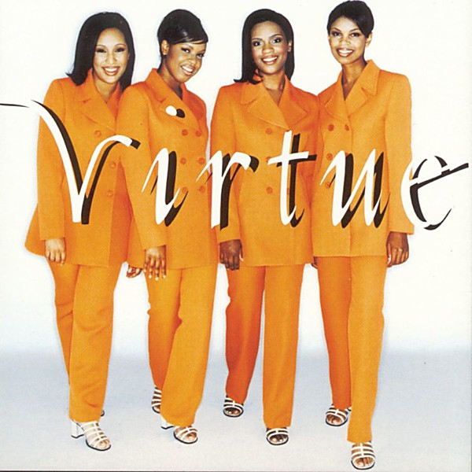

# Virtue

By **Virtue**

## Album Data

- **Catalog:** Beets
- **Format:** Digital, Album
- **Album:** Virtue
- **Artist:** Virtue
- **Albumartist:** Virtue
- **Genre:** Speed Metal
- **MusicBrainz Album Artist ID:** 
- **MusicBrainz Album ID:** 
- **MusicBrainz Release Group ID:** 
- **Year:** 1997
- **Catalog #:** 
- **Label:** 
- **Total Tracks:** 11

## Album Tracks

### Track 01 - Let The Redeemed

- **Artist:** Virtue
- **Format:** ALAC
- **Genre:** Speed Metal
- **Length:** 4:42
- **MusicBrainz Track ID:** 
- **Title:** Let The Redeemed
- **Track:** 01
- **Year:** 1997

### Track 02 - Your Love Lifted Me

- **Artist:** Virtue
- **Format:** ALAC
- **Genre:** Speed Metal
- **Length:** 4:03
- **MusicBrainz Track ID:** 
- **Title:** Your Love Lifted Me
- **Track:** 02
- **Year:** 1997

### Track 03 - So Good To Know

- **Artist:** Virtue
- **Format:** ALAC
- **Genre:** Speed Metal
- **Length:** 4:31
- **MusicBrainz Track ID:** 
- **Title:** So Good To Know
- **Track:** 03
- **Year:** 1997

### Track 04 - Greatest Part Of Me

- **Artist:** Virtue
- **Format:** ALAC
- **Genre:** Speed Metal
- **Length:** 5:13
- **MusicBrainz Track ID:** 
- **Title:** Greatest Part Of Me
- **Track:** 04
- **Year:** 1997

### Track 05 - Quiet Times

- **Artist:** Virtue
- **Format:** ALAC
- **Genre:** Speed Metal
- **Length:** 5:11
- **MusicBrainz Track ID:** 
- **Title:** Quiet Times
- **Track:** 05
- **Year:** 1997

### Track 06 - Lord You Are Worthy (Interlude)

- **Artist:** Virtue
- **Format:** ALAC
- **Genre:** Speed Metal
- **Length:** 0:53
- **MusicBrainz Track ID:** 
- **Title:** Lord You Are Worthy (Interlude)
- **Track:** 06
- **Year:** 1997

### Track 07 - Take It By Force

- **Artist:** Virtue
- **Format:** ALAC
- **Genre:** Speed Metal
- **Length:** 4:20
- **MusicBrainz Track ID:** 
- **Title:** Take It By Force
- **Track:** 07
- **Year:** 1997

### Track 08 - Through Your Name

- **Artist:** Virtue
- **Format:** ALAC
- **Genre:** Speed Metal
- **Length:** 4:45
- **MusicBrainz Track ID:** 
- **Title:** Through Your Name
- **Track:** 08
- **Year:** 1997

### Track 09 - I Must Tell Jesus

- **Artist:** Virtue
- **Format:** ALAC
- **Genre:** Speed Metal
- **Length:** 4:20
- **MusicBrainz Track ID:** 
- **Title:** I Must Tell Jesus
- **Track:** 09
- **Year:** 1997

### Track 10 - Cry No More

- **Artist:** Virtue
- **Format:** ALAC
- **Genre:** Speed Metal
- **Length:** 4:42
- **MusicBrainz Track ID:** 
- **Title:** Cry No More
- **Track:** 10
- **Year:** 1997

### Track 11 - Be With You

- **Artist:** Virtue
- **Format:** ALAC
- **Genre:** Speed Metal
- **Length:** 4:33
- **MusicBrainz Track ID:** 
- **Title:** Be With You
- **Track:** 11
- **Year:** 1997

### Track 01 - Let the Redeemed

- **Artist:** Virtue!
- **Format:** MP3
- **Genre:** Soul
- **Length:** 4:42
- **MusicBrainz Track ID:** 
- **Title:** Let the Redeemed
- **Track:** 01
- **Year:** 1997

### Track 02 - Your Love Lifted Me

- **Artist:** Virtue!
- **Format:** MP3
- **Genre:** Soul
- **Length:** 4:02
- **MusicBrainz Track ID:** 
- **Title:** Your Love Lifted Me
- **Track:** 02
- **Year:** 1997

### Track 03 - So Good to Know

- **Artist:** Virtue!
- **Format:** MP3
- **Genre:** Soul
- **Length:** 4:31
- **MusicBrainz Track ID:** 
- **Title:** So Good to Know
- **Track:** 03
- **Year:** 1997

### Track 04 - Greatest Part of Me

- **Artist:** Virtue!
- **Format:** MP3
- **Genre:** Soul
- **Length:** 5:13
- **MusicBrainz Track ID:** 
- **Title:** Greatest Part of Me
- **Track:** 04
- **Year:** 1997

### Track 05 - Quiet Times

- **Artist:** Virtue!
- **Format:** MP3
- **Genre:** Soul
- **Length:** 5:10
- **MusicBrainz Track ID:** 
- **Title:** Quiet Times
- **Track:** 05
- **Year:** 1997

### Track 06 - Lord You Are Worthy (Interlude)

- **Artist:** Virtue!
- **Format:** MP3
- **Genre:** Soul
- **Length:** 0:53
- **MusicBrainz Track ID:** 
- **Title:** Lord You Are Worthy (Interlude)
- **Track:** 06
- **Year:** 1997

### Track 07 - Take It by Force

- **Artist:** Virtue!
- **Format:** MP3
- **Genre:** Soul
- **Length:** 4:20
- **MusicBrainz Track ID:** 
- **Title:** Take It by Force
- **Track:** 07
- **Year:** 1997

### Track 08 - Through Your Name

- **Artist:** Virtue!
- **Format:** MP3
- **Genre:** Soul
- **Length:** 4:44
- **MusicBrainz Track ID:** 
- **Title:** Through Your Name
- **Track:** 08
- **Year:** 1997

### Track 09 - I Must Tell Jesus

- **Artist:** Virtue!
- **Format:** MP3
- **Genre:** Soul
- **Length:** 4:20
- **MusicBrainz Track ID:** 
- **Title:** I Must Tell Jesus
- **Track:** 09
- **Year:** 1997

### Track 10 - Cry No More

- **Artist:** Virtue!
- **Format:** MP3
- **Genre:** Soul
- **Length:** 4:42
- **MusicBrainz Track ID:** 
- **Title:** Cry No More
- **Track:** 10
- **Year:** 1997

### Track 11 - Be With You

- **Artist:** Virtue!
- **Format:** MP3
- **Genre:** Soul
- **Length:** 4:33
- **MusicBrainz Track ID:** 
- **Title:** Be With You
- **Track:** 11
- **Year:** 1997

