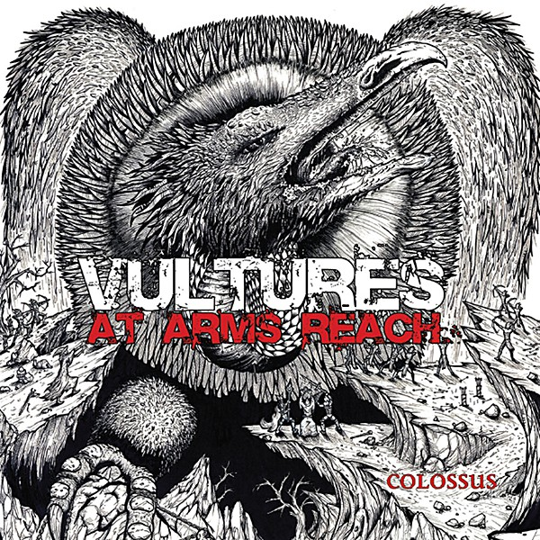

# Colossus

By **Vultures at Arms Reach**

## Album Data

- **Catalog:** Beets
- **Format:** Digital, Album
- **Album:** Colossus
- **Artist:** Vultures At Arms Reach
- **Albumartist:** Vultures at Arms Reach
- **Genre:** Post-Metal
- **MusicBrainz Album Artist ID:** [e2843c45-98e1-4e1e-8f77-454a818c33dd](https://musicbrainz.org/artist/e2843c45-98e1-4e1e-8f77-454a818c33dd)
- **MusicBrainz Album ID:** [80b64476-e943-4b4d-8d42-4db9126116b7](https://musicbrainz.org/release/80b64476-e943-4b4d-8d42-4db9126116b7)
- **MusicBrainz Release Group ID:** [c08f1df8-d9a9-4638-8b37-5167b9880f4a](https://musicbrainz.org/release-group/c08f1df8-d9a9-4638-8b37-5167b9880f4a)
- **Year:** 2014
- **Catalog #:** 
- **Label:** 
- **Total Tracks:** 06

## Album Tracks

### Track 01 - Colossus

- **Artist:** Vultures at Arms Reach
- **Format:** ALAC
- **Genre:** Post-Metal
- **Length:** 6:52
- **MusicBrainz Track ID:** [3854a4af-90ce-4505-88ad-913a1cc662a8](https://musicbrainz.org/recording/3854a4af-90ce-4505-88ad-913a1cc662a8)
- **Title:** Colossus
- **Track:** 01
- **Year:** 2014

### Track 02 - Blood Eagle

- **Artist:** Vultures at Arms Reach
- **Format:** ALAC
- **Genre:** Post-Metal
- **Length:** 4:34
- **MusicBrainz Track ID:** [55409fbf-da49-4a7e-b276-6780dcb582f6](https://musicbrainz.org/recording/55409fbf-da49-4a7e-b276-6780dcb582f6)
- **Title:** Blood Eagle
- **Track:** 02
- **Year:** 2014

### Track 03 - Dust

- **Artist:** Vultures at Arms Reach
- **Format:** ALAC
- **Genre:** Post-Metal
- **Length:** 6:33
- **MusicBrainz Track ID:** [4534ca9c-9352-4db0-883f-c5b8bf8e976b](https://musicbrainz.org/recording/4534ca9c-9352-4db0-883f-c5b8bf8e976b)
- **Title:** Dust
- **Track:** 03
- **Year:** 2014

### Track 04 - Ashes

- **Artist:** Vultures at Arms Reach
- **Format:** ALAC
- **Genre:** Post-Metal
- **Length:** 5:55
- **MusicBrainz Track ID:** [577acfd4-0d78-4645-95f5-1851ff6b13a0](https://musicbrainz.org/recording/577acfd4-0d78-4645-95f5-1851ff6b13a0)
- **Title:** Ashes
- **Track:** 04
- **Year:** 2014

### Track 05 - Heavy Hands

- **Artist:** Vultures at Arms Reach
- **Format:** ALAC
- **Genre:** Post-Metal
- **Length:** 3:28
- **MusicBrainz Track ID:** [cd9477af-c228-4b79-bc60-9186f775703d](https://musicbrainz.org/recording/cd9477af-c228-4b79-bc60-9186f775703d)
- **Title:** Heavy Hands
- **Track:** 05
- **Year:** 2014

### Track 06 - Draugr

- **Artist:** Vultures at Arms Reach
- **Format:** ALAC
- **Genre:** Post-Metal
- **Length:** 5:23
- **MusicBrainz Track ID:** [6a9849b7-746f-439a-8809-0a47fb99042e](https://musicbrainz.org/recording/6a9849b7-746f-439a-8809-0a47fb99042e)
- **Title:** Draugr
- **Track:** 06
- **Year:** 2014

