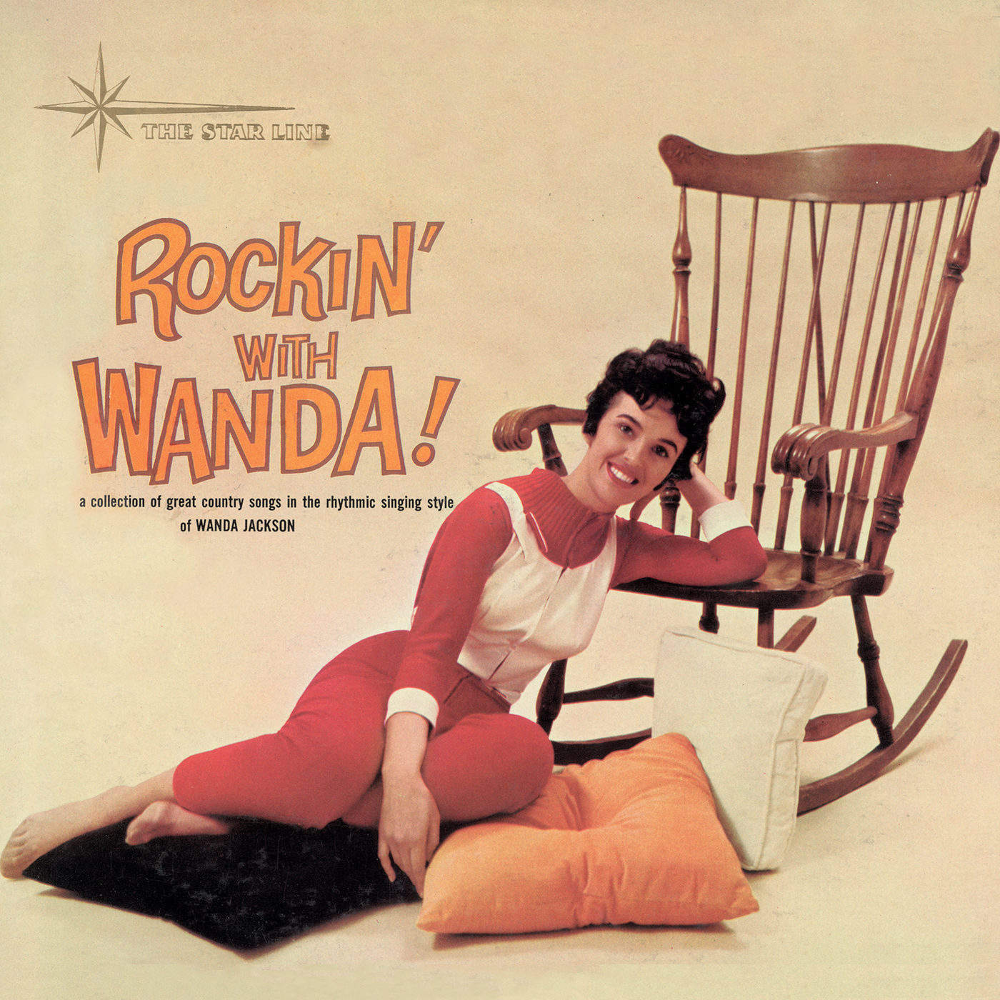

# Rockin’ With Wanda

By **Wanda Jackson**

## Album Data

- **Catalog:** Beets
- **Format:** Digital, Album
- **Album:** Rockin’ With Wanda
- **Artist:** Wanda Jackson
- **Albumartist:** Wanda Jackson
- **Genre:** Rockabilly
- **MusicBrainz Album Artist ID:** [550fbe01-42e9-4006-bcd0-6a1854dceb8f](https://musicbrainz.org/artist/550fbe01-42e9-4006-bcd0-6a1854dceb8f)
- **MusicBrainz Album ID:** [c4c88b0e-6f30-42b0-aa77-63de53a18a87](https://musicbrainz.org/release/c4c88b0e-6f30-42b0-aa77-63de53a18a87)
- **MusicBrainz Release Group ID:** [7154e00f-59a7-3ab8-b06b-631e6c9409f2](https://musicbrainz.org/release-group/7154e00f-59a7-3ab8-b06b-631e6c9409f2)
- **Year:** 2002
- **Catalog #:** 2435-40683-2-4
- **Label:** Capitol Records
- **Total Tracks:** 18

## Album Tracks

### Track 01 - Rock Your Baby

- **Artist:** Wanda Jackson
- **Format:** MP3
- **Genre:** Rockabilly
- **Length:** 1:46
- **MusicBrainz Track ID:** [f11f9357-7472-4075-ae80-bd3969935d99](https://musicbrainz.org/recording/f11f9357-7472-4075-ae80-bd3969935d99)
- **Title:** Rock Your Baby
- **Track:** 01
- **Year:** 2002

### Track 02 - Fujiyama Mama

- **Artist:** Wanda Jackson
- **Format:** MP3
- **Genre:** Rockabilly
- **Length:** 2:14
- **MusicBrainz Track ID:** [d1cdc843-d05d-48cf-8457-b990000e01f3](https://musicbrainz.org/recording/d1cdc843-d05d-48cf-8457-b990000e01f3)
- **Title:** Fujiyama Mama
- **Track:** 02
- **Year:** 2002

### Track 03 - You’re the One for Me

- **Artist:** Wanda Jackson
- **Format:** MP3
- **Genre:** Rockabilly
- **Length:** 2:00
- **MusicBrainz Track ID:** [400d5d0a-10e4-4254-917d-32942d800744](https://musicbrainz.org/recording/400d5d0a-10e4-4254-917d-32942d800744)
- **Title:** You’re the One for Me
- **Track:** 03
- **Year:** 2002

### Track 04 - Did You Miss Me?

- **Artist:** Wanda Jackson
- **Format:** MP3
- **Genre:** Rockabilly
- **Length:** 2:18
- **MusicBrainz Track ID:** [84af7eac-2e84-4d6b-a967-3f9847402f1e](https://musicbrainz.org/recording/84af7eac-2e84-4d6b-a967-3f9847402f1e)
- **Title:** Did You Miss Me?
- **Track:** 04
- **Year:** 2002

### Track 05 - Cool Love

- **Artist:** Wanda Jackson
- **Format:** MP3
- **Genre:** Rockabilly
- **Length:** 2:17
- **MusicBrainz Track ID:** [e86b921b-d575-4e02-badf-8c81e3046267](https://musicbrainz.org/recording/e86b921b-d575-4e02-badf-8c81e3046267)
- **Title:** Cool Love
- **Track:** 05
- **Year:** 2002

### Track 06 - Honey Bop

- **Artist:** Wanda Jackson
- **Format:** MP3
- **Genre:** Rockabilly
- **Length:** 2:14
- **MusicBrainz Track ID:** [af43f03b-142c-4167-b04b-a9d0ca82fe9c](https://musicbrainz.org/recording/af43f03b-142c-4167-b04b-a9d0ca82fe9c)
- **Title:** Honey Bop
- **Track:** 06
- **Year:** 2002

### Track 07 - Hot Dog! That Made Him Mad

- **Artist:** Wanda Jackson
- **Format:** MP3
- **Genre:** Rockabilly
- **Length:** 2:40
- **MusicBrainz Track ID:** [42280854-b210-44fb-85f2-c3cbf7a72df7](https://musicbrainz.org/recording/42280854-b210-44fb-85f2-c3cbf7a72df7)
- **Title:** Hot Dog! That Made Him Mad
- **Track:** 07
- **Year:** 2002

### Track 08 - Baby Loves Him

- **Artist:** Wanda Jackson
- **Format:** MP3
- **Genre:** Rockabilly
- **Length:** 2:02
- **MusicBrainz Track ID:** [5dee4b77-db9d-4eb0-8a67-f069b9c57daa](https://musicbrainz.org/recording/5dee4b77-db9d-4eb0-8a67-f069b9c57daa)
- **Title:** Baby Loves Him
- **Track:** 08
- **Year:** 2002

### Track 09 - Mean Mean Man

- **Artist:** Wanda Jackson
- **Format:** MP3
- **Genre:** Rockabilly
- **Length:** 2:13
- **MusicBrainz Track ID:** [3c782727-d8b5-4019-9939-6ffecf6bd967](https://musicbrainz.org/recording/3c782727-d8b5-4019-9939-6ffecf6bd967)
- **Title:** Mean Mean Man
- **Track:** 09
- **Year:** 2002

### Track 10 - You’ve Turned to a Stranger

- **Artist:** Wanda Jackson
- **Format:** MP3
- **Genre:** Rockabilly
- **Length:** 2:42
- **MusicBrainz Track ID:** [6a528fe5-89a2-44f1-a8e5-ff67b84e5f3e](https://musicbrainz.org/recording/6a528fe5-89a2-44f1-a8e5-ff67b84e5f3e)
- **Title:** You’ve Turned to a Stranger
- **Track:** 10
- **Year:** 2002

### Track 11 - Don’a Wan’a

- **Artist:** Wanda Jackson
- **Format:** MP3
- **Genre:** Rockabilly
- **Length:** 2:15
- **MusicBrainz Track ID:** [0adde6ba-eec5-4857-91fd-0607cb7943af](https://musicbrainz.org/recording/0adde6ba-eec5-4857-91fd-0607cb7943af)
- **Title:** Don’a Wan’a
- **Track:** 11
- **Year:** 2002

### Track 12 - I Gotta Know

- **Artist:** Wanda Jackson
- **Format:** MP3
- **Genre:** Rockabilly
- **Length:** 2:30
- **MusicBrainz Track ID:** [65e76467-fa94-4a32-97f8-6a1df6aebb1e](https://musicbrainz.org/recording/65e76467-fa94-4a32-97f8-6a1df6aebb1e)
- **Title:** I Gotta Know
- **Track:** 12
- **Year:** 2002

### Track 13 - (Everytime They Play) Our Song

- **Artist:** Wanda Jackson
- **Format:** MP3
- **Genre:** Rockabilly
- **Length:** 2:03
- **MusicBrainz Track ID:** [aded5028-1a7f-4f45-9dd6-da09941c840a](https://musicbrainz.org/recording/aded5028-1a7f-4f45-9dd6-da09941c840a)
- **Title:** (Everytime They Play) Our Song
- **Track:** 13
- **Year:** 2002

### Track 14 - Sinful Heart

- **Artist:** Wanda Jackson
- **Format:** MP3
- **Genre:** Rockabilly
- **Length:** 2:37
- **MusicBrainz Track ID:** [dd7dc29c-4bfd-427e-b285-f7540777542a](https://musicbrainz.org/recording/dd7dc29c-4bfd-427e-b285-f7540777542a)
- **Title:** Sinful Heart
- **Track:** 14
- **Year:** 2002

### Track 15 - Savin’ My Love

- **Artist:** Wanda Jackson
- **Format:** MP3
- **Genre:** Rockabilly
- **Length:** 2:09
- **MusicBrainz Track ID:** [129ff382-3ae8-4924-9e42-636d0bb38120](https://musicbrainz.org/recording/129ff382-3ae8-4924-9e42-636d0bb38120)
- **Title:** Savin’ My Love
- **Track:** 15
- **Year:** 2002

### Track 16 - A Date With Jerry

- **Artist:** Wanda Jackson
- **Format:** MP3
- **Genre:** Rockabilly
- **Length:** 2:15
- **MusicBrainz Track ID:** [a3a0d1d9-f66a-43c1-81d6-b96d82d420d9](https://musicbrainz.org/recording/a3a0d1d9-f66a-43c1-81d6-b96d82d420d9)
- **Title:** A Date With Jerry
- **Track:** 16
- **Year:** 2002

### Track 17 - Reaching

- **Artist:** Wanda Jackson
- **Format:** MP3
- **Genre:** Rockabilly
- **Length:** 2:21
- **MusicBrainz Track ID:** [42ce9a2e-35c3-40d6-bb65-7bcf21115717](https://musicbrainz.org/recording/42ce9a2e-35c3-40d6-bb65-7bcf21115717)
- **Title:** Reaching
- **Track:** 17
- **Year:** 2002

### Track 18 - I’d Rather Have You

- **Artist:** Wanda Jackson
- **Format:** MP3
- **Genre:** Rockabilly
- **Length:** 2:33
- **MusicBrainz Track ID:** [22f93a90-4728-421f-828f-5e9c1c1cb9fe](https://musicbrainz.org/recording/22f93a90-4728-421f-828f-5e9c1c1cb9fe)
- **Title:** I’d Rather Have You
- **Track:** 18
- **Year:** 2002

## See also

- [Roon: Rockin' With Wanda](../../Roon/Wanda_Jackson/Rockin_With_Wanda.md)
- [Vinyl: Rockin' With Wanda](../../Vinyl/Wanda_Jackson/Rockin_With_Wanda.md)
- [Vinyl: ](../../Vinyl/Wanda_Jackson/Wanda_Jackson.md)
