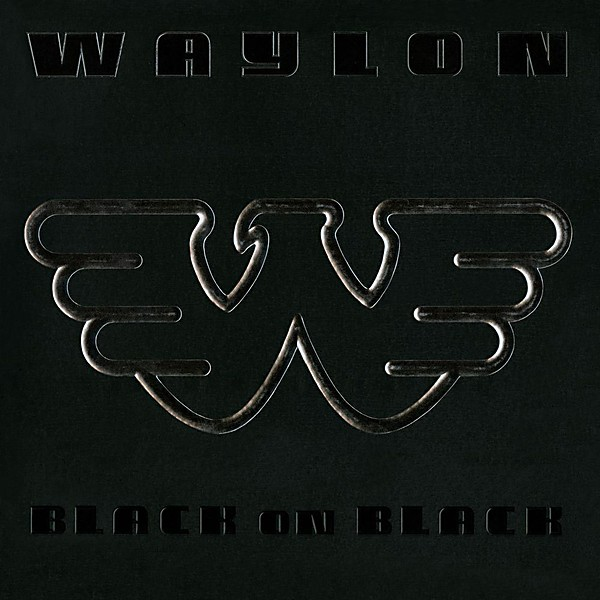

# Black on Black

By **Waylon Jennings**

## Album Data

- **Catalog:** Beets
- **Format:** Digital, Album
- **Album:** Black on Black
- **Artist:** Waylon Jennings
- **Albumartist:** Waylon Jennings
- **Genre:** Outlaw Country
- **MusicBrainz Album Artist ID:** [1a46826b-4d73-4e04-8590-f36c9d832f9e](https://musicbrainz.org/artist/1a46826b-4d73-4e04-8590-f36c9d832f9e)
- **MusicBrainz Album ID:** [3a25c688-bf07-4739-943f-0bceb93b3859](https://musicbrainz.org/release/3a25c688-bf07-4739-943f-0bceb93b3859)
- **MusicBrainz Release Group ID:** [07164569-be03-4c30-a3f0-be7cb63d15d3](https://musicbrainz.org/release-group/07164569-be03-4c30-a3f0-be7cb63d15d3)
- **Year:** 1982
- **Catalog #:** AHL1-4247
- **Label:** RCA
- **Total Tracks:** 10

## Album Tracks

### Track 01 - Women Do Know How to Carry On

- **Artist:** Waylon Jennings
- **Format:** MP3
- **Genre:** Outlaw Country
- **Length:** 3:18
- **MusicBrainz Track ID:** [c01c17d4-a286-4104-bf0c-ceb3bfa74b68](https://musicbrainz.org/recording/c01c17d4-a286-4104-bf0c-ceb3bfa74b68)
- **Title:** Women Do Know How to Carry On
- **Track:** 01
- **Year:** 1982

### Track 02 - Honky Tonk Blues

- **Artist:** Waylon Jennings
- **Format:** MP3
- **Genre:** Outlaw Country
- **Length:** 2:47
- **MusicBrainz Track ID:** [84e3de89-4b10-4260-81e0-4cc0983c3f6e](https://musicbrainz.org/recording/84e3de89-4b10-4260-81e0-4cc0983c3f6e)
- **Title:** Honky Tonk Blues
- **Track:** 02
- **Year:** 1982

### Track 03 - Just to Satisfy You

- **Artist:** Waylon Jennings
- **Format:** MP3
- **Genre:** Outlaw Country
- **Length:** 2:51
- **MusicBrainz Track ID:** [7815dbe2-287a-4080-a36a-429fe4722d06](https://musicbrainz.org/recording/7815dbe2-287a-4080-a36a-429fe4722d06)
- **Title:** Just to Satisfy You
- **Track:** 03
- **Year:** 1982

### Track 04 - We Had It Made as Lovers

- **Artist:** Waylon Jennings
- **Format:** MP3
- **Genre:** Outlaw Country
- **Length:** 2:15
- **MusicBrainz Track ID:** [fa147f6b-6392-4d3f-9bae-87810ba23a4e](https://musicbrainz.org/recording/fa147f6b-6392-4d3f-9bae-87810ba23a4e)
- **Title:** We Had It Made as Lovers
- **Track:** 04
- **Year:** 1982

### Track 05 - Shine

- **Artist:** Waylon Jennings
- **Format:** MP3
- **Genre:** Outlaw Country
- **Length:** 2:51
- **MusicBrainz Track ID:** [105bee50-5e83-4c37-84cc-b7dab45a16b2](https://musicbrainz.org/recording/105bee50-5e83-4c37-84cc-b7dab45a16b2)
- **Title:** Shine
- **Track:** 05
- **Year:** 1982

### Track 06 - Folsom Prison Blues

- **Artist:** Waylon Jennings
- **Format:** MP3
- **Genre:** Rock And Roll
- **Length:** 2:41
- **MusicBrainz Track ID:** [1dcf87af-c4e2-4559-b132-d92132d62185](https://musicbrainz.org/recording/1dcf87af-c4e2-4559-b132-d92132d62185)
- **Title:** Folsom Prison Blues
- **Track:** 06
- **Year:** 1982

### Track 07 - Gonna Write a Letter

- **Artist:** Waylon Jennings
- **Format:** MP3
- **Genre:** Outlaw Country
- **Length:** 2:39
- **MusicBrainz Track ID:** [4b85f542-b55a-4c1a-b537-65af6c965087](https://musicbrainz.org/recording/4b85f542-b55a-4c1a-b537-65af6c965087)
- **Title:** Gonna Write a Letter
- **Track:** 07
- **Year:** 1982

### Track 08 - May I Borrow Some Sugar From You

- **Artist:** Waylon Jennings
- **Format:** MP3
- **Genre:** Outlaw Country
- **Length:** 3:26
- **MusicBrainz Track ID:** [27240f24-2bbb-4298-9993-98833ee534a4](https://musicbrainz.org/recording/27240f24-2bbb-4298-9993-98833ee534a4)
- **Title:** May I Borrow Some Sugar From You
- **Track:** 08
- **Year:** 1982

### Track 09 - Song for the Life

- **Artist:** Waylon Jennings
- **Format:** MP3
- **Genre:** Outlaw Country
- **Length:** 3:42
- **MusicBrainz Track ID:** [0525bc17-bccf-4952-9bff-e00106eac4e7](https://musicbrainz.org/recording/0525bc17-bccf-4952-9bff-e00106eac4e7)
- **Title:** Song for the Life
- **Track:** 09
- **Year:** 1982

### Track 10 - Get Naked With Me

- **Artist:** Waylon Jennings
- **Format:** MP3
- **Genre:** Outlaw Country
- **Length:** 3:16
- **MusicBrainz Track ID:** [c5ace9c1-ac15-4b08-a667-e17e2e95a23c](https://musicbrainz.org/recording/c5ace9c1-ac15-4b08-a667-e17e2e95a23c)
- **Title:** Get Naked With Me
- **Track:** 10
- **Year:** 1982

## See also

- [Vinyl: Are You Ready For The Country](../../Vinyl/Waylon_Jennings/Are_You_Ready_For_The_Country.md)
- [Vinyl: ](../../Vinyl/Waylon_Jennings/Waylon_Jennings.md)
