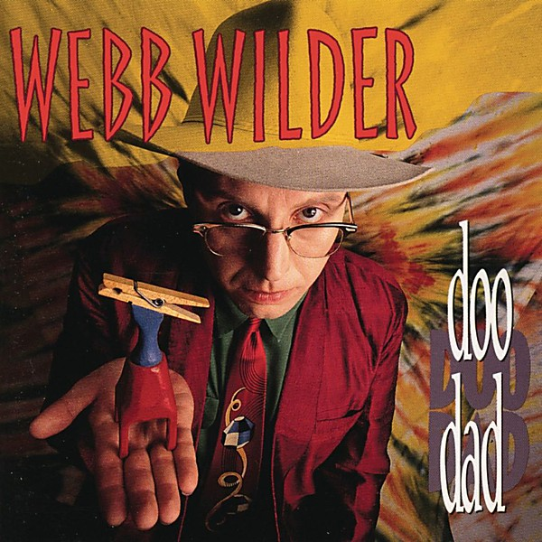

# Doo Dad

By **Webb Wilder**

## Album Data

- **Catalog:** Beets
- **Format:** Digital, Album
- **Album:** Doo Dad
- **Artist:** Webb Wilder
- **Albumartist:** Webb Wilder
- **Genre:** Rock
- **MusicBrainz Album Artist ID:** [a02b61f6-ee38-4e4a-9824-22ba83fe8a03](https://musicbrainz.org/artist/a02b61f6-ee38-4e4a-9824-22ba83fe8a03)
- **MusicBrainz Album ID:** [9062eedc-dd3b-4534-baaa-5b6a7103d9af](https://musicbrainz.org/release/9062eedc-dd3b-4534-baaa-5b6a7103d9af)
- **MusicBrainz Release Group ID:** [55713648-7a7a-3d67-8fab-aa6995a6bcf8](https://musicbrainz.org/release-group/55713648-7a7a-3d67-8fab-aa6995a6bcf8)
- **Year:** 1991
- **Catalog #:** 
- **Label:** 
- **Total Tracks:** 12

## Album Tracks

### Track 01 - Hoodoo Witch

- **Artist:** Webb Wilder
- **Format:** ALAC
- **Genre:** Hard Rock
- **Length:** 6:33
- **MusicBrainz Track ID:** [9b61d24c-aec1-4803-b439-8d6c96a7f141](https://musicbrainz.org/recording/9b61d24c-aec1-4803-b439-8d6c96a7f141)
- **Title:** Hoodoo Witch
- **Track:** 01
- **Year:** 1991

### Track 02 - Tough It Out

- **Artist:** Webb Wilder
- **Format:** ALAC
- **Genre:** Rock
- **Length:** 3:54
- **MusicBrainz Track ID:** [421e8fa8-21c4-49be-8ad8-56a0f1be1201](https://musicbrainz.org/recording/421e8fa8-21c4-49be-8ad8-56a0f1be1201)
- **Title:** Tough It Out
- **Track:** 02
- **Year:** 1991

### Track 03 - Meet Your New Landlord

- **Artist:** Webb Wilder
- **Format:** ALAC
- **Genre:** Southern Rock
- **Length:** 4:01
- **MusicBrainz Track ID:** [719806ba-42a2-47a8-a6c2-51bc4cd629ac](https://musicbrainz.org/recording/719806ba-42a2-47a8-a6c2-51bc4cd629ac)
- **Title:** Meet Your New Landlord
- **Track:** 03
- **Year:** 1991

### Track 04 - Sittin' Pretty

- **Artist:** Webb Wilder
- **Format:** ALAC
- **Genre:** Rock
- **Length:** 4:10
- **MusicBrainz Track ID:** [00d097b5-bc40-471a-bf2d-2106df999934](https://musicbrainz.org/recording/00d097b5-bc40-471a-bf2d-2106df999934)
- **Title:** Sittin' Pretty
- **Track:** 04
- **Year:** 1991

### Track 05 - Big Time

- **Artist:** Webb Wilder
- **Format:** ALAC
- **Genre:** Rock And Roll
- **Length:** 4:18
- **MusicBrainz Track ID:** [fb2f2f87-2309-466e-b026-39a22bba91c1](https://musicbrainz.org/recording/fb2f2f87-2309-466e-b026-39a22bba91c1)
- **Title:** Big Time
- **Track:** 05
- **Year:** 1991

### Track 06 - Sputnik

- **Artist:** Webb Wilder
- **Format:** ALAC
- **Genre:** Rock
- **Length:** 3:17
- **MusicBrainz Track ID:** [fada5c83-ddf8-457c-b846-356bf1076c6d](https://musicbrainz.org/recording/fada5c83-ddf8-457c-b846-356bf1076c6d)
- **Title:** Sputnik
- **Track:** 06
- **Year:** 1991

### Track 07 - Run With It

- **Artist:** Webb Wilder
- **Format:** ALAC
- **Genre:** Rock
- **Length:** 4:47
- **MusicBrainz Track ID:** [1f9e25b7-e516-4cf2-ab17-0560ffab685f](https://musicbrainz.org/recording/1f9e25b7-e516-4cf2-ab17-0560ffab685f)
- **Title:** Run With It
- **Track:** 07
- **Year:** 1991

### Track 08 - King of the Hill

- **Artist:** Webb Wilder
- **Format:** ALAC
- **Genre:** Rock
- **Length:** 4:53
- **MusicBrainz Track ID:** [f3c3f57b-4533-4403-aa4e-21013d468b98](https://musicbrainz.org/recording/f3c3f57b-4533-4403-aa4e-21013d468b98)
- **Title:** King of the Hill
- **Track:** 08
- **Year:** 1991

### Track 09 - Everyday (I Kick Myself)

- **Artist:** Webb Wilder
- **Format:** ALAC
- **Genre:** Rock
- **Length:** 4:00
- **MusicBrainz Track ID:** [45400dbd-af32-48e2-ad0d-08f4bfd6b3ee](https://musicbrainz.org/recording/45400dbd-af32-48e2-ad0d-08f4bfd6b3ee)
- **Title:** Everyday (I Kick Myself)
- **Track:** 09
- **Year:** 1991

### Track 10 - The Rest (Will Take Care of Itself)

- **Artist:** Webb Wilder
- **Format:** ALAC
- **Genre:** Rock
- **Length:** 4:26
- **MusicBrainz Track ID:** [7a538fe4-3dd7-45c6-b42a-8a20402e21a3](https://musicbrainz.org/recording/7a538fe4-3dd7-45c6-b42a-8a20402e21a3)
- **Title:** The Rest (Will Take Care of Itself)
- **Track:** 10
- **Year:** 1991

### Track 11 - Baby Please Don't Go

- **Artist:** Webb Wilder
- **Format:** ALAC
- **Genre:** Rock
- **Length:** 4:47
- **MusicBrainz Track ID:** [110aa859-caeb-4490-8c74-6e9d55cb0810](https://musicbrainz.org/recording/110aa859-caeb-4490-8c74-6e9d55cb0810)
- **Title:** Baby Please Don't Go
- **Track:** 11
- **Year:** 1991

### Track 12 - I Had Too Much to Dream (Last Night)

- **Artist:** Webb Wilder
- **Format:** ALAC
- **Genre:** Rock
- **Length:** 4:03
- **MusicBrainz Track ID:** [6aef4cc5-5033-417a-a048-52d1c99da844](https://musicbrainz.org/recording/6aef4cc5-5033-417a-a048-52d1c99da844)
- **Title:** I Had Too Much to Dream (Last Night)
- **Track:** 12
- **Year:** 1991

