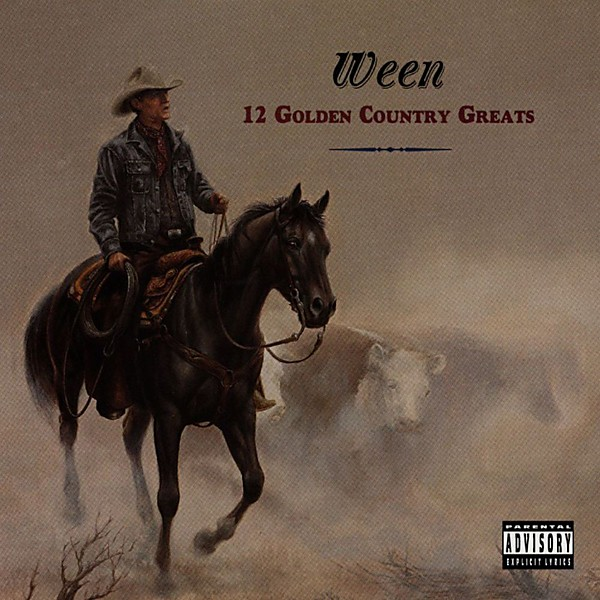

# 12 Golden Country Greats

By **Ween**

## Album Data

- **Catalog:** Beets
- **Format:** Digital, Album
- **Album:** 12 Golden Country Greats
- **Artist:** Ween
- **Albumartist:** Ween
- **Genre:** Outlaw Country
- **MusicBrainz Album Artist ID:** [c0eee88b-47f2-4cd2-ac48-a045e902a432](https://musicbrainz.org/artist/c0eee88b-47f2-4cd2-ac48-a045e902a432)
- **MusicBrainz Album ID:** [c48fa5ac-a16f-435b-88f3-179a668a40ad](https://musicbrainz.org/release/c48fa5ac-a16f-435b-88f3-179a668a40ad)
- **MusicBrainz Release Group ID:** [d6d2ee0d-791d-3270-a7d1-a49d7b3e8ebc](https://musicbrainz.org/release-group/d6d2ee0d-791d-3270-a7d1-a49d7b3e8ebc)
- **Year:** 1996
- **Catalog #:** 61639-2
- **Label:** Elektra Entertainment
- **Total Tracks:** 16

## Album Tracks

### Track 01 - Take Me Away

- **Artist:** Ween
- **Format:** ALAC
- **Genre:** Indie Rock
- **Length:** 3:00
- **MusicBrainz Track ID:** [14d6347d-f52c-43aa-b7a2-fbe209a2f926](https://musicbrainz.org/recording/14d6347d-f52c-43aa-b7a2-fbe209a2f926)
- **Title:** Take Me Away
- **Track:** 01
- **Year:** 1994

### Track 02 - Spinal Meningitis (Got Me Down)

- **Artist:** Ween
- **Format:** ALAC
- **Genre:** Indie Rock
- **Length:** 2:52
- **MusicBrainz Track ID:** [9e180695-89be-416b-b3f6-c3c99e1fd5b6](https://musicbrainz.org/recording/9e180695-89be-416b-b3f6-c3c99e1fd5b6)
- **Title:** Spinal Meningitis (Got Me Down)
- **Track:** 02
- **Year:** 1994

### Track 03 - Freedom of ’76

- **Artist:** Ween
- **Format:** ALAC
- **Genre:** Neo-Psychedelia
- **Length:** 2:50
- **MusicBrainz Track ID:** [627cbde1-d22b-48f2-9981-70fc3e4e0d49](https://musicbrainz.org/recording/627cbde1-d22b-48f2-9981-70fc3e4e0d49)
- **Title:** Freedom of ’76
- **Track:** 03
- **Year:** 1994

### Track 04 - I Can’t Put My Finger on It

- **Artist:** Ween
- **Format:** ALAC
- **Genre:** Neo-Psychedelia
- **Length:** 2:47
- **MusicBrainz Track ID:** [82388618-887c-4040-a88b-93f296b3e41e](https://musicbrainz.org/recording/82388618-887c-4040-a88b-93f296b3e41e)
- **Title:** I Can’t Put My Finger on It
- **Track:** 04
- **Year:** 1994

### Track 05 - A Tear for Eddie

- **Artist:** Ween
- **Format:** ALAC
- **Genre:** Indie Rock
- **Length:** 4:49
- **MusicBrainz Track ID:** [938e9719-9541-41cf-b6a9-031ee0d9a187](https://musicbrainz.org/recording/938e9719-9541-41cf-b6a9-031ee0d9a187)
- **Title:** A Tear for Eddie
- **Track:** 05
- **Year:** 1994

### Track 06 - Roses Are Free

- **Artist:** Ween
- **Format:** ALAC
- **Genre:** Indie Rock
- **Length:** 4:34
- **MusicBrainz Track ID:** [f2e5b322-a876-4e71-b772-d7c56fb908e3](https://musicbrainz.org/recording/f2e5b322-a876-4e71-b772-d7c56fb908e3)
- **Title:** Roses Are Free
- **Track:** 06
- **Year:** 1994

### Track 07 - Baby Bitch

- **Artist:** Ween
- **Format:** ALAC
- **Genre:** Indie Rock
- **Length:** 3:04
- **MusicBrainz Track ID:** [7a60f358-0c88-47bc-838a-01535e984ebc](https://musicbrainz.org/recording/7a60f358-0c88-47bc-838a-01535e984ebc)
- **Title:** Baby Bitch
- **Track:** 07
- **Year:** 1994

### Track 08 - Mister, Would You Please Help My Pony?

- **Artist:** Ween
- **Format:** ALAC
- **Genre:** Indie Rock
- **Length:** 2:55
- **MusicBrainz Track ID:** [aac6214d-c695-4ce0-88c2-c1077d03f6ba](https://musicbrainz.org/recording/aac6214d-c695-4ce0-88c2-c1077d03f6ba)
- **Title:** Mister, Would You Please Help My Pony?
- **Track:** 08
- **Year:** 1994

### Track 09 - Drifter in the Dark

- **Artist:** Ween
- **Format:** ALAC
- **Genre:** Indie Rock
- **Length:** 2:31
- **MusicBrainz Track ID:** [3c0e4ec5-e3d1-403a-9b09-8cd1214533a9](https://musicbrainz.org/recording/3c0e4ec5-e3d1-403a-9b09-8cd1214533a9)
- **Title:** Drifter in the Dark
- **Track:** 09
- **Year:** 1994

### Track 10 - Voodoo Lady

- **Artist:** Ween
- **Format:** ALAC
- **Genre:** Indie Rock
- **Length:** 3:48
- **MusicBrainz Track ID:** [7ebc4aae-9a25-46a4-b585-51a682b35d93](https://musicbrainz.org/recording/7ebc4aae-9a25-46a4-b585-51a682b35d93)
- **Title:** Voodoo Lady
- **Track:** 10
- **Year:** 1994

### Track 11 - Joppa Road

- **Artist:** Ween
- **Format:** ALAC
- **Genre:** Neo-Psychedelia
- **Length:** 3:02
- **MusicBrainz Track ID:** [50d1cb31-f9f3-4fb6-aeb3-94f50e9ca744](https://musicbrainz.org/recording/50d1cb31-f9f3-4fb6-aeb3-94f50e9ca744)
- **Title:** Joppa Road
- **Track:** 11
- **Year:** 1994

### Track 12 - Candi

- **Artist:** Ween
- **Format:** ALAC
- **Genre:** Humor
- **Length:** 4:02
- **MusicBrainz Track ID:** [3ebc05ea-17d0-4b08-8224-bc7f43122dcd](https://musicbrainz.org/recording/3ebc05ea-17d0-4b08-8224-bc7f43122dcd)
- **Title:** Candi
- **Track:** 12
- **Year:** 1994

### Track 13 - Buenas tardes amigo

- **Artist:** Ween
- **Format:** ALAC
- **Genre:** Alternative Rock
- **Length:** 7:06
- **MusicBrainz Track ID:** [658e4a94-b79c-4fd2-8c9c-63616bf9c873](https://musicbrainz.org/recording/658e4a94-b79c-4fd2-8c9c-63616bf9c873)
- **Title:** Buenas tardes amigo
- **Track:** 13
- **Year:** 1994

### Track 14 - The HIV Song

- **Artist:** Ween
- **Format:** ALAC
- **Genre:** Stoner Rock
- **Length:** 2:09
- **MusicBrainz Track ID:** [93b424e5-6f89-4c60-a328-435e3486799d](https://musicbrainz.org/recording/93b424e5-6f89-4c60-a328-435e3486799d)
- **Title:** The HIV Song
- **Track:** 14
- **Year:** 1994

### Track 15 - What Deaner Was Talkin’ About

- **Artist:** Ween
- **Format:** ALAC
- **Genre:** Neo-Psychedelia
- **Length:** 1:59
- **MusicBrainz Track ID:** [79502acb-6edc-4bb5-9921-a79f7262cd95](https://musicbrainz.org/recording/79502acb-6edc-4bb5-9921-a79f7262cd95)
- **Title:** What Deaner Was Talkin’ About
- **Track:** 15
- **Year:** 1994

### Track 16 - Don’t Shit Where You Eat

- **Artist:** Ween
- **Format:** ALAC
- **Genre:** Neo-Psychedelia
- **Length:** 3:19
- **MusicBrainz Track ID:** [5a25f893-e474-4e4d-87ba-96861a9abf01](https://musicbrainz.org/recording/5a25f893-e474-4e4d-87ba-96861a9abf01)
- **Title:** Don’t Shit Where You Eat
- **Track:** 16
- **Year:** 1994

## See also

- [Chocolate and Cheese](Chocolate_and_Cheese.md)
- [God Ween Satan](God_Ween_Satan.md)
- [La Cucaracha](La_Cucaracha.md)
- [Live in Chicago](Live_in_Chicago.md)
- [Pure Guava](Pure_Guava.md)
- [Quebec](Quebec.md)
- [Shinola (Vol. 1)](Shinola_Vol_1.md)
- [The Mollusk](The_Mollusk.md)
- [White Pepper](White_Pepper.md)
- [Roon: 12 Golden Country Greats](../../Roon/Ween/12_Golden_Country_Greats.md)
- [Roon: Chocolate and Cheese](../../Roon/Ween/Chocolate_and_Cheese.md)
- [Roon: Live at Stubb's, 7/2000 (Live)](../../Roon/Ween/Live_at_Stubbs__7-2000_Live.md)
- [Roon: Pure Guava](../../Roon/Ween/Pure_Guava.md)
- [Roon: Quebec](../../Roon/Ween/Quebec.md)
- [Roon: The Mollusk](../../Roon/Ween/The_Mollusk.md)
- [Roon: White Pepper](../../Roon/Ween/White_Pepper.md)
- [Vinyl: Shinola Vol.1](../../Vinyl/Ween/Shinola_Vol1.md)
- [Vinyl: ](../../Vinyl/Ween/Ween.md)
