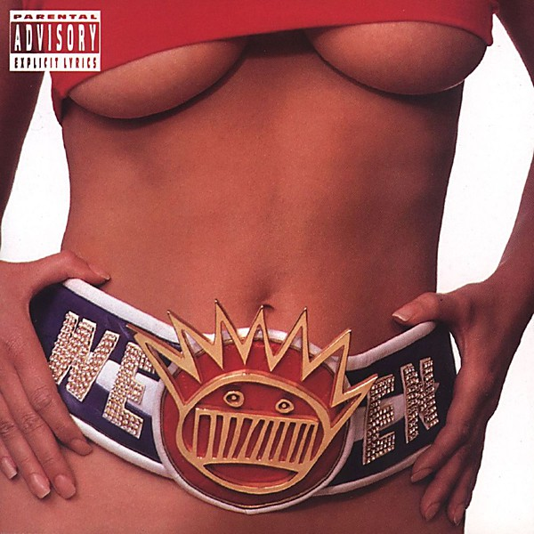

# Chocolate and Cheese

By **Ween**

## Album Data

- **Catalog:** Beets
- **Format:** Digital, Album
- **Album:** Chocolate and Cheese
- **Artist:** Ween
- **Albumartist:** Ween
- **Genre:** Neo-Psychedelia
- **MusicBrainz Album Artist ID:** [c0eee88b-47f2-4cd2-ac48-a045e902a432](https://musicbrainz.org/artist/c0eee88b-47f2-4cd2-ac48-a045e902a432)
- **MusicBrainz Album ID:** [febc2eb1-e76f-4155-ab21-2422f014bc33](https://musicbrainz.org/release/febc2eb1-e76f-4155-ab21-2422f014bc33)
- **MusicBrainz Release Group ID:** [53b1e528-4360-3c28-a55c-4263a1ef58c3](https://musicbrainz.org/release-group/53b1e528-4360-3c28-a55c-4263a1ef58c3)
- **Year:** 1994
- **Catalog #:** 
- **Label:** Rhino
- **Total Tracks:** 29

## Album Tracks

### Track 01 - You Fucked Up

- **Artist:** Ween
- **Format:** ALAC
- **Genre:** Noise Rock
- **Length:** 1:37
- **MusicBrainz Track ID:** [41ae729e-4e38-4e6a-9b44-565744252068](https://musicbrainz.org/recording/41ae729e-4e38-4e6a-9b44-565744252068)
- **Title:** You Fucked Up
- **Track:** 01
- **Year:** 2002

### Track 02 - Tick

- **Artist:** Ween
- **Format:** ALAC
- **Genre:** Comedy Rock
- **Length:** 1:52
- **MusicBrainz Track ID:** [a72c6050-0230-4076-a22b-7724ae6fff6a](https://musicbrainz.org/recording/a72c6050-0230-4076-a22b-7724ae6fff6a)
- **Title:** Tick
- **Track:** 02
- **Year:** 2002

### Track 03 - I’m in the Mood to Move

- **Artist:** Ween
- **Format:** ALAC
- **Genre:** Noise Rock
- **Length:** 1:16
- **MusicBrainz Track ID:** [a106021d-6e8e-4681-8859-c5f47681e772](https://musicbrainz.org/recording/a106021d-6e8e-4681-8859-c5f47681e772)
- **Title:** I’m in the Mood to Move
- **Track:** 03
- **Year:** 2002

### Track 04 - I Gots a Weasel

- **Artist:** Ween
- **Format:** ALAC
- **Genre:** Experimental Rock
- **Length:** 1:22
- **MusicBrainz Track ID:** [ab192d59-c965-422f-acf1-d016ecba8a64](https://musicbrainz.org/recording/ab192d59-c965-422f-acf1-d016ecba8a64)
- **Title:** I Gots a Weasel
- **Track:** 04
- **Year:** 2002

### Track 05 - Fat Lenny

- **Artist:** Ween
- **Format:** ALAC
- **Genre:** Punk Blues
- **Length:** 1:56
- **MusicBrainz Track ID:** [e59a5775-037f-49f2-a5b6-9ba86a5a626a](https://musicbrainz.org/recording/e59a5775-037f-49f2-a5b6-9ba86a5a626a)
- **Title:** Fat Lenny
- **Track:** 05
- **Year:** 2002

### Track 06 - Cold and Wet

- **Artist:** Ween
- **Format:** ALAC
- **Genre:** Alternative Rock
- **Length:** 1:23
- **MusicBrainz Track ID:** [b6ebd5fd-c0c5-4ffb-b55c-057a3ea32241](https://musicbrainz.org/recording/b6ebd5fd-c0c5-4ffb-b55c-057a3ea32241)
- **Title:** Cold and Wet
- **Track:** 06
- **Year:** 2002

### Track 07 - Bumblebee

- **Artist:** Ween
- **Format:** ALAC
- **Genre:** Alternative Rock
- **Length:** 1:18
- **MusicBrainz Track ID:** [ccffc070-e0bd-4808-b433-65ca79a5184e](https://musicbrainz.org/recording/ccffc070-e0bd-4808-b433-65ca79a5184e)
- **Title:** Bumblebee
- **Track:** 07
- **Year:** 2002

### Track 08 - Bumblebee, Pt. 2

- **Artist:** Ween
- **Format:** ALAC
- **Genre:** Noise Rock
- **Length:** 1:23
- **MusicBrainz Track ID:** [5785450f-3943-4d2b-adf3-bf4324ac469c](https://musicbrainz.org/recording/5785450f-3943-4d2b-adf3-bf4324ac469c)
- **Title:** Bumblebee, Pt. 2
- **Track:** 08
- **Year:** 2002

### Track 09 - Don’t Laugh (i Love You)

- **Artist:** Ween
- **Format:** ALAC
- **Genre:** Noise Rock
- **Length:** 2:49
- **MusicBrainz Track ID:** [14def84e-52ea-4a25-bac6-a05fb175a846](https://musicbrainz.org/recording/14def84e-52ea-4a25-bac6-a05fb175a846)
- **Title:** Don’t Laugh (i Love You)
- **Track:** 09
- **Year:** 2002

### Track 10 - Never Squeal

- **Artist:** Ween
- **Format:** ALAC
- **Genre:** Alternative Rock
- **Length:** 2:26
- **MusicBrainz Track ID:** [488ff054-70b5-47ef-8e79-32af61d4b7ce](https://musicbrainz.org/recording/488ff054-70b5-47ef-8e79-32af61d4b7ce)
- **Title:** Never Squeal
- **Track:** 10
- **Year:** 2002

### Track 11 - Up on the Hill

- **Artist:** Ween
- **Format:** ALAC
- **Genre:** Alternative Rock
- **Length:** 1:56
- **MusicBrainz Track ID:** [df0be3c7-8b5a-4358-9887-5a320b6b803a](https://musicbrainz.org/recording/df0be3c7-8b5a-4358-9887-5a320b6b803a)
- **Title:** Up on the Hill
- **Track:** 11
- **Year:** 2002

### Track 12 - Wayne’s Pet Youngin’

- **Artist:** Ween
- **Format:** ALAC
- **Genre:** Noise Rock
- **Length:** 1:40
- **MusicBrainz Track ID:** [f41e4fd7-36d8-4057-b929-3c0e1719c832](https://musicbrainz.org/recording/f41e4fd7-36d8-4057-b929-3c0e1719c832)
- **Title:** Wayne’s Pet Youngin’
- **Track:** 12
- **Year:** 2002

### Track 13 - Nicole

- **Artist:** Ween
- **Format:** ALAC
- **Genre:** Lovers Rock
- **Length:** 9:20
- **MusicBrainz Track ID:** [5eac37e6-0056-4d97-9921-a034fd60f67f](https://musicbrainz.org/recording/5eac37e6-0056-4d97-9921-a034fd60f67f)
- **Title:** Nicole
- **Track:** 13
- **Year:** 2002

### Track 14 - Common Bitch

- **Artist:** Ween
- **Format:** ALAC
- **Genre:** Lo-Fi
- **Length:** 1:46
- **MusicBrainz Track ID:** [c8533f2e-b358-43d3-bbfe-df1d948825d7](https://musicbrainz.org/recording/c8533f2e-b358-43d3-bbfe-df1d948825d7)
- **Title:** Common Bitch
- **Track:** 14
- **Year:** 2002

### Track 15 - El Camino

- **Artist:** Ween
- **Format:** ALAC
- **Genre:** Comedy Rock
- **Length:** 2:17
- **MusicBrainz Track ID:** [8d68ec25-4978-490f-be3c-1b581d5eb40d](https://musicbrainz.org/recording/8d68ec25-4978-490f-be3c-1b581d5eb40d)
- **Title:** El Camino
- **Track:** 15
- **Year:** 2002

### Track 16 - Old Queen Cole

- **Artist:** Ween
- **Format:** ALAC
- **Genre:** Alternative Rock
- **Length:** 1:32
- **MusicBrainz Track ID:** [bcaa3fea-d79f-4107-b749-729aa3584a37](https://musicbrainz.org/recording/bcaa3fea-d79f-4107-b749-729aa3584a37)
- **Title:** Old Queen Cole
- **Track:** 16
- **Year:** 2002

### Track 17 - Stacey

- **Artist:** Ween
- **Format:** ALAC
- **Genre:** Alternative Rock
- **Length:** 1:58
- **MusicBrainz Track ID:** [96e8982b-4f16-4b19-9ad3-2a3c47e68f7b](https://musicbrainz.org/recording/96e8982b-4f16-4b19-9ad3-2a3c47e68f7b)
- **Title:** Stacey
- **Track:** 17
- **Year:** 2002

### Track 18 - Nan

- **Artist:** Ween
- **Format:** ALAC
- **Genre:** Alternative Rock
- **Length:** 2:55
- **MusicBrainz Track ID:** [a34d7e14-282d-4048-9cc1-a06542872eb7](https://musicbrainz.org/recording/a34d7e14-282d-4048-9cc1-a06542872eb7)
- **Title:** Nan
- **Track:** 18
- **Year:** 2002

### Track 19 - Licking the Palm for Guava

- **Artist:** Ween
- **Format:** ALAC
- **Genre:** Alternative Rock
- **Length:** 1:00
- **MusicBrainz Track ID:** [57043fd6-2288-425c-9eac-2f278e308d07](https://musicbrainz.org/recording/57043fd6-2288-425c-9eac-2f278e308d07)
- **Title:** Licking the Palm for Guava
- **Track:** 19
- **Year:** 2002

### Track 20 - Mushroom Festival in Hell

- **Artist:** Ween
- **Format:** ALAC
- **Genre:** Noise Rock
- **Length:** 2:41
- **MusicBrainz Track ID:** [3718020c-e589-4c83-aa0e-7d76655b2177](https://musicbrainz.org/recording/3718020c-e589-4c83-aa0e-7d76655b2177)
- **Title:** Mushroom Festival in Hell
- **Track:** 20
- **Year:** 2002

### Track 21 - L.m.l.y.p.

- **Artist:** Ween
- **Format:** ALAC
- **Genre:** Uk Garage
- **Length:** 8:48
- **MusicBrainz Track ID:** [a9f272a3-a41e-4911-9ad5-273f9fa80c4b](https://musicbrainz.org/recording/a9f272a3-a41e-4911-9ad5-273f9fa80c4b)
- **Title:** L.m.l.y.p.
- **Track:** 21
- **Year:** 2002

### Track 22 - Papa Zit

- **Artist:** Ween
- **Format:** ALAC
- **Genre:** Noise Rock
- **Length:** 1:14
- **MusicBrainz Track ID:** [ce1112e2-f344-43a8-8e53-399689c9f23b](https://musicbrainz.org/recording/ce1112e2-f344-43a8-8e53-399689c9f23b)
- **Title:** Papa Zit
- **Track:** 22
- **Year:** 2002

### Track 23 - Hippy Smell

- **Artist:** Ween
- **Format:** ALAC
- **Genre:** Indie Rock
- **Length:** 2:11
- **MusicBrainz Track ID:** [59b48934-e1bf-405c-9939-cb61f3396a4a](https://musicbrainz.org/recording/59b48934-e1bf-405c-9939-cb61f3396a4a)
- **Title:** Hippy Smell
- **Track:** 23
- **Year:** 2002

### Track 24 - Old Man Thunder

- **Artist:** Ween
- **Format:** ALAC
- **Genre:** Noise Rock
- **Length:** 0:19
- **MusicBrainz Track ID:** [e05fd184-035c-44a3-9151-badec9bcfaa3](https://musicbrainz.org/recording/e05fd184-035c-44a3-9151-badec9bcfaa3)
- **Title:** Old Man Thunder
- **Track:** 24
- **Year:** 2002

### Track 25 - Birthday Boy

- **Artist:** Ween
- **Format:** ALAC
- **Genre:** Shoegaze
- **Length:** 3:30
- **MusicBrainz Track ID:** [75ff4de7-5921-45aa-8499-e435ac071daf](https://musicbrainz.org/recording/75ff4de7-5921-45aa-8499-e435ac071daf)
- **Title:** Birthday Boy
- **Track:** 25
- **Year:** 2002

### Track 26 - Blackjack

- **Artist:** Ween
- **Format:** ALAC
- **Genre:** Alternative Rock
- **Length:** 4:37
- **MusicBrainz Track ID:** [bc097ce4-f773-4a9b-a040-5340ab506f99](https://musicbrainz.org/recording/bc097ce4-f773-4a9b-a040-5340ab506f99)
- **Title:** Blackjack
- **Track:** 26
- **Year:** 2002

### Track 27 - Squelch the Weasel

- **Artist:** Ween
- **Format:** ALAC
- **Genre:** Neofolk
- **Length:** 3:11
- **MusicBrainz Track ID:** [55084714-3d7c-48f4-b7e7-09d19fd3c12d](https://musicbrainz.org/recording/55084714-3d7c-48f4-b7e7-09d19fd3c12d)
- **Title:** Squelch the Weasel
- **Track:** 27
- **Year:** 2002

### Track 28 - Marble Tulip Juicy Tree

- **Artist:** Ween
- **Format:** ALAC
- **Genre:** Indie Rock
- **Length:** 5:17
- **MusicBrainz Track ID:** [f5dd2354-c04f-421e-9c0e-456da1bc0c0d](https://musicbrainz.org/recording/f5dd2354-c04f-421e-9c0e-456da1bc0c0d)
- **Title:** Marble Tulip Juicy Tree
- **Track:** 28
- **Year:** 2002

### Track 29 - Puffy Cloud

- **Artist:** Ween
- **Format:** ALAC
- **Genre:** Indie Rock
- **Length:** 2:39
- **MusicBrainz Track ID:** [5d981448-2c72-4105-9617-00be9bc9cdd5](https://musicbrainz.org/recording/5d981448-2c72-4105-9617-00be9bc9cdd5)
- **Title:** Puffy Cloud
- **Track:** 29
- **Year:** 2002

## See also

- [12 Golden Country Greats](12_Golden_Country_Greats.md)
- [God Ween Satan](God_Ween_Satan.md)
- [La Cucaracha](La_Cucaracha.md)
- [Live in Chicago](Live_in_Chicago.md)
- [Pure Guava](Pure_Guava.md)
- [Quebec](Quebec.md)
- [Shinola (Vol. 1)](Shinola_Vol_1.md)
- [The Mollusk](The_Mollusk.md)
- [White Pepper](White_Pepper.md)
- [Roon: 12 Golden Country Greats](../../Roon/Ween/12_Golden_Country_Greats.md)
- [Roon: Chocolate and Cheese](../../Roon/Ween/Chocolate_and_Cheese.md)
- [Roon: Live at Stubb's, 7/2000 (Live)](../../Roon/Ween/Live_at_Stubbs__7-2000_Live.md)
- [Roon: Pure Guava](../../Roon/Ween/Pure_Guava.md)
- [Roon: Quebec](../../Roon/Ween/Quebec.md)
- [Roon: The Mollusk](../../Roon/Ween/The_Mollusk.md)
- [Roon: White Pepper](../../Roon/Ween/White_Pepper.md)
- [Vinyl: Shinola Vol.1](../../Vinyl/Ween/Shinola_Vol1.md)
- [Vinyl: ](../../Vinyl/Ween/Ween.md)
