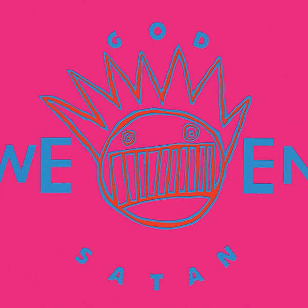

# God Ween Satan

By **Ween**

## Album Data

- **Catalog:** Beets
- **Format:** Digital, Album
- **Album:** God Ween Satan
- **Artist:** Ween
- **Albumartist:** Ween
- **Genre:** Noise Rock
- **MusicBrainz Album Artist ID:** [c0eee88b-47f2-4cd2-ac48-a045e902a432](https://musicbrainz.org/artist/c0eee88b-47f2-4cd2-ac48-a045e902a432)
- **MusicBrainz Album ID:** [8e64cfc7-d12d-465a-8eb4-7adf9a5c14a1](https://musicbrainz.org/release/8e64cfc7-d12d-465a-8eb4-7adf9a5c14a1)
- **MusicBrainz Release Group ID:** [f65e2443-6b24-31ac-9add-4fcf3274d4f4](https://musicbrainz.org/release-group/f65e2443-6b24-31ac-9add-4fcf3274d4f4)
- **Year:** 2002
- **Catalog #:** 
- **Label:** New Rounder
- **Total Tracks:** 13

## Album Tracks

### Track 01 - Fiesta

- **Artist:** Ween
- **Format:** ALAC
- **Genre:** Alternative Rock
- **Length:** 2:13
- **MusicBrainz Track ID:** [6757e559-8fc7-48a7-b308-78c127c39d66](https://musicbrainz.org/recording/6757e559-8fc7-48a7-b308-78c127c39d66)
- **Title:** Fiesta
- **Track:** 01
- **Year:** 2007

### Track 02 - Blue Balloon

- **Artist:** Ween
- **Format:** ALAC
- **Genre:** Soft Rock
- **Length:** 3:51
- **MusicBrainz Track ID:** [b53b1aa7-ff34-451d-a47c-43b8d220fb74](https://musicbrainz.org/recording/b53b1aa7-ff34-451d-a47c-43b8d220fb74)
- **Title:** Blue Balloon
- **Track:** 02
- **Year:** 2007

### Track 03 - Friends

- **Artist:** Ween
- **Format:** ALAC
- **Genre:** Lo-Fi
- **Length:** 4:06
- **MusicBrainz Track ID:** [144c416b-2309-4ca7-a330-1cb57d47a1f9](https://musicbrainz.org/recording/144c416b-2309-4ca7-a330-1cb57d47a1f9)
- **Title:** Friends
- **Track:** 03
- **Year:** 2007

### Track 04 - Object

- **Artist:** Ween
- **Format:** ALAC
- **Genre:** Indie Rock
- **Length:** 2:36
- **MusicBrainz Track ID:** [64a1d2b0-a96d-489f-9d0d-744273cb5cf1](https://musicbrainz.org/recording/64a1d2b0-a96d-489f-9d0d-744273cb5cf1)
- **Title:** Object
- **Track:** 04
- **Year:** 2007

### Track 05 - Learnin’ to Love

- **Artist:** Ween
- **Format:** ALAC
- **Genre:** Indie Rock
- **Length:** 2:24
- **MusicBrainz Track ID:** [37c28339-eaf2-4183-b4a3-c95f4d886faf](https://musicbrainz.org/recording/37c28339-eaf2-4183-b4a3-c95f4d886faf)
- **Title:** Learnin’ to Love
- **Track:** 05
- **Year:** 2007

### Track 06 - With My Own Bare Hands

- **Artist:** Ween
- **Format:** ALAC
- **Genre:** Indie Rock
- **Length:** 2:45
- **MusicBrainz Track ID:** [d070a38e-b10d-4c77-b129-2ed170596a41](https://musicbrainz.org/recording/d070a38e-b10d-4c77-b129-2ed170596a41)
- **Title:** With My Own Bare Hands
- **Track:** 06
- **Year:** 2007

### Track 07 - The Fruit Man

- **Artist:** Ween
- **Format:** ALAC
- **Genre:** Dub
- **Length:** 4:00
- **MusicBrainz Track ID:** [03cc85ac-f7e2-4c8e-9a4a-95b76a9114bc](https://musicbrainz.org/recording/03cc85ac-f7e2-4c8e-9a4a-95b76a9114bc)
- **Title:** The Fruit Man
- **Track:** 07
- **Year:** 2007

### Track 08 - Spirit Walker

- **Artist:** Ween
- **Format:** ALAC
- **Genre:** Alternative Rock
- **Length:** 3:21
- **MusicBrainz Track ID:** [a220b6b8-3d00-427d-96c5-7e81819800c6](https://musicbrainz.org/recording/a220b6b8-3d00-427d-96c5-7e81819800c6)
- **Title:** Spirit Walker
- **Track:** 08
- **Year:** 2007

### Track 09 - Shamemaker

- **Artist:** Ween
- **Format:** ALAC
- **Genre:** Alternative Rock
- **Length:** 2:38
- **MusicBrainz Track ID:** [403d50b5-72a3-4aa1-9a44-4dfec46974ec](https://musicbrainz.org/recording/403d50b5-72a3-4aa1-9a44-4dfec46974ec)
- **Title:** Shamemaker
- **Track:** 09
- **Year:** 2007

### Track 10 - Sweetheart

- **Artist:** Ween
- **Format:** ALAC
- **Genre:** Indie Rock
- **Length:** 3:15
- **MusicBrainz Track ID:** [1baf0141-50bf-49af-af06-7a7d82bbf626](https://musicbrainz.org/recording/1baf0141-50bf-49af-af06-7a7d82bbf626)
- **Title:** Sweetheart
- **Track:** 10
- **Year:** 2007

### Track 11 - Lullaby

- **Artist:** Ween
- **Format:** ALAC
- **Genre:** Alternative Rock
- **Length:** 3:20
- **MusicBrainz Track ID:** [bd6cf554-617f-49f8-9490-860680049a84](https://musicbrainz.org/recording/bd6cf554-617f-49f8-9490-860680049a84)
- **Title:** Lullaby
- **Track:** 11
- **Year:** 2007

### Track 12 - Woman and Man

- **Artist:** Ween
- **Format:** ALAC
- **Genre:** Progressive Rock
- **Length:** 10:48
- **MusicBrainz Track ID:** [62a0d0cb-8f20-4bbc-a791-4724e34ed789](https://musicbrainz.org/recording/62a0d0cb-8f20-4bbc-a791-4724e34ed789)
- **Title:** Woman and Man
- **Track:** 12
- **Year:** 2007

### Track 13 - Your Party

- **Artist:** Ween
- **Format:** ALAC
- **Genre:** Indie Rock
- **Length:** 4:08
- **MusicBrainz Track ID:** [41b46454-61a5-45c2-a769-c269c4962971](https://musicbrainz.org/recording/41b46454-61a5-45c2-a769-c269c4962971)
- **Title:** Your Party
- **Track:** 13
- **Year:** 2007

## See also

- [12 Golden Country Greats](12_Golden_Country_Greats.md)
- [Chocolate and Cheese](Chocolate_and_Cheese.md)
- [La Cucaracha](La_Cucaracha.md)
- [Live in Chicago](Live_in_Chicago.md)
- [Pure Guava](Pure_Guava.md)
- [Quebec](Quebec.md)
- [Shinola (Vol. 1)](Shinola_Vol_1.md)
- [The Mollusk](The_Mollusk.md)
- [White Pepper](White_Pepper.md)
- [Roon: 12 Golden Country Greats](../../Roon/Ween/12_Golden_Country_Greats.md)
- [Roon: Chocolate and Cheese](../../Roon/Ween/Chocolate_and_Cheese.md)
- [Roon: Live at Stubb's, 7/2000 (Live)](../../Roon/Ween/Live_at_Stubbs__7-2000_Live.md)
- [Roon: Pure Guava](../../Roon/Ween/Pure_Guava.md)
- [Roon: Quebec](../../Roon/Ween/Quebec.md)
- [Roon: The Mollusk](../../Roon/Ween/The_Mollusk.md)
- [Roon: White Pepper](../../Roon/Ween/White_Pepper.md)
- [Vinyl: Shinola Vol.1](../../Vinyl/Ween/Shinola_Vol1.md)
- [Vinyl: ](../../Vinyl/Ween/Ween.md)
