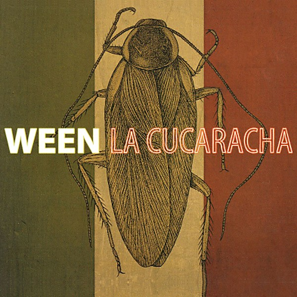

# La Cucaracha

By **Ween**

## Album Data

- **Catalog:** Beets
- **Format:** Digital, Album
- **Album:** La Cucaracha
- **Artist:** Ween
- **Albumartist:** Ween
- **Genre:** Indie Rock
- **MusicBrainz Album Artist ID:** [c0eee88b-47f2-4cd2-ac48-a045e902a432](https://musicbrainz.org/artist/c0eee88b-47f2-4cd2-ac48-a045e902a432)
- **MusicBrainz Album ID:** [c2ac77bb-120a-42ba-b066-96d24063af41](https://musicbrainz.org/release/c2ac77bb-120a-42ba-b066-96d24063af41)
- **MusicBrainz Release Group ID:** [d13ce7dc-6c4f-3c0a-9bba-d7e70ae412de](https://musicbrainz.org/release-group/d13ce7dc-6c4f-3c0a-9bba-d7e70ae412de)
- **Year:** 2007
- **Catalog #:** SVE 3066
- **Label:** Sanctuary Records
- **Total Tracks:** 17

## Album Tracks

### Track 01 - Take Me Away

- **Artist:** Ween
- **Format:** ALAC
- **Genre:** Indie Rock
- **Length:** 3:02
- **MusicBrainz Track ID:** [1ebc0dd9-a252-45f1-bdbe-7e34b6acfe89](https://musicbrainz.org/recording/1ebc0dd9-a252-45f1-bdbe-7e34b6acfe89)
- **Title:** Take Me Away
- **Track:** 01
- **Year:** 2004

### Track 02 - The Grobe

- **Artist:** Ween
- **Format:** ALAC
- **Genre:** Stoner Rock
- **Length:** 3:17
- **MusicBrainz Track ID:** [ab7f7901-adcd-450c-9775-4dd5947dca96](https://musicbrainz.org/recording/ab7f7901-adcd-450c-9775-4dd5947dca96)
- **Title:** The Grobe
- **Track:** 02
- **Year:** 2004

### Track 03 - Transdermal Celebration

- **Artist:** Ween
- **Format:** ALAC
- **Genre:** New Prog
- **Length:** 3:33
- **MusicBrainz Track ID:** [bf0136de-5446-4cc1-b9f6-584a25cded1d](https://musicbrainz.org/recording/bf0136de-5446-4cc1-b9f6-584a25cded1d)
- **Title:** Transdermal Celebration
- **Track:** 03
- **Year:** 2004

### Track 04 - Even If You Don't

- **Artist:** Ween
- **Format:** ALAC
- **Genre:** Indie Rock
- **Length:** 4:20
- **MusicBrainz Track ID:** [06d75220-6033-402d-84bf-492a119b7992](https://musicbrainz.org/recording/06d75220-6033-402d-84bf-492a119b7992)
- **Title:** Even If You Don't
- **Track:** 04
- **Year:** 2004

### Track 05 - Voodoo Lady

- **Artist:** Ween
- **Format:** ALAC
- **Genre:** Indie Rock
- **Length:** 7:30
- **MusicBrainz Track ID:** [ef5a0ea5-6fe1-4889-b8e9-825e5eb4ce9f](https://musicbrainz.org/recording/ef5a0ea5-6fe1-4889-b8e9-825e5eb4ce9f)
- **Title:** Voodoo Lady
- **Track:** 05
- **Year:** 2004

### Track 06 - The HIV Song

- **Artist:** Ween
- **Format:** ALAC
- **Genre:** Stoner Rock
- **Length:** 1:54
- **MusicBrainz Track ID:** [f3b3c5b2-f549-40b7-9c34-79f4493e2448](https://musicbrainz.org/recording/f3b3c5b2-f549-40b7-9c34-79f4493e2448)
- **Title:** The HIV Song
- **Track:** 06
- **Year:** 2004

### Track 07 - Baby Bitch

- **Artist:** Ween
- **Format:** ALAC
- **Genre:** Indie Rock
- **Length:** 3:26
- **MusicBrainz Track ID:** [0cb936f3-6c4f-4d28-97f3-e22e531f55c7](https://musicbrainz.org/recording/0cb936f3-6c4f-4d28-97f3-e22e531f55c7)
- **Title:** Baby Bitch
- **Track:** 07
- **Year:** 2004

### Track 08 - Roses Are Free

- **Artist:** Ween
- **Format:** ALAC
- **Genre:** Indie Rock
- **Length:** 6:03
- **MusicBrainz Track ID:** [2510a534-f35c-484b-8112-6173086bc824](https://musicbrainz.org/recording/2510a534-f35c-484b-8112-6173086bc824)
- **Title:** Roses Are Free
- **Track:** 08
- **Year:** 2004

### Track 09 - Mutilated Lips

- **Artist:** Ween
- **Format:** ALAC
- **Genre:** Stoner Rock
- **Length:** 4:37
- **MusicBrainz Track ID:** [841f3950-37d2-460b-ab2a-203c229f972a](https://musicbrainz.org/recording/841f3950-37d2-460b-ab2a-203c229f972a)
- **Title:** Mutilated Lips
- **Track:** 09
- **Year:** 2004

### Track 10 - Chocolate Town

- **Artist:** Ween
- **Format:** ALAC
- **Genre:** Alternative Rock
- **Length:** 3:23
- **MusicBrainz Track ID:** [39be3864-ed41-4972-8fcd-1c6c3dba6646](https://musicbrainz.org/recording/39be3864-ed41-4972-8fcd-1c6c3dba6646)
- **Title:** Chocolate Town
- **Track:** 10
- **Year:** 2004

### Track 11 - I'll Be Your Johnny on the Spot

- **Artist:** Ween
- **Format:** ALAC
- **Genre:** Rock
- **Length:** 4:29
- **MusicBrainz Track ID:** [ed4ecd48-ff99-45df-98c2-92f86be95a9e](https://musicbrainz.org/recording/ed4ecd48-ff99-45df-98c2-92f86be95a9e)
- **Title:** I'll Be Your Johnny on the Spot
- **Track:** 11
- **Year:** 2004

### Track 12 - Buckingham Green

- **Artist:** Ween
- **Format:** ALAC
- **Genre:** Stoner Rock
- **Length:** 3:57
- **MusicBrainz Track ID:** [9673c973-dee9-4214-8051-ff715bfc45ce](https://musicbrainz.org/recording/9673c973-dee9-4214-8051-ff715bfc45ce)
- **Title:** Buckingham Green
- **Track:** 12
- **Year:** 2004

### Track 13 - Spinal Meningitis Got Me Down

- **Artist:** Ween
- **Format:** ALAC
- **Genre:** Rock
- **Length:** 3:08
- **MusicBrainz Track ID:** [97397f5a-8e85-4861-9a7d-9199e873751f](https://musicbrainz.org/recording/97397f5a-8e85-4861-9a7d-9199e873751f)
- **Title:** Spinal Meningitis Got Me Down
- **Track:** 13
- **Year:** 2004

### Track 14 - Pork Roll Egg and Cheese

- **Artist:** Ween
- **Format:** ALAC
- **Genre:** Rock
- **Length:** 2:30
- **MusicBrainz Track ID:** [bdcd8faf-25fb-46a2-84de-aeccf8813754](https://musicbrainz.org/recording/bdcd8faf-25fb-46a2-84de-aeccf8813754)
- **Title:** Pork Roll Egg and Cheese
- **Track:** 14
- **Year:** 2004

### Track 15 - The Argus

- **Artist:** Ween
- **Format:** ALAC
- **Genre:** Indie Rock
- **Length:** 4:57
- **MusicBrainz Track ID:** [4c691149-5e9e-4fe1-bc0d-1cf66298e4fa](https://musicbrainz.org/recording/4c691149-5e9e-4fe1-bc0d-1cf66298e4fa)
- **Title:** The Argus
- **Track:** 15
- **Year:** 2004

### Track 16 - Zoloft

- **Artist:** Ween
- **Format:** ALAC
- **Genre:** Neo-Psychedelia
- **Length:** 7:05
- **MusicBrainz Track ID:** [b7d244ee-d77a-468f-aeca-2e7bbced47ee](https://musicbrainz.org/recording/b7d244ee-d77a-468f-aeca-2e7bbced47ee)
- **Title:** Zoloft
- **Track:** 16
- **Year:** 2004

### Track 17 - Ocean Man

- **Artist:** Ween
- **Format:** ALAC
- **Genre:** Indie Rock
- **Length:** 2:15
- **MusicBrainz Track ID:** [3d69c421-9538-4a4b-ac7a-1bc62b68fb6c](https://musicbrainz.org/recording/3d69c421-9538-4a4b-ac7a-1bc62b68fb6c)
- **Title:** Ocean Man
- **Track:** 17
- **Year:** 2004

## See also

- [12 Golden Country Greats](12_Golden_Country_Greats.md)
- [Chocolate and Cheese](Chocolate_and_Cheese.md)
- [God Ween Satan](God_Ween_Satan.md)
- [Live in Chicago](Live_in_Chicago.md)
- [Pure Guava](Pure_Guava.md)
- [Quebec](Quebec.md)
- [Shinola (Vol. 1)](Shinola_Vol_1.md)
- [The Mollusk](The_Mollusk.md)
- [White Pepper](White_Pepper.md)
- [Roon: 12 Golden Country Greats](../../Roon/Ween/12_Golden_Country_Greats.md)
- [Roon: Chocolate and Cheese](../../Roon/Ween/Chocolate_and_Cheese.md)
- [Roon: Live at Stubb's, 7/2000 (Live)](../../Roon/Ween/Live_at_Stubbs__7-2000_Live.md)
- [Roon: Pure Guava](../../Roon/Ween/Pure_Guava.md)
- [Roon: Quebec](../../Roon/Ween/Quebec.md)
- [Roon: The Mollusk](../../Roon/Ween/The_Mollusk.md)
- [Roon: White Pepper](../../Roon/Ween/White_Pepper.md)
- [Vinyl: Shinola Vol.1](../../Vinyl/Ween/Shinola_Vol1.md)
- [Vinyl: ](../../Vinyl/Ween/Ween.md)
