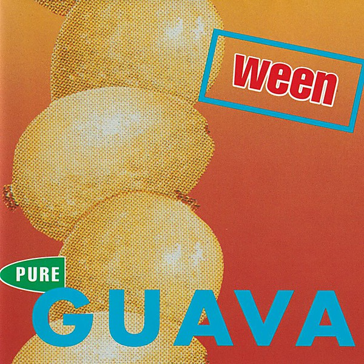

# Pure Guava

By **Ween**

## Album Data

- **Catalog:** Beets
- **Format:** Digital, Album
- **Album:** Pure Guava
- **Artist:** Ween
- **Albumartist:** Ween
- **Genre:** Noise Rock
- **MusicBrainz Album Artist ID:** 
- **MusicBrainz Album ID:** 
- **MusicBrainz Release Group ID:** 
- **Year:** 0000
- **Catalog #:** 
- **Label:** 
- **Total Tracks:** 15

## Album Tracks

### Track 01 - It's Gonna Be A Long Night

- **Artist:** Ween
- **Format:** ALAC
- **Genre:** Stoner Rock
- **Length:** 2:50
- **MusicBrainz Track ID:** 
- **Title:** It's Gonna Be A Long Night
- **Track:** 01
- **Year:** 2003

### Track 02 - Zoloft

- **Artist:** Ween
- **Format:** ALAC
- **Genre:** Neo-Psychedelia
- **Length:** 3:51
- **MusicBrainz Track ID:** 
- **Title:** Zoloft
- **Track:** 02
- **Year:** 2003

### Track 03 - Transdermal Celebration

- **Artist:** Ween
- **Format:** ALAC
- **Genre:** New Prog
- **Length:** 3:26
- **MusicBrainz Track ID:** 
- **Title:** Transdermal Celebration
- **Track:** 03
- **Year:** 2003

### Track 04 - Among His Tribe

- **Artist:** Ween
- **Format:** ALAC
- **Genre:** Alternative Rock
- **Length:** 3:39
- **MusicBrainz Track ID:** 
- **Title:** Among His Tribe
- **Track:** 04
- **Year:** 2003

### Track 05 - So Many People In The Neighborhood

- **Artist:** Ween
- **Format:** ALAC
- **Genre:** Lo-Fi
- **Length:** 3:30
- **MusicBrainz Track ID:** 
- **Title:** So Many People In The Neighborhood
- **Track:** 05
- **Year:** 2003

### Track 06 - Tried And True

- **Artist:** Ween
- **Format:** ALAC
- **Genre:** Neo-Psychedelia
- **Length:** 4:02
- **MusicBrainz Track ID:** 
- **Title:** Tried And True
- **Track:** 06
- **Year:** 2003

### Track 06 - Tried And True

- **Artist:** Ween
- **Format:** AAC
- **Genre:** Neo-Psychedelia
- **Length:** 4:02
- **MusicBrainz Track ID:** 
- **Title:** Tried And True
- **Track:** 06
- **Year:** 2003

### Track 07 - Happy Colored Marbles

- **Artist:** Ween
- **Format:** ALAC
- **Genre:** Emo
- **Length:** 3:14
- **MusicBrainz Track ID:** 
- **Title:** Happy Colored Marbles
- **Track:** 07
- **Year:** 2003

### Track 07 - Happy Colored Marbles

- **Artist:** Ween
- **Format:** AAC
- **Genre:** Emo
- **Length:** 3:14
- **MusicBrainz Track ID:** 
- **Title:** Happy Colored Marbles
- **Track:** 07
- **Year:** 2003

### Track 08 - Hey There Fancy Pants

- **Artist:** Ween
- **Format:** ALAC
- **Genre:** Neo-Psychedelia
- **Length:** 2:00
- **MusicBrainz Track ID:** 
- **Title:** Hey There Fancy Pants
- **Track:** 08
- **Year:** 2003

### Track 09 - Captain

- **Artist:** Ween
- **Format:** ALAC
- **Genre:** Indie Rock
- **Length:** 3:59
- **MusicBrainz Track ID:** 
- **Title:** Captain
- **Track:** 09
- **Year:** 2003

### Track 10 - Chocolate Town

- **Artist:** Ween
- **Format:** ALAC
- **Genre:** Alternative Rock
- **Length:** 3:17
- **MusicBrainz Track ID:** 
- **Title:** Chocolate Town
- **Track:** 10
- **Year:** 2003

### Track 11 - I Don't Want It

- **Artist:** Ween
- **Format:** ALAC
- **Genre:** Indie Rock
- **Length:** 3:25
- **MusicBrainz Track ID:** 
- **Title:** I Don't Want It
- **Track:** 11
- **Year:** 2003

### Track 12 - The Fucked Jam

- **Artist:** Ween
- **Format:** ALAC
- **Genre:** Lo-Fi
- **Length:** 2:59
- **MusicBrainz Track ID:** 
- **Title:** The Fucked Jam
- **Track:** 12
- **Year:** 2003

### Track 13 - Alcan Road

- **Artist:** Ween
- **Format:** ALAC
- **Genre:** Alternative Rock
- **Length:** 5:08
- **MusicBrainz Track ID:** 
- **Title:** Alcan Road
- **Track:** 13
- **Year:** 2003

### Track 14 - The Argus

- **Artist:** Ween
- **Format:** ALAC
- **Genre:** Indie Rock
- **Length:** 4:53
- **MusicBrainz Track ID:** 
- **Title:** The Argus
- **Track:** 14
- **Year:** 2003

### Track 15 - If You Could Save Yourself (You'd Save Us All)

- **Artist:** Ween
- **Format:** ALAC
- **Genre:** Indie Rock
- **Length:** 4:47
- **MusicBrainz Track ID:** 
- **Title:** If You Could Save Yourself (You'd Save Us All)
- **Track:** 15
- **Year:** 2003

