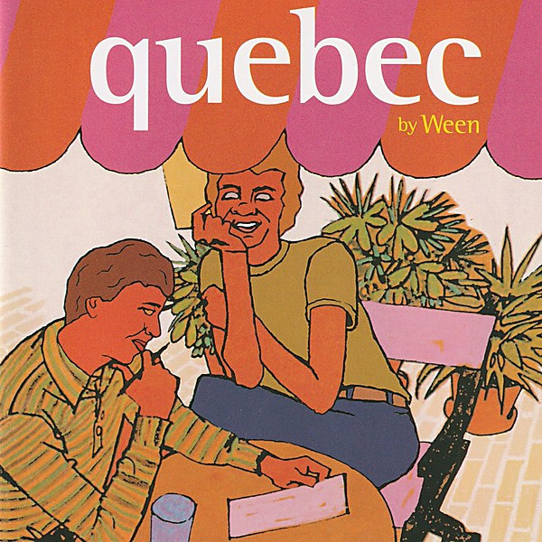

# Quebec

By **Ween**

## Album Data

- **Catalog:** Beets
- **Format:** Digital, Album
- **Album:** Quebec
- **Artist:** Ween
- **Albumartist:** Ween
- **Genre:** Neo-Psychedelia
- **MusicBrainz Album Artist ID:** 
- **MusicBrainz Album ID:** 
- **MusicBrainz Release Group ID:** 
- **Year:** 2003
- **Catalog #:** 
- **Label:** Chocodog Records
- **Total Tracks:** 12

## Album Tracks

### Track 01 - Tastes Good On Th’ Bun

- **Artist:** Ween
- **Format:** AAC
- **Genre:** Alternative Rock
- **Length:** 3:26
- **MusicBrainz Track ID:** [4988d5f2-a09c-42f1-a1a1-4d8bc6f3e563](https://musicbrainz.org/recording/4988d5f2-a09c-42f1-a1a1-4d8bc6f3e563)
- **Title:** Tastes Good On Th’ Bun
- **Track:** 01
- **Year:** 2005

### Track 02 - Boys Club

- **Artist:** Ween
- **Format:** AAC
- **Genre:** Alternative Rock
- **Length:** 3:10
- **MusicBrainz Track ID:** [53470256-75bb-48c2-98d5-45ec6d2d8f22](https://musicbrainz.org/recording/53470256-75bb-48c2-98d5-45ec6d2d8f22)
- **Title:** Boys Club
- **Track:** 02
- **Year:** 2005

### Track 03 - I Fell In Love Today

- **Artist:** Ween
- **Format:** AAC
- **Genre:** Indie Rock
- **Length:** 4:14
- **MusicBrainz Track ID:** [0b38a1c7-fa56-40c5-8710-0822c7a47d9d](https://musicbrainz.org/recording/0b38a1c7-fa56-40c5-8710-0822c7a47d9d)
- **Title:** I Fell In Love Today
- **Track:** 03
- **Year:** 2005

### Track 04 - Big Fat Fuck

- **Artist:** Ween
- **Format:** AAC
- **Genre:** Dub
- **Length:** 2:58
- **MusicBrainz Track ID:** [4acb99e4-e972-4838-af60-cb48828facaa](https://musicbrainz.org/recording/4acb99e4-e972-4838-af60-cb48828facaa)
- **Title:** Big Fat Fuck
- **Track:** 04
- **Year:** 2005

### Track 05 - Gabrielle

- **Artist:** Ween
- **Format:** AAC
- **Genre:** Indie Rock
- **Length:** 3:33
- **MusicBrainz Track ID:** [eb7996e6-055d-4681-854b-bd2b4a7044a6](https://musicbrainz.org/recording/eb7996e6-055d-4681-854b-bd2b4a7044a6)
- **Title:** Gabrielle
- **Track:** 05
- **Year:** 2005

### Track 06 - Did You See Me?

- **Artist:** Ween
- **Format:** AAC
- **Genre:** Indie Rock
- **Length:** 5:18
- **MusicBrainz Track ID:** [77783250-fee2-4bba-a7c3-94f7009f6c86](https://musicbrainz.org/recording/77783250-fee2-4bba-a7c3-94f7009f6c86)
- **Title:** Did You See Me?
- **Track:** 06
- **Year:** 2005

### Track 07 - How High Can You Fly

- **Artist:** Ween
- **Format:** AAC
- **Genre:** Rock
- **Length:** 2:39
- **MusicBrainz Track ID:** [68648cbe-8e2b-4bdd-bb56-cef08f2fce49](https://musicbrainz.org/recording/68648cbe-8e2b-4bdd-bb56-cef08f2fce49)
- **Title:** How High Can You Fly
- **Track:** 07
- **Year:** 2005

### Track 08 - Transitions

- **Artist:** Ween
- **Format:** AAC
- **Genre:** Alternative Rock
- **Length:** 3:49
- **MusicBrainz Track ID:** [d7a4c51c-996a-46ee-95bd-324a150d2869](https://musicbrainz.org/recording/d7a4c51c-996a-46ee-95bd-324a150d2869)
- **Title:** Transitions
- **Track:** 08
- **Year:** 2005

### Track 09 - Israel

- **Artist:** Ween
- **Format:** AAC
- **Genre:** Indie Rock
- **Length:** 3:45
- **MusicBrainz Track ID:** [901f460b-97af-4a6a-a11c-9fc2c144f9ea](https://musicbrainz.org/recording/901f460b-97af-4a6a-a11c-9fc2c144f9ea)
- **Title:** Israel
- **Track:** 09
- **Year:** 2005

### Track 10 - The Rift

- **Artist:** Ween
- **Format:** AAC
- **Genre:** Alternative Rock
- **Length:** 5:44
- **MusicBrainz Track ID:** [b4a9fe90-e733-4007-a4a8-464c7ad6a31f](https://musicbrainz.org/recording/b4a9fe90-e733-4007-a4a8-464c7ad6a31f)
- **Title:** The Rift
- **Track:** 10
- **Year:** 2005

### Track 11 - Monique The Freak

- **Artist:** Ween
- **Format:** AAC
- **Genre:** Indie Rock
- **Length:** 5:56
- **MusicBrainz Track ID:** [5364d928-885c-4fb3-9488-ff085f9650c5](https://musicbrainz.org/recording/5364d928-885c-4fb3-9488-ff085f9650c5)
- **Title:** Monique The Freak
- **Track:** 11
- **Year:** 2005

### Track 12 - Someday

- **Artist:** Ween
- **Format:** AAC
- **Genre:** Psychedelic Pop
- **Length:** 3:53
- **MusicBrainz Track ID:** [03565fc5-1ad1-4a20-9643-0d254ab80163](https://musicbrainz.org/recording/03565fc5-1ad1-4a20-9643-0d254ab80163)
- **Title:** Someday
- **Track:** 12
- **Year:** 2005

## See also

- [12 Golden Country Greats](12_Golden_Country_Greats.md)
- [Chocolate and Cheese](Chocolate_and_Cheese.md)
- [God Ween Satan](God_Ween_Satan.md)
- [La Cucaracha](La_Cucaracha.md)
- [Live in Chicago](Live_in_Chicago.md)
- [Pure Guava](Pure_Guava.md)
- [Shinola (Vol. 1)](Shinola_Vol_1.md)
- [The Mollusk](The_Mollusk.md)
- [White Pepper](White_Pepper.md)
- [Roon: 12 Golden Country Greats](../../Roon/Ween/12_Golden_Country_Greats.md)
- [Roon: Chocolate and Cheese](../../Roon/Ween/Chocolate_and_Cheese.md)
- [Roon: Live at Stubb's, 7/2000 (Live)](../../Roon/Ween/Live_at_Stubbs__7-2000_Live.md)
- [Roon: Pure Guava](../../Roon/Ween/Pure_Guava.md)
- [Roon: Quebec](../../Roon/Ween/Quebec.md)
- [Roon: The Mollusk](../../Roon/Ween/The_Mollusk.md)
- [Roon: White Pepper](../../Roon/Ween/White_Pepper.md)
- [Vinyl: Shinola Vol.1](../../Vinyl/Ween/Shinola_Vol1.md)
- [Vinyl: ](../../Vinyl/Ween/Ween.md)
