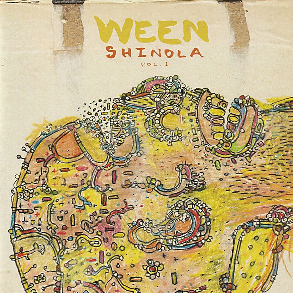

# Shinola (Vol. 1)

By **Ween**

## Album Data

- **Catalog:** Beets
- **Format:** Digital, Album
- **Album:** Shinola (Vol. 1)
- **Artist:** Ween
- **Albumartist:** Ween
- **Genre:** Alternative Rock
- **MusicBrainz Album Artist ID:** [c0eee88b-47f2-4cd2-ac48-a045e902a432](https://musicbrainz.org/artist/c0eee88b-47f2-4cd2-ac48-a045e902a432)
- **MusicBrainz Album ID:** [258e7e6c-d038-47f2-9daa-20926ffd253a](https://musicbrainz.org/release/258e7e6c-d038-47f2-9daa-20926ffd253a)
- **MusicBrainz Release Group ID:** [9dce315f-0e42-3f23-aecc-68ae7ac1b2a8](https://musicbrainz.org/release-group/9dce315f-0e42-3f23-aecc-68ae7ac1b2a8)
- **Year:** 2005
- **Catalog #:** 62013-2
- **Label:** Elektra
- **Total Tracks:** 14

## Album Tracks

### Track 01 - I’m Dancing in the Show Tonight

- **Artist:** Ween
- **Format:** MP3
- **Genre:** Indie Rock
- **Length:** 1:55
- **MusicBrainz Track ID:** [38415acc-13a4-4714-aad2-43495ef817b0](https://musicbrainz.org/recording/38415acc-13a4-4714-aad2-43495ef817b0)
- **Title:** I’m Dancing in the Show Tonight
- **Track:** 01
- **Year:** 1997

### Track 02 - The Mollusk

- **Artist:** Ween
- **Format:** MP3
- **Genre:** Stoner Rock
- **Length:** 2:37
- **MusicBrainz Track ID:** [93171fcb-a14d-46d3-9a0d-ddb73f8c6659](https://musicbrainz.org/recording/93171fcb-a14d-46d3-9a0d-ddb73f8c6659)
- **Title:** The Mollusk
- **Track:** 02
- **Year:** 1997

### Track 03 - Polka Dot Tail

- **Artist:** Ween
- **Format:** MP3
- **Genre:** Indie Rock
- **Length:** 3:19
- **MusicBrainz Track ID:** [ba76288a-f89f-4943-90db-65609eab9853](https://musicbrainz.org/recording/ba76288a-f89f-4943-90db-65609eab9853)
- **Title:** Polka Dot Tail
- **Track:** 03
- **Year:** 1997

### Track 04 - I’ll Be Your Jonny on the Spot

- **Artist:** Ween
- **Format:** MP3
- **Genre:** Indie Rock
- **Length:** 2:00
- **MusicBrainz Track ID:** [2ec68790-1b0a-412e-9ae4-1de63cd1fb45](https://musicbrainz.org/recording/2ec68790-1b0a-412e-9ae4-1de63cd1fb45)
- **Title:** I’ll Be Your Jonny on the Spot
- **Track:** 04
- **Year:** 1997

### Track 05 - Mutilated Lips

- **Artist:** Ween
- **Format:** MP3
- **Genre:** Stoner Rock
- **Length:** 3:48
- **MusicBrainz Track ID:** [2cc61f83-d7c2-43c4-9549-2b15d5a33faa](https://musicbrainz.org/recording/2cc61f83-d7c2-43c4-9549-2b15d5a33faa)
- **Title:** Mutilated Lips
- **Track:** 05
- **Year:** 1997

### Track 06 - The Blarney Stone

- **Artist:** Ween
- **Format:** MP3
- **Genre:** Indie Rock
- **Length:** 3:13
- **MusicBrainz Track ID:** [86c77144-5c6f-4e4e-9478-b0ae3067437b](https://musicbrainz.org/recording/86c77144-5c6f-4e4e-9478-b0ae3067437b)
- **Title:** The Blarney Stone
- **Track:** 06
- **Year:** 1997

### Track 07 - It’s Gonna Be (Alright)

- **Artist:** Ween
- **Format:** MP3
- **Genre:** Indie Rock
- **Length:** 3:17
- **MusicBrainz Track ID:** [42d728e1-105d-4e9c-8232-e8b4ece6f52a](https://musicbrainz.org/recording/42d728e1-105d-4e9c-8232-e8b4ece6f52a)
- **Title:** It’s Gonna Be (Alright)
- **Track:** 07
- **Year:** 1997

### Track 08 - The Golden Eel

- **Artist:** Ween
- **Format:** MP3
- **Genre:** Indie Rock
- **Length:** 4:03
- **MusicBrainz Track ID:** [87315545-769c-403e-86ae-f94ebdd796cc](https://musicbrainz.org/recording/87315545-769c-403e-86ae-f94ebdd796cc)
- **Title:** The Golden Eel
- **Track:** 08
- **Year:** 1997

### Track 09 - Cold Blows the Wind

- **Artist:** Ween
- **Format:** MP3
- **Genre:** Post-Rock
- **Length:** 4:27
- **MusicBrainz Track ID:** [914123b6-1114-492a-b5ee-42fdaab1ddb4](https://musicbrainz.org/recording/914123b6-1114-492a-b5ee-42fdaab1ddb4)
- **Title:** Cold Blows the Wind
- **Track:** 09
- **Year:** 1997

### Track 10 - Pink Eye (on My Leg)

- **Artist:** Ween
- **Format:** MP3
- **Genre:** Indie Rock
- **Length:** 3:12
- **MusicBrainz Track ID:** [ad46c6c4-5c7d-43ac-a8d9-1e5a2b590e35](https://musicbrainz.org/recording/ad46c6c4-5c7d-43ac-a8d9-1e5a2b590e35)
- **Title:** Pink Eye (on My Leg)
- **Track:** 10
- **Year:** 1997

### Track 11 - Waving My Dick in the Wind

- **Artist:** Ween
- **Format:** MP3
- **Genre:** Indie Rock
- **Length:** 2:11
- **MusicBrainz Track ID:** [bae3c9ad-c389-4202-8e4a-0b7caa95f25e](https://musicbrainz.org/recording/bae3c9ad-c389-4202-8e4a-0b7caa95f25e)
- **Title:** Waving My Dick in the Wind
- **Track:** 11
- **Year:** 1997

### Track 12 - Buckingham Green

- **Artist:** Ween
- **Format:** MP3
- **Genre:** Stoner Rock
- **Length:** 3:18
- **MusicBrainz Track ID:** [964c2de1-92c3-49d1-9f47-a1f2ae1ce12c](https://musicbrainz.org/recording/964c2de1-92c3-49d1-9f47-a1f2ae1ce12c)
- **Title:** Buckingham Green
- **Track:** 12
- **Year:** 1997

### Track 13 - Ocean Man

- **Artist:** Ween
- **Format:** MP3
- **Genre:** Indie Rock
- **Length:** 2:06
- **MusicBrainz Track ID:** [4c0ef497-b3fa-474a-bd05-e238e34cf411](https://musicbrainz.org/recording/4c0ef497-b3fa-474a-bd05-e238e34cf411)
- **Title:** Ocean Man
- **Track:** 13
- **Year:** 1997

### Track 14 - She Wanted to Leave (reprise)

- **Artist:** Ween
- **Format:** MP3
- **Genre:** Indie Rock
- **Length:** 4:25
- **MusicBrainz Track ID:** [19fc0805-89ec-4002-9d9a-52e4342f9bf5](https://musicbrainz.org/recording/19fc0805-89ec-4002-9d9a-52e4342f9bf5)
- **Title:** She Wanted to Leave (reprise)
- **Track:** 14
- **Year:** 1997

## See also

- [12 Golden Country Greats](12_Golden_Country_Greats.md)
- [Chocolate and Cheese](Chocolate_and_Cheese.md)
- [God Ween Satan](God_Ween_Satan.md)
- [La Cucaracha](La_Cucaracha.md)
- [Live in Chicago](Live_in_Chicago.md)
- [Pure Guava](Pure_Guava.md)
- [Quebec](Quebec.md)
- [The Mollusk](The_Mollusk.md)
- [White Pepper](White_Pepper.md)
- [Roon: 12 Golden Country Greats](../../Roon/Ween/12_Golden_Country_Greats.md)
- [Roon: Chocolate and Cheese](../../Roon/Ween/Chocolate_and_Cheese.md)
- [Roon: Live at Stubb's, 7/2000 (Live)](../../Roon/Ween/Live_at_Stubbs__7-2000_Live.md)
- [Roon: Pure Guava](../../Roon/Ween/Pure_Guava.md)
- [Roon: Quebec](../../Roon/Ween/Quebec.md)
- [Roon: The Mollusk](../../Roon/Ween/The_Mollusk.md)
- [Roon: White Pepper](../../Roon/Ween/White_Pepper.md)
- [Vinyl: Shinola Vol.1](../../Vinyl/Ween/Shinola_Vol1.md)
- [Vinyl: ](../../Vinyl/Ween/Ween.md)
