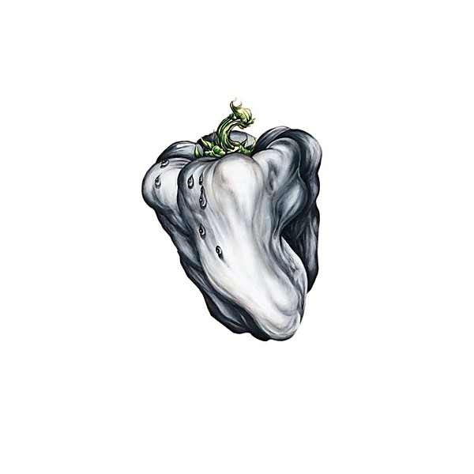

# White Pepper

By **Ween**

## Album Data

- **Catalog:** Beets
- **Format:** Digital, Album
- **Album:** White Pepper
- **Artist:** Ween
- **Albumartist:** Ween
- **Genre:** Indie Rock
- **MusicBrainz Album Artist ID:** [https](https://musicbrainz.org/artist/https)
- **MusicBrainz Album ID:** [https](https://musicbrainz.org/release/https)
- **MusicBrainz Release Group ID:** 
- **Year:** 2000
- **Catalog #:** 
- **Label:** The False Profits
- **Total Tracks:** 12

## Album Tracks

### Track 01 - Exactly Where I'm At

- **Artist:** Ween
- **Format:** ALAC
- **Genre:** Indie Rock
- **Length:** 4:31
- **MusicBrainz Track ID:** [https](https://musicbrainz.org/recording/https)
- **Title:** Exactly Where I'm At
- **Track:** 01
- **Year:** 2000

### Track 02 - Flutes of Chi

- **Artist:** Ween
- **Format:** ALAC
- **Genre:** Alternative Rock
- **Length:** 3:30
- **MusicBrainz Track ID:** [https](https://musicbrainz.org/recording/https)
- **Title:** Flutes of Chi
- **Track:** 02
- **Year:** 2000

### Track 03 - Even If You Don't

- **Artist:** Ween
- **Format:** ALAC
- **Genre:** Indie Rock
- **Length:** 3:25
- **MusicBrainz Track ID:** [https](https://musicbrainz.org/recording/https)
- **Title:** Even If You Don't
- **Track:** 03
- **Year:** 2000

### Track 04 - Bananas and Blow

- **Artist:** Ween
- **Format:** ALAC
- **Genre:** Indie Pop
- **Length:** 3:34
- **MusicBrainz Track ID:** [https](https://musicbrainz.org/recording/https)
- **Title:** Bananas and Blow
- **Track:** 04
- **Year:** 2000

### Track 05 - Stroker Ace

- **Artist:** Ween
- **Format:** ALAC
- **Genre:** Thrash Metal
- **Length:** 2:08
- **MusicBrainz Track ID:** [https](https://musicbrainz.org/recording/https)
- **Title:** Stroker Ace
- **Track:** 05
- **Year:** 2000

### Track 06 - Ice Castles

- **Artist:** Ween
- **Format:** ALAC
- **Genre:** Neo-Psychedelia
- **Length:** 2:05
- **MusicBrainz Track ID:** [https](https://musicbrainz.org/recording/https)
- **Title:** Ice Castles
- **Track:** 06
- **Year:** 2000

### Track 07 - Back To Basom

- **Artist:** Ween
- **Format:** ALAC
- **Genre:** Indie Rock
- **Length:** 3:46
- **MusicBrainz Track ID:** [https](https://musicbrainz.org/recording/https)
- **Title:** Back To Basom
- **Track:** 07
- **Year:** 2000

### Track 08 - The Grobe

- **Artist:** Ween
- **Format:** ALAC
- **Genre:** Stoner Rock
- **Length:** 3:32
- **MusicBrainz Track ID:** [https](https://musicbrainz.org/recording/https)
- **Title:** The Grobe
- **Track:** 08
- **Year:** 2000

### Track 09 - Pandy Fackler

- **Artist:** Ween
- **Format:** ALAC
- **Genre:** Emo
- **Length:** 3:57
- **MusicBrainz Track ID:** [https](https://musicbrainz.org/recording/https)
- **Title:** Pandy Fackler
- **Track:** 09
- **Year:** 2000

### Track 10 - Stay Forever

- **Artist:** Ween
- **Format:** ALAC
- **Genre:** Indie Rock
- **Length:** 3:32
- **MusicBrainz Track ID:** [https](https://musicbrainz.org/recording/https)
- **Title:** Stay Forever
- **Track:** 10
- **Year:** 2000

### Track 11 - Falling Out

- **Artist:** Ween
- **Format:** ALAC
- **Genre:** Indie Rock
- **Length:** 2:28
- **MusicBrainz Track ID:** [https](https://musicbrainz.org/recording/https)
- **Title:** Falling Out
- **Track:** 11
- **Year:** 2000

### Track 12 - She's Your Baby

- **Artist:** Ween
- **Format:** ALAC
- **Genre:** Alternative Rock
- **Length:** 3:00
- **MusicBrainz Track ID:** [https](https://musicbrainz.org/recording/https)
- **Title:** She's Your Baby
- **Track:** 12
- **Year:** 2000

## See also

- [12 Golden Country Greats](12_Golden_Country_Greats.md)
- [Chocolate and Cheese](Chocolate_and_Cheese.md)
- [God Ween Satan](God_Ween_Satan.md)
- [La Cucaracha](La_Cucaracha.md)
- [Live in Chicago](Live_in_Chicago.md)
- [Pure Guava](Pure_Guava.md)
- [Quebec](Quebec.md)
- [Shinola (Vol. 1)](Shinola_Vol_1.md)
- [The Mollusk](The_Mollusk.md)
- [Roon: 12 Golden Country Greats](../../Roon/Ween/12_Golden_Country_Greats.md)
- [Roon: Chocolate and Cheese](../../Roon/Ween/Chocolate_and_Cheese.md)
- [Roon: Live at Stubb's, 7/2000 (Live)](../../Roon/Ween/Live_at_Stubbs__7-2000_Live.md)
- [Roon: Pure Guava](../../Roon/Ween/Pure_Guava.md)
- [Roon: Quebec](../../Roon/Ween/Quebec.md)
- [Roon: The Mollusk](../../Roon/Ween/The_Mollusk.md)
- [Roon: White Pepper](../../Roon/Ween/White_Pepper.md)
- [Vinyl: Shinola Vol.1](../../Vinyl/Ween/Shinola_Vol1.md)
- [Vinyl: ](../../Vinyl/Ween/Ween.md)
