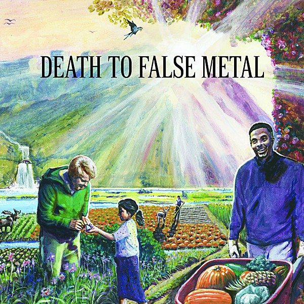

# Death to False Metal

By **Weezer**

## Album Data

- **Catalog:** Beets
- **Format:** Digital, Album
- **Album:** Death to False Metal
- **Artist:** Weezer
- **Albumartist:** Weezer
- **Genre:** Pop Punk
- **MusicBrainz Album Artist ID:** [6fe07aa5-fec0-4eca-a456-f29bff451b04](https://musicbrainz.org/artist/6fe07aa5-fec0-4eca-a456-f29bff451b04)
- **MusicBrainz Album ID:** [9d0a3656-bef0-4847-985e-808442a07cca](https://musicbrainz.org/release/9d0a3656-bef0-4847-985e-808442a07cca)
- **MusicBrainz Release Group ID:** [51c88244-97b3-4ae5-9ffa-3a4530bb6343](https://musicbrainz.org/release-group/51c88244-97b3-4ae5-9ffa-3a4530bb6343)
- **Year:** 2010
- **Catalog #:** 
- **Label:** Republic Records
- **Total Tracks:** 13

## Album Tracks

### Track 01 - Ain't Got Nobody

- **Artist:** Weezer
- **Format:** ALAC
- **Genre:** Indie Rock
- **Length:** 3:21
- **MusicBrainz Track ID:** [e7ff22e8-accc-4d41-a67e-95106a0fd039](https://musicbrainz.org/recording/e7ff22e8-accc-4d41-a67e-95106a0fd039)
- **Title:** Ain't Got Nobody
- **Track:** 01
- **Year:** 2014

### Track 02 - Back to the Shack

- **Artist:** Weezer
- **Format:** ALAC
- **Genre:** Rock
- **Length:** 3:05
- **MusicBrainz Track ID:** [4f1743a8-587f-4348-93c8-17b8a23c3c55](https://musicbrainz.org/recording/4f1743a8-587f-4348-93c8-17b8a23c3c55)
- **Title:** Back to the Shack
- **Track:** 02
- **Year:** 2014

### Track 03 - Eulogy for a Rock Band

- **Artist:** Weezer
- **Format:** ALAC
- **Genre:** Indie Rock
- **Length:** 3:24
- **MusicBrainz Track ID:** [ad455bdd-314c-4e19-862a-ad553028092a](https://musicbrainz.org/recording/ad455bdd-314c-4e19-862a-ad553028092a)
- **Title:** Eulogy for a Rock Band
- **Track:** 03
- **Year:** 2014

### Track 04 - Lonely Girl

- **Artist:** Weezer
- **Format:** ALAC
- **Genre:** Alternative Rock
- **Length:** 2:49
- **MusicBrainz Track ID:** [eede19f6-241a-4918-8443-55fa11b601e4](https://musicbrainz.org/recording/eede19f6-241a-4918-8443-55fa11b601e4)
- **Title:** Lonely Girl
- **Track:** 04
- **Year:** 2014

### Track 05 - I've Had It Up to Here

- **Artist:** Weezer
- **Format:** ALAC
- **Genre:** Pop Punk
- **Length:** 2:49
- **MusicBrainz Track ID:** [0756da4e-e188-4714-a106-56af67e4e76b](https://musicbrainz.org/recording/0756da4e-e188-4714-a106-56af67e4e76b)
- **Title:** I've Had It Up to Here
- **Track:** 05
- **Year:** 2014

### Track 06 - The British Are Coming

- **Artist:** Weezer
- **Format:** ALAC
- **Genre:** Alternative Rock
- **Length:** 4:08
- **MusicBrainz Track ID:** [0f70095c-1ab6-4fca-af97-274f5ed3c834](https://musicbrainz.org/recording/0f70095c-1ab6-4fca-af97-274f5ed3c834)
- **Title:** The British Are Coming
- **Track:** 06
- **Year:** 2014

### Track 07 - Da Vinci

- **Artist:** Weezer
- **Format:** ALAC
- **Genre:** Rock
- **Length:** 4:05
- **MusicBrainz Track ID:** [559e8dbf-2eb1-4ccc-985e-b709710b8a56](https://musicbrainz.org/recording/559e8dbf-2eb1-4ccc-985e-b709710b8a56)
- **Title:** Da Vinci
- **Track:** 07
- **Year:** 2014

### Track 08 - Go Away

- **Artist:** Weezer
- **Format:** ALAC
- **Genre:** Power Pop
- **Length:** 3:13
- **MusicBrainz Track ID:** [579ff83d-472f-4aad-902f-2f1180c22a52](https://musicbrainz.org/recording/579ff83d-472f-4aad-902f-2f1180c22a52)
- **Title:** Go Away
- **Track:** 08
- **Year:** 2014

### Track 09 - Cleopatra

- **Artist:** Weezer
- **Format:** ALAC
- **Genre:** Alternative Rock
- **Length:** 3:11
- **MusicBrainz Track ID:** [fb9c22e1-c808-4bae-bc14-f1c1dc68dd9d](https://musicbrainz.org/recording/fb9c22e1-c808-4bae-bc14-f1c1dc68dd9d)
- **Title:** Cleopatra
- **Track:** 09
- **Year:** 2014

### Track 10 - Foolish Father

- **Artist:** Weezer
- **Format:** ALAC
- **Genre:** Pop Punk
- **Length:** 4:31
- **MusicBrainz Track ID:** [a4509370-2164-4d42-b7d3-5e18561101e9](https://musicbrainz.org/recording/a4509370-2164-4d42-b7d3-5e18561101e9)
- **Title:** Foolish Father
- **Track:** 10
- **Year:** 2014

### Track 11 - I. The Waste Land

- **Artist:** Weezer
- **Format:** ALAC
- **Genre:** Pop Punk
- **Length:** 1:56
- **MusicBrainz Track ID:** [f74079d3-16ce-4d60-b2f0-986f7370ac8d](https://musicbrainz.org/recording/f74079d3-16ce-4d60-b2f0-986f7370ac8d)
- **Title:** I. The Waste Land
- **Track:** 11
- **Year:** 2014

### Track 12 - II. Anonymous

- **Artist:** Weezer
- **Format:** ALAC
- **Genre:** Pop Punk
- **Length:** 3:19
- **MusicBrainz Track ID:** [730d1017-021f-4df3-87b3-405298b36217](https://musicbrainz.org/recording/730d1017-021f-4df3-87b3-405298b36217)
- **Title:** II. Anonymous
- **Track:** 12
- **Year:** 2014

### Track 13 - III. Return to Ithaka

- **Artist:** Weezer
- **Format:** ALAC
- **Genre:** Pop Punk
- **Length:** 2:17
- **MusicBrainz Track ID:** [35c63ea5-ac93-4881-81e3-626f477d0f46](https://musicbrainz.org/recording/35c63ea5-ac93-4881-81e3-626f477d0f46)
- **Title:** III. Return to Ithaka
- **Track:** 13
- **Year:** 2014

## See also

- [Everything Will Be Alright in the End](Everything_Will_Be_Alright_in_the_End.md)
- [Hurley](Hurley.md)
- [Make Believe](Make_Believe.md)
- [Maladroit](Maladroit.md)
- [Pinkerton](Pinkerton.md)
- [Raditude (Amazon MP3 Deluxe Exclusive Version)](Raditude_Amazon_MP3_Deluxe_Exclusive_Version.md)
- [Raditude Bonus Disc](Raditude_Bonus_Disc.md)
- [Raditude](Raditude.md)
- [Weezer](Weezer.md)
- [Weezer (White Album)](Weezer_White_Album.md)
- [Roon: Everything Will Be Alright In The End](../../Roon/Weezer/Everything_Will_Be_Alright_In_The_End.md)
- [Roon: OK Human](../../Roon/Weezer/OK_Human.md)
- [Roon: Raditude (Deluxe)](../../Roon/Weezer/Raditude_Deluxe.md)
- [Roon: SZNZ](../../Roon/Weezer/SZNZ-_Autumn.md)
- [Roon: SZNZ](../../Roon/Weezer/SZNZ-_Spring.md)
- [Roon: SZNZ](../../Roon/Weezer/SZNZ-_Summer.md)
- [Roon: Van Weezer](../../Roon/Weezer/Van_Weezer.md)
- [Roon: Weezer (Black Album)](../../Roon/Weezer/Weezer_Black_Album.md)
- [Roon: Weezer (Teal Album)](../../Roon/Weezer/Weezer_Teal_Album.md)
- [Roon: Weezer (White Album) (Deluxe Edition)](../../Roon/Weezer/Weezer_White_Album_Deluxe_Edition.md)
- [Vinyl: Maladroit](../../Vinyl/Weezer/Maladroit.md)
- [Vinyl: ](../../Vinyl/Weezer/Weezer.md)
