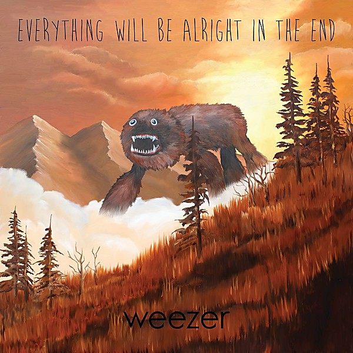

# Everything Will Be Alright in the End

By **Weezer**

## Album Data

- **Catalog:** Beets
- **Format:** Digital, Album
- **Album:** Everything Will Be Alright in the End
- **Artist:** Weezer
- **Albumartist:** Weezer
- **Genre:** Pop Punk
- **MusicBrainz Album Artist ID:** [6fe07aa5-fec0-4eca-a456-f29bff451b04](https://musicbrainz.org/artist/6fe07aa5-fec0-4eca-a456-f29bff451b04)
- **MusicBrainz Album ID:** [b06c55e9-0374-436c-b2ee-79caadca7af7](https://musicbrainz.org/release/b06c55e9-0374-436c-b2ee-79caadca7af7)
- **MusicBrainz Release Group ID:** [f69dbf99-60db-4179-bfa8-6ba15a772047](https://musicbrainz.org/release-group/f69dbf99-60db-4179-bfa8-6ba15a772047)
- **Year:** 2014
- **Catalog #:** [none]
- **Label:** Epitaph
- **Total Tracks:** 10

## Album Tracks

### Track 01 - Memories

- **Artist:** Weezer
- **Format:** ALAC
- **Genre:** Indie Rock
- **Length:** 3:14
- **MusicBrainz Track ID:** [23a3c540-abd3-4fa8-bc22-93c71f05d8c7](https://musicbrainz.org/recording/23a3c540-abd3-4fa8-bc22-93c71f05d8c7)
- **Title:** Memories
- **Track:** 01
- **Year:** 2010

### Track 02 - Ruling Me

- **Artist:** Weezer
- **Format:** ALAC
- **Genre:** Indie Rock
- **Length:** 3:29
- **MusicBrainz Track ID:** [ba354ade-5179-4618-b24a-627f12343785](https://musicbrainz.org/recording/ba354ade-5179-4618-b24a-627f12343785)
- **Title:** Ruling Me
- **Track:** 02
- **Year:** 2010

### Track 03 - Trainwrecks

- **Artist:** Weezer
- **Format:** ALAC
- **Genre:** Indie Rock
- **Length:** 3:21
- **MusicBrainz Track ID:** [4f529bc6-7101-4234-a8a0-7e255a89f372](https://musicbrainz.org/recording/4f529bc6-7101-4234-a8a0-7e255a89f372)
- **Title:** Trainwrecks
- **Track:** 03
- **Year:** 2010

### Track 04 - Unspoken

- **Artist:** Weezer
- **Format:** ALAC
- **Genre:** Indie Rock
- **Length:** 3:00
- **MusicBrainz Track ID:** [c068b510-78f6-4402-b926-c8ad412758b8](https://musicbrainz.org/recording/c068b510-78f6-4402-b926-c8ad412758b8)
- **Title:** Unspoken
- **Track:** 04
- **Year:** 2010

### Track 05 - Where's My Sex?

- **Artist:** Weezer
- **Format:** ALAC
- **Genre:** Indie Rock
- **Length:** 3:28
- **MusicBrainz Track ID:** [5b0dcd62-4519-4f31-99bc-2f1bda6dea5f](https://musicbrainz.org/recording/5b0dcd62-4519-4f31-99bc-2f1bda6dea5f)
- **Title:** Where's My Sex?
- **Track:** 05
- **Year:** 2010

### Track 06 - Run Away

- **Artist:** Weezer
- **Format:** ALAC
- **Genre:** Pop Punk
- **Length:** 2:55
- **MusicBrainz Track ID:** [ec16a4f7-628a-45d3-b5ba-78f15ad36032](https://musicbrainz.org/recording/ec16a4f7-628a-45d3-b5ba-78f15ad36032)
- **Title:** Run Away
- **Track:** 06
- **Year:** 2010

### Track 07 - Hang On

- **Artist:** Weezer
- **Format:** ALAC
- **Genre:** Indie Rock
- **Length:** 3:33
- **MusicBrainz Track ID:** [03fa27e8-430f-409a-b871-561d921e015b](https://musicbrainz.org/recording/03fa27e8-430f-409a-b871-561d921e015b)
- **Title:** Hang On
- **Track:** 07
- **Year:** 2010

### Track 08 - Smart Girls

- **Artist:** Weezer
- **Format:** ALAC
- **Genre:** Pop Punk
- **Length:** 3:10
- **MusicBrainz Track ID:** [f1043db4-70c3-479e-b708-4e63779d387a](https://musicbrainz.org/recording/f1043db4-70c3-479e-b708-4e63779d387a)
- **Title:** Smart Girls
- **Track:** 08
- **Year:** 2010

### Track 09 - Brave New World

- **Artist:** Weezer
- **Format:** ALAC
- **Genre:** Indie Rock
- **Length:** 3:56
- **MusicBrainz Track ID:** [1c6aac7c-36de-4379-af74-f0ff3db61e3c](https://musicbrainz.org/recording/1c6aac7c-36de-4379-af74-f0ff3db61e3c)
- **Title:** Brave New World
- **Track:** 09
- **Year:** 2010

### Track 10 - Time Flies

- **Artist:** Weezer
- **Format:** ALAC
- **Genre:** Indie Rock
- **Length:** 3:46
- **MusicBrainz Track ID:** [dc93677b-11ca-411d-832f-fbfa98af0d2a](https://musicbrainz.org/recording/dc93677b-11ca-411d-832f-fbfa98af0d2a)
- **Title:** Time Flies
- **Track:** 10
- **Year:** 2010

## See also

- [Death to False Metal](Death_to_False_Metal.md)
- [Hurley](Hurley.md)
- [Make Believe](Make_Believe.md)
- [Maladroit](Maladroit.md)
- [Pinkerton](Pinkerton.md)
- [Raditude (Amazon MP3 Deluxe Exclusive Version)](Raditude_Amazon_MP3_Deluxe_Exclusive_Version.md)
- [Raditude Bonus Disc](Raditude_Bonus_Disc.md)
- [Raditude](Raditude.md)
- [Weezer](Weezer.md)
- [Weezer (White Album)](Weezer_White_Album.md)
- [Roon: Everything Will Be Alright In The End](../../Roon/Weezer/Everything_Will_Be_Alright_In_The_End.md)
- [Roon: OK Human](../../Roon/Weezer/OK_Human.md)
- [Roon: Raditude (Deluxe)](../../Roon/Weezer/Raditude_Deluxe.md)
- [Roon: SZNZ](../../Roon/Weezer/SZNZ-_Autumn.md)
- [Roon: SZNZ](../../Roon/Weezer/SZNZ-_Spring.md)
- [Roon: SZNZ](../../Roon/Weezer/SZNZ-_Summer.md)
- [Roon: Van Weezer](../../Roon/Weezer/Van_Weezer.md)
- [Roon: Weezer (Black Album)](../../Roon/Weezer/Weezer_Black_Album.md)
- [Roon: Weezer (Teal Album)](../../Roon/Weezer/Weezer_Teal_Album.md)
- [Roon: Weezer (White Album) (Deluxe Edition)](../../Roon/Weezer/Weezer_White_Album_Deluxe_Edition.md)
- [Vinyl: Maladroit](../../Vinyl/Weezer/Maladroit.md)
- [Vinyl: ](../../Vinyl/Weezer/Weezer.md)
