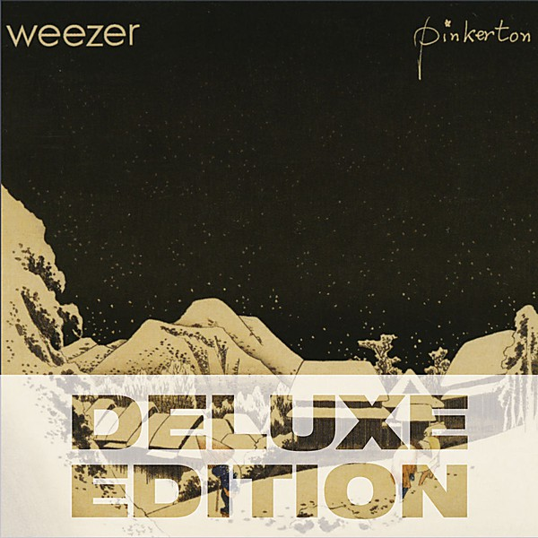

# Pinkerton

By **Weezer**

## Album Data

- **Catalog:** Beets
- **Format:** Digital, Album
- **Album:** Pinkerton
- **Artist:** Weezer
- **Albumartist:** Weezer
- **Genre:** Emo
- **MusicBrainz Album Artist ID:** [6fe07aa5-fec0-4eca-a456-f29bff451b04](https://musicbrainz.org/artist/6fe07aa5-fec0-4eca-a456-f29bff451b04)
- **MusicBrainz Album ID:** [49d996b2-ab53-41bd-8789-3d87938dc07d](https://musicbrainz.org/release/49d996b2-ab53-41bd-8789-3d87938dc07d)
- **MusicBrainz Release Group ID:** [385f30e2-0483-355d-aded-23e66aa20f87](https://musicbrainz.org/release-group/385f30e2-0483-355d-aded-23e66aa20f87)
- **Year:** 1996
- **Catalog #:** 
- **Label:** Geffen Records
- **Total Tracks:** 10

## Album Tracks

### Track 01 - (If You're Wondering If I Want You to) I Want You To

- **Artist:** Weezer
- **Format:** ALAC
- **Genre:** Indie Rock
- **Length:** 3:28
- **MusicBrainz Track ID:** [fdfc53ef-1a50-4783-8617-a22aaf49b6eb](https://musicbrainz.org/recording/fdfc53ef-1a50-4783-8617-a22aaf49b6eb)
- **Title:** (If You're Wondering If I Want You to) I Want You To
- **Track:** 01
- **Year:** 2009

### Track 02 - I'm Your Daddy

- **Artist:** Weezer
- **Format:** ALAC
- **Genre:** Indie Rock
- **Length:** 3:08
- **MusicBrainz Track ID:** [aa5223bb-2111-4690-bce0-c8658ec7e70f](https://musicbrainz.org/recording/aa5223bb-2111-4690-bce0-c8658ec7e70f)
- **Title:** I'm Your Daddy
- **Track:** 02
- **Year:** 2009

### Track 03 - The Girl Got Hot

- **Artist:** Weezer
- **Format:** ALAC
- **Genre:** Emo
- **Length:** 3:14
- **MusicBrainz Track ID:** [a429d148-53f4-40ec-9539-867451130cdd](https://musicbrainz.org/recording/a429d148-53f4-40ec-9539-867451130cdd)
- **Title:** The Girl Got Hot
- **Track:** 03
- **Year:** 2009

### Track 05 - Put Me Back Together

- **Artist:** Weezer
- **Format:** ALAC
- **Genre:** Alternative Rock
- **Length:** 3:15
- **MusicBrainz Track ID:** [c759d724-e286-475b-ad99-357a0efdd291](https://musicbrainz.org/recording/c759d724-e286-475b-ad99-357a0efdd291)
- **Title:** Put Me Back Together
- **Track:** 05
- **Year:** 2009

### Track 06 - Trippin' Down the Freeway

- **Artist:** Weezer
- **Format:** ALAC
- **Genre:** Alternative Rock
- **Length:** 3:40
- **MusicBrainz Track ID:** [62947ae4-eb5b-47d5-86b9-01ba9bbf0635](https://musicbrainz.org/recording/62947ae4-eb5b-47d5-86b9-01ba9bbf0635)
- **Title:** Trippin' Down the Freeway
- **Track:** 06
- **Year:** 2009

### Track 07 - Love Is the Answer

- **Artist:** Weezer
- **Format:** ALAC
- **Genre:** Emo
- **Length:** 3:43
- **MusicBrainz Track ID:** [55be0d6b-27b3-4c64-95d3-209228eb1b14](https://musicbrainz.org/recording/55be0d6b-27b3-4c64-95d3-209228eb1b14)
- **Title:** Love Is the Answer
- **Track:** 07
- **Year:** 2009

### Track 08 - Let It All Hang Out

- **Artist:** Weezer
- **Format:** ALAC
- **Genre:** Emo
- **Length:** 3:17
- **MusicBrainz Track ID:** [f1256335-d3c4-4b78-a389-99484e088743](https://musicbrainz.org/recording/f1256335-d3c4-4b78-a389-99484e088743)
- **Title:** Let It All Hang Out
- **Track:** 08
- **Year:** 2009

### Track 09 - In the Mall

- **Artist:** Weezer
- **Format:** ALAC
- **Genre:** Alternative Rock
- **Length:** 2:39
- **MusicBrainz Track ID:** [71f51f7c-6879-4d04-8bc0-23864d62dccb](https://musicbrainz.org/recording/71f51f7c-6879-4d04-8bc0-23864d62dccb)
- **Title:** In the Mall
- **Track:** 09
- **Year:** 2009

### Track 10 - I Don't Want to Let You Go

- **Artist:** Weezer
- **Format:** ALAC
- **Genre:** Emo
- **Length:** 3:48
- **MusicBrainz Track ID:** [b4b75334-1d17-4adb-aa2a-353cda362f2d](https://musicbrainz.org/recording/b4b75334-1d17-4adb-aa2a-353cda362f2d)
- **Title:** I Don't Want to Let You Go
- **Track:** 10
- **Year:** 2009

### Track 04 - Can't Stop Partying

- **Artist:** Weezer feat. Lil Wayne
- **Format:** ALAC
- **Genre:** Power Pop
- **Length:** 4:22
- **MusicBrainz Track ID:** [0936f764-b669-4082-b75d-2d52aa8005aa](https://musicbrainz.org/recording/0936f764-b669-4082-b75d-2d52aa8005aa)
- **Title:** Can't Stop Partying
- **Track:** 04
- **Year:** 2009

## See also

- [Death to False Metal](Death_to_False_Metal.md)
- [Everything Will Be Alright in the End](Everything_Will_Be_Alright_in_the_End.md)
- [Hurley](Hurley.md)
- [Make Believe](Make_Believe.md)
- [Maladroit](Maladroit.md)
- [Raditude (Amazon MP3 Deluxe Exclusive Version)](Raditude_Amazon_MP3_Deluxe_Exclusive_Version.md)
- [Raditude Bonus Disc](Raditude_Bonus_Disc.md)
- [Raditude](Raditude.md)
- [Weezer](Weezer.md)
- [Weezer (White Album)](Weezer_White_Album.md)
- [Roon: Everything Will Be Alright In The End](../../Roon/Weezer/Everything_Will_Be_Alright_In_The_End.md)
- [Roon: OK Human](../../Roon/Weezer/OK_Human.md)
- [Roon: Raditude (Deluxe)](../../Roon/Weezer/Raditude_Deluxe.md)
- [Roon: SZNZ](../../Roon/Weezer/SZNZ-_Autumn.md)
- [Roon: SZNZ](../../Roon/Weezer/SZNZ-_Spring.md)
- [Roon: SZNZ](../../Roon/Weezer/SZNZ-_Summer.md)
- [Roon: Van Weezer](../../Roon/Weezer/Van_Weezer.md)
- [Roon: Weezer (Black Album)](../../Roon/Weezer/Weezer_Black_Album.md)
- [Roon: Weezer (Teal Album)](../../Roon/Weezer/Weezer_Teal_Album.md)
- [Roon: Weezer (White Album) (Deluxe Edition)](../../Roon/Weezer/Weezer_White_Album_Deluxe_Edition.md)
- [Vinyl: Maladroit](../../Vinyl/Weezer/Maladroit.md)
- [Vinyl: ](../../Vinyl/Weezer/Weezer.md)
